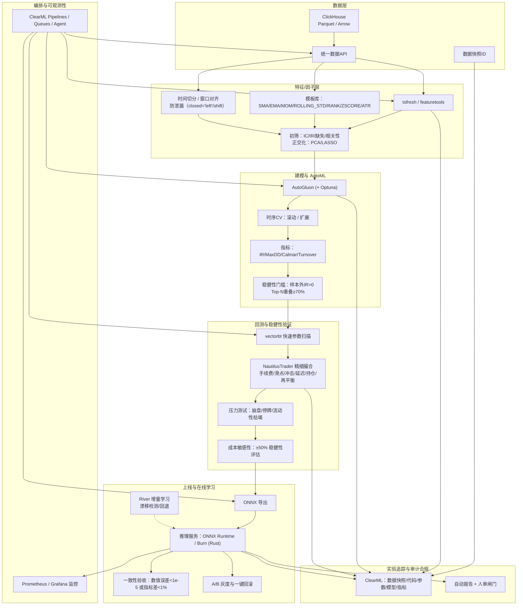

# Qraft 通用化 AI 驱动量化研究平台（Plan 3.0）

面向“多市场、多数据形态（结构化/半结构化/非结构化）、低/中频为主”的自动化策略探索与验证平台；以可复现、可审计、可扩展为第一原则，在不牺牲工程稳健性的前提下兼顾研究效率与落地速度。

## 1. 目标与SLO

- 目标：在不依赖 RD-Agent+Qlib 的前提下，形成“因子/特征 → AutoML建模 → 分层回测 → 稳健性筛选 → 策略产出/上线”的闭环，适配股票/期货/加密等市场。
- 研究SLO：
  - 全市场日频回测（含成本）≤ 2 小时；分钟频回测（单市场）≤ 6 小时。
  - 一次全流程PoC（单标的）≤ 24 小时完成。
- 上线SLO：
  - 推理P99 ≤ 5 ms（CPU/GPU择优）；灰度可回滚 ≤ 1 分钟。
  - 冷启动复跑结果波动 < 1%。

## 2. 架构总览

数据层 → 特征/因子层 → 建模与AutoML → 回测与稳健性 → 上线与在线学习 → 编排与可观测性 → 审计与合规

- 数据层：ClickHouse/Parquet(Arrow) 为主，统一数据API与快照管理。
- 特征/因子层：tsfresh/featuretools + 模板化变换库，严格时间切分与防泄漏。
- 建模与AutoML：AutoGluon(+Optuna)；统一时序CV与指标产线。
- 回测与稳健性：vectorbt 快速筛，NautilusTrader精细撮合；多阶段压力测试与成本敏感性。
- 上线与在线学习：River 增量学习；推理服务（ONNX Runtime 或 Rust Burn 单二进制）。
- 编排与可观测性：首选MLflow轻量使用，跑通之后，需要更高层级的扩展再选择(ClearML Pipelines/Queues/Agent + Prometheus/Grafana；实验登记ClearML)。
- 审计与合规：数据/代码/参数/模型版本全链路可追踪，策略报告自动生成+人审闸门。

备注：Burn 适合“部署侧跨设备/低延时推理”，不替代研究闭环。[Burn](https://github.com/tracel-ai/burn)

## 3. 数据与特征（防泄漏为王）

- 统一数据API：`get_data(market, symbols, start, end, fields)`；封装复权、币种转换、时区对齐、缺失处理。
- 存储策略：
  - 日/分钟级 → ClickHouse（列式、聚合与窗口）；
  - Tick/L2+ → Parquet/Arrow 分区存储，按需读取。
- 快照与再现：每次实验记录数据快照ID（源表范围+MD5），写入ClearML。
- 特征/因子：
  - 自动特征：tsfresh（时序统计集）与 featuretools（DFS）。
  - 模板库：SMA/EMA/MOM/ROLLING_STD/RANK/ZSCORE/ATR/log-returns/分位/波动率/量价微结构等；元函数+参数域自动生成候选。
  - 时间切分：严格使用`rolling/shift(closed='left')`风格算子；统一“切分器/窗口对齐器”。
  - 初筛：IC/IR、缺失率、稳定性、与基因因子相关性阈；正交化（PCA/LASSO）。

参考：
- featuretools（自动特征合成）: https://featuretools.alteryx.com/
- tsfresh（时序特征库）: https://tsfresh.readthedocs.io/en/latest/text/list_of_features.html

## 4. 建模与AutoML

- 训练栈：AutoGluon（Tabular/TS）为主，Optuna补充细粒度超参搜索。
- 时序CV：滚动/扩展窗口（可配置折数、步长、冷却期），统一评估接口输出指标：IC/IR/Acc/ROC-AUC/Calmar/MaxDD/Turnover。
- 稳健性门槛：
  - 样本外IR > 0；训练-验证IR相关系数 > 0.6；
  - 多时期/跨标的 Top-N 重叠率 ≥ 70%；
  - 信息半衰期与特征漂移监控达标。

参考：AutoGluon TS: https://auto.gluon.ai/stable/tutorials/timeseries/

## 5. 回测、成本与压力测试

- 分层回测：
  1) vectorbt 快速参数扫描（Numba加速）；
  2) 精细撮合与执行近似（NautilusTrader）：手续费、双边滑点、冲击成本（成交量占比/流动性限制）、撮合延迟、持仓与再平衡规则；
  3) 小资金实盘影子验证 → 正式资金灰度。
- 成本敏感性：滑点±50%、冲击系数±50% 时策略排名Top-N稳健（重叠≥70%）。
- 压力测试：极端波动、停牌/熔断、流动性枯竭、交易所异常回报。

参考：vectorbt: https://vectorbt.dev/ | https://github.com/polakowo/vectorbt

## 6. 上线与在线学习

- 推理服务：
  - 训练端导出ONNX；线上用 ONNX Runtime 或 Burn(Rust) 部署为单二进制/容器，提供健康检查、模型哈希、A/B/灰度与一键回滚。
  - 一致性验收：Python vs 线上推理在同一批特征上的误差 < 1e-5 或关键指标差 < 1%。
- 在线学习（择需）：
  - River 增量更新（滑动窗口/学习率上限/漂移阈）；
  - 漂移触发降级：回退至最近稳定离线模型；
  - 线上-离线双轨评估与周度再训练。

参考：River: https://riverml.xyz/ | https://github.com/online-ml/river

## 7. 编排、可观测与审计

- 编排：ClearML Pipelines/Queues/Agent：拉数 → 特征 → 初筛 → AutoML → 分层回测 → 稳健性评估 → 报告 → 上线/灰度。
- 监控：Prometheus/Grafana 指标（绩效、成本偏差、风格漂移、服务延迟与错误率）。
- 实验登记：ClearML 记录数据快照ID、代码版本、依赖、随机种子、特征列与窗口、成本参数、模型文件与评估指标；模型注册与版本回滚通过 ClearML Model Registry 管理。
- 审计：自动生成实验与策略报告（包含数据与代码指纹、重要图表与结论），人审闸门后方可下发。

## 8. 性能与语言策略（混合栈最佳实践）

- 研究侧优先Python生态，定点加速：
  - DataFrame/IO：pandas → Polars（Rust内核）、PyArrow/Parquet；
  - 向量化/并行：Numba/numexpr、Ray/Dask；
  - 计算下推：rolling/join/聚合尽量在ClickHouse完成。
- 部署与执行侧原生化：
  - 推理：ONNX Runtime 或 Burn（跨设备、WASM/Metal/CUDA/ROCm）。
  - 执行：如需毫秒级撮合/风控，采用原生微服务（Rust/C++）承担关键路径，研究框架仅编排。

参考：Burn（跨设备推理）: https://github.com/tracel-ai/burn

## 9. 里程碑与产出

- Phase 1（0–1月）基础闭环
  - 搭建数据API与快照；tsfresh/featuretools 自动因子；vectorbt 快速回测与成本模型；ClearML 登记。
  - 产出：可复现的基线策略与报告；冷启动复跑<1%。
- Phase 2（1–3月）自动化与稳健化
  - AutoGluon+Optuna；时序CV与稳健性门槛；Nautilus 精细撮合；压力测试与成本敏感性。
  - 产出：Top-N 稳健策略名单与参数、敏感性与压力报告。
- Phase 3（3月+）上线与在线学习
  - 推理服务（ONNX/Burn）+ 灰度回滚；River 增量学习与漂移监控；编排/观测/合规完善。
  - 产出：生产策略与上线SOP、监控与回滚方案。

## 10. 验收标准（可替代性门槛）

- 正确性与再现性
  - 同一实验冷启动复跑指标波动 < 1%（含成本）；数据快照与代码版本可完整追溯。
  - 泄漏单测全过：任一特征不得使用未来信息；窗口/标签对齐一致。
- 回测逼真度
  - 与对照实现（可选Qlib或自研基线）同数据同逻辑下，年化/回撤/成交量等距差 < 2%。
  - 成本灵敏度：滑点/冲击±50%时 Top-N 排名重叠 ≥ 70%。
- 稳健性与泛化
  - 样本外IR > 0；训练-验证IR相关系数 > 0.6；跨期/跨标的胜率 ≥ 60%。
- 工程化
  - E2E无人值守跑通；失败可重试；报警与一键回滚有效；资源/时间在SLO内。

## 11. 风险与缓解

- 过拟合与数据泄漏 → 严格时序切分、泄漏单测、分层筛选与样本外门槛；
- 计算成本失控 → 先统计过滤→轻量回测→重回测的金字塔式搜索；Ray 并行与预算闸门；
- 执行逼真度不足 → 成本/撮合参数校准与对照基线，影子/灰度优先；
- 生态割裂/语言迁移成本 → 研究用Python，部署用原生微服务；以ONNX作边界；
- 合规模糊 → 审计报告与人审闸门、日志留痕与版本锁定。

## 12. 工具清单（精选）

- 特征/因子：tsfresh（时序特征）、featuretools（DFS）
- AutoML：AutoGluon（TS/Tabular）、Optuna（超参）
- 回测：vectorbt（快速）、NautilusTrader（精细撮合）
- 在线学习：River（增量）
- 数据：ClickHouse、Parquet/Arrow、Polars
- 编排/实验/注册：ClearML；观测：Prometheus/Grafana
- 推理部署：ONNX Runtime / Burn（Rust）

外部参考：
- featuretools: https://featuretools.alteryx.com/
- tsfresh: https://tsfresh.readthedocs.io/en/latest/text/list_of_features.html
- AutoGluon TS: https://auto.gluon.ai/stable/tutorials/timeseries/
- vectorbt: https://vectorbt.dev/ | https://github.com/polakowo/vectorbt
- River: https://riverml.xyz/ | https://github.com/online-ml/river
- Burn: https://github.com/tracel-ai/burn

## 13. 架构图




# 专业意见和建议
超赞的 3.0 方案！总体上：你的分层清晰、技术选型务实，能在不依赖 Qlib 的前提下覆盖“因子→AutoML→分层回测→上线”的闭环。我按“可落地性、稳健性与可维护性”给出可执行的增强建议（尽量具体到接口/参数/检查项）。

---

## A. 全局与SLO落地

* **SLO→SLA 映射**：为每条主链路设硬性预算（举例）

  * 数据装载（全市场日频）：≤ 20 分钟；特征计算：≤ 30 分钟；AutoML 搜索：≤ 50 分钟；vectorbt 粗筛：≤ 10 分钟；Nautilus 精核：≤ 10 分钟。ClearML Pipeline 中把这五段作为**显式 stage**并设置超时/重试。
* **确定性与随机种子**：规定全局 `RUN_ID` 和 `SEED`（训练、Optuna、numpy/torch、vectorbt/Nautilus 参数生成）写入 ClearML artifacts，强制 **再跑差 <1%** 的门槛可验证。
* **环境锁定**：每个阶段固定 Docker 镜像（含 CUDA/ROCm 版本），在实验记录中保存 `requirements.lock` 与镜像 digest。

---

## B. 数据层（ClickHouse / Parquet / API）

* **分区与主键**（建议）

  * CH：`PARTITION BY (market, toYYYYMM(date))`，`ORDER BY (symbol, ts)`；分钟/日两张宽表，聚合表单独维护。
  * Tick/L2+（Parquet）：`market=date/hour/symbol` 分区；写入时强制 **单调 ts**。
* **交易日历与时区**：内置 `calendar` 服务（per-market/weekmap/holiday/half-day）；统一输出 UTC ts + 本地 tz 字段，API 层做对齐。
* **复权与合约连续性**：

  * 股票：前/后复权在 API 内切换；
  * 期货：**连续主力**规则固定（OI 或成交量），切换点写入快照元数据；
  * 期权：标的、到期、行权价、希腊值与 IV 面板缓存，生成为**衍生表**（日频）。
* **数据快照**：`snapshot_id = SHA256(sql_text + table_versions + time_range)`；API 返回 `snapshot_meta.json`（行数、缺失率、字段哈希、采样统计）。

---

## C. 特征/因子（防泄漏与可复用）

* **切分器与窗口对齐器**：沉淀成独立模块（e.g. `splitter.Rolling(start, step, holdout)` / `aligner.LeftClosed(lookback)`），对 tsfresh/featuretools 计算前就裁剪边界；**任何 rolling/lag 只能通过 aligner 调**。
* **模板库规范**：为每个元算子定义**参数域**（JSONSchema），如 `SMA{window∈[3,240]}`, `RANK{window, by=volume}`，并记录生成的**特征签名**（公式+参数+窗口）到 ClearML。
* **初筛与去冗余**：先做 **缺失/稀疏/低方差/稳定性**过滤，再跑 IC/IR；对相似特征做 **clustering（皮尔逊/距离）+ 代表选取**，最后可做一次 LASSO/ElasticNet 稀疏化。

---

## D. 建模与 AutoML（AutoGluon + Optuna）

* **时序CV 标准化**：封装统一 `TimeSeriesCV`（滚动/扩展），显式 **gap（冷却期）**，保证**无泄漏**；把 IC/IR/Calmar/Turnover 注入 AutoGluon 的自定义 metric。
* **搜索预算与早停**：

  * AutoGluon：限制 `time_limit`、`num_bag_sets`；
  * Optuna：用 `MedianPruner` / `SuccessiveHalving`；在 ClearML 内记录**每试验耗时与收益**，支撑后续**性价比分析**。
* **多目标优化**：引入 **Pareto Frontier**（IR↑、Turnover↓、MaxDD↓），避免单指标过拟合。
* **跨域一致性**：同一策略在**多市场/多周期**上做 `GroupKFold`（按 symbol/sector），输出 **Top-N 重叠**与**参数漂移**报告。

---

## E. 回测与成本（vectorbt → Nautilus）

* **参数金字塔搜索**：

  1. vectorbt：宽域、粗粒度、快速淘汰（Numba、并行）；
  2. Nautilus：窄域、细粒度、真实撮合。
     把两阶段参数空间、过滤阈值、样本外窗口写入一份 `search.yaml`，复用在两侧。
* **成本模型校准**：

  * 股票/期货：佣金表（阶梯）、最小变动价位、合约乘数；
  * 加密：maker/taker，资金费率；
  * 滑点：**复合模型**（点差 + 冲击成本 α·参与率^β + 延迟），每市场单独标定；对 ±50% 灵敏度评估生成**重叠率曲线**而非单点。
* **执行约束**：限价、冰山、TWAP/VWAP；最大持仓/标的/行业/保证金约束；停牌/熔断/断联回放规则要在 Nautilus 测试集中覆盖。

---

## F. 上线与在线学习（ONNX / Burn / River）

* **数值一致性验收**：离线 Python vs 在线（ONNX/Burn）在**同一批特征**上比对——保存 `test_vectors.npz`，阈值：每输出维度相对误差 < `1e-5` 或策略关键指标差 < 1%。
* **模型边界协议**：用 **ONNX + Model Card** 固定输入列名、顺序、类型、缺省填充值；在推理侧做**特征签名校验**（不匹配直接熔断 + 回退）。
* **漂移与降级**：River 只接**稳定且强信号**的策略（高 turnover/低半衰期策略慎用在线学习）；概念漂移检测（ADWIN/KS/PSI），触发 -> 冻结在线学习 + 回退上一稳定版本。

---

## G. 编排、可观测与审计（ClearML / Prometheus）

* **Pipeline 原子化**：把“拉数→特征→初筛→AutoML→vectorbt→Nautilus→稳健性→报告→注册→上线”拆为**幂等组件**（每步缓存 by snapshot\_id & feature\_signatures）。
* **端到端指标**：

  * 研究：样本外 IR、Top-N 重叠、成本敏感性曲线、搜索性价比；
  * 线上：延迟 P50/P95/P99、错误率、特征命中率、漂移 PSI、执行偏差（预期 vs 成交）。
* **审计包**：每次候选策略产出一个 **zip**：包含 snapshot\_meta、search.yaml、model.onnx、参数与阈值、回测曲线与日志、模型卡、审批记录。

---

## H. 性能工程（混合栈）

* **I/O 与列存**：训练前把训练切片落到 **Arrow IPC** 或 **Parquet Row-Group≈128MB**；尽量**下推** rolling/join 到 ClickHouse（`FINAL` 慎用，控制 `max_bytes_before_external_sort`）。
* **Polars / PyArrow**：特征阶段优先 Polars 懒执行；CPU 侧 `num_threads = min(physical, 32)`，Ray 用于横向并行（试验/标的/窗口为并行单位）。
* **GPU/异构**：若用 AutoGluon+XGBoost/LightGBM GPU，统一 CUDA/driver 版本；记录 GPU 算子与数据型（float32/float64）差异对精度的影响。

---

## I. 风险点再加固

* **期权专用特征**：希腊值、IV 面、微笑曲线、跨期/跨式价差——建议单独建 `options_feature_plugin`，并在特征签名中记录 `as_of` 与插值法。
* **加密交易风控**：交易所 API 速率限制与断连重试、资金费率与强平规则差异，统一在执行层抽象。
* **策略泄漏单测**：为每个新特征自动生成 **leakage unit test**（检查未来引用、右闭窗口、对齐），纳入 CI。

---

## J. 目录与接口（建议范式）

```
qraft/
  data/
    api.py             # get_data(), snapshot()
    calendar.py
  features/
    templates/*.py     # 元算子与参数域
    aligner.py         # LeftClosed aligner
    screening.py       # 缺失/方差/IC/稳定性
  modeling/
    cv.py              # TimeSeriesCV (gap)
    autogluon_runner.py
    optuna_runner.py
  backtest/
    vectorbt_scan.py
    nautilus_core.py
    cost_models.py
  deploy/
    onnx_check.py      # 一致性验收
    service.py         # 推理服务适配(Burn/ORT)
  ops/
    pipeline.py        # ClearML DAG
    observability.py   # Prometheus exporters
  audit/
    package.py         # 审计包生成
```

---

## K. 里程碑细化（P0 可交付）

* **P0（2–3周）**：

  1. 数据 API + 快照；2) 特征对齐器 & 模板库（10 个元算子）；
  2. TimeSeriesCV（含 gap）+ AutoGluon 单策略 baseline；
  3. vectorbt 粗筛 → Nautilus 单市场验证链路；
  4. ClearML Pipeline 最小闭环；6) 审计包 v0。
* **P1（4–8周）**：成本标定、灵敏度曲线、Pareto 多目标、期权插件、ONNX 一致性工具、Prom/Grafana 基线看板。
* **P2（8–12周）**：在线学习（River）灰度、跨市场批量跑、A/B 与一键回滚、合规模板化报告。

---

如果你愿意，我可以把上面的 **ClearML Pipeline DAG**、**TimeSeriesCV 伪代码** 和 **cost model 校准脚本模板** 直接给出（可拷贝即用），或者把目录骨架初始化成一个最小可跑的 repo。你偏好哪一个？
