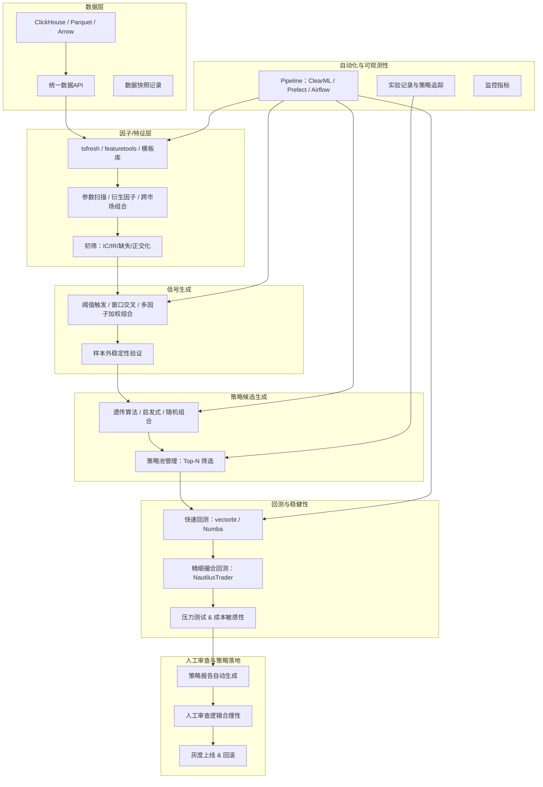

明白，我们可以把“Qraft4.0”设计为一个**无模型、全因子/策略组合驱动、面向多市场的自动化量化策略探索平台**。我会按照Qraft3.0的逻辑架构方式，全面整理无模型策略探索的最佳实践方案。

---

# 🧠 Qraft 4.0 设计草案 · 无模型策略探索版

## **1. 平台定位与目标**

**定位**：面向多市场、多数据形态（结构化/半结构化/非结构化）、低/中频量化策略探索与验证平台。
**目标**：在**不训练预测模型**的前提下，通过自动化因子生成、智能组合、回测筛选，形成稳健策略候选集，辅助人工决策与策略上线。

**设计原则**：

* **可复现**：每次实验数据、因子组合和回测结果完整记录
* **可扩展**：支持跨市场、跨频率因子组合和回测
* **高效**：利用分层筛选、向量化/并行计算降低资源消耗
* **可审计**：全流程记录策略来源、组合逻辑和回测指标

---

## **2. 核心流程**

```text
原始数据 → 因子/特征生成 → 信号生成 → 候选策略组合 → 多阶段回测 → 稳健性筛选 → 策略池 → 人工审查 → 策略上线
```

### **流程对应Qraft3.0对照**

| Qraft3.0 模型训练流程                                        | Qraft4.0 无模型流程                                                | 核心差异                            |
| ------------------------------------------------------ | ------------------------------------------------------------- | ------------------------------- |
| 数据层 → 特征/因子层 → 建模与AutoML → 回测 → 上线与在线学习 → 编排与可观测性 → 审计 | 数据层 → 因子/特征生成 → 信号生成 → 策略组合 → 回测 → 稳健性筛选 → 策略池 → 人工审查 → 上线/监控 | **去掉建模与AutoML，增加信号生成与智能因子组合模块** |

---

## **3. 数据层**

* **数据来源**：

  * 股票/期货/期权/加密货币市场
  * 多级别：日/分钟/Tick
  * 可支持结构化（OHLCV）、半结构化（订单簿）、非结构化（新闻、社交舆情）

* **存储与API**：

  * ClickHouse / Parquet / Arrow 分区存储
  * `get_data(market, symbols, start, end, fields)` 统一接口
  * 数据快照记录（MD5+版本号）

* **数据处理**：

  * 缺失值处理、复权、币种转换、时区对齐
  * 快速聚合与窗口计算下推到数据库

---

## **4. 因子/特征生成**

* **自动化因子生成**

  * **基础因子**：技术指标 SMA, EMA, MOM, ATR, RSI, 波动率
  * **参数扫描**：窗口长度、阈值连续化生成候选因子
  * **衍生因子**：价量交叉、波动-动量组合、衰减权重因子
  * **高阶组合**：跨市场、跨频率组合

* **特征库模板化**

  * 自动生成数百到数千个因子
  * 支持动态因子扩展

* **因子筛选**：

  * 单因子IC/IR阈值
  * 缺失率过滤
  * 高相关性因子正交化（PCA/LASSO）

---

## **5. 信号生成**

* **定义**：

  * 信号 = 因子或因子组合在特定条件下触发的交易信号（买/卖/平仓）

* **生成逻辑**：

  1. 阈值条件（如因子>上分位数）
  2. 窗口交叉（短期因子突破长期因子）
  3. 多因子加权组合（均值/分位/逻辑与或）

* **稳健性原则**：

  * 多周期、多标的验证信号稳定性
  * 样本外胜率 ≥ 50% 作为信号候选门槛

---

## **6. 策略候选生成**

* **因子组合策略**

  * 使用遗传算法 / 启发式搜索 / 随机采样生成候选组合
  * 组合可包括 N 个因子，按逻辑运算或加权形式生成信号
  * 每个候选策略定义：

    * 信号来源（因子组合）
    * 参数（窗口、阈值、权重）
    * 交易逻辑（买入/卖出条件、仓位管理）

* **策略池管理**

  * 每轮回测后将候选策略入池
  * 保留Top-N稳健策略进入下一阶段筛选

---

## **7. 回测与稳健性筛选**

* **分层回测**

  1. **快速回测**：vectorbt / numpy向量化，快速评估大量策略
  2. **精细撮合回测**：NautilusTrader，考虑滑点、冲击、延迟、持仓规则
  3. **压力测试**：极端行情、停牌/熔断、跨市场事件

* **稳健性指标**

  * 样本外收益、IC/IR
  * Top-N重叠率 ≥ 70%
  * 成本敏感性 ±50%

* **候选策略筛选**

  * 样本外表现良好的策略进入策略池
  * 多时期、多市场验证通过的策略优先

---

## **8. 人工审查与策略落地**

* **策略报告自动生成**

  * 包含因子来源、组合逻辑、回测指标、稳健性分析
* **人工审查**

  * 交易逻辑合理性
  * 风控限制与交易所规则
* **策略上线**

  * 灰度、A/B测试
  * 可回滚

---

## **9. 自动化与可观测性**

* **Pipeline自动化**

  * ClearML / Airflow / Prefect 管理全流程
  * 数据获取 → 因子生成 → 信号 → 策略组合 → 回测 → 筛选 → 报告

* **实验记录**

  * 每个因子、组合、回测结果、参数版本
  * 可追溯与复现

* **监控指标**

  * 策略池大小、回测耗时、稳健性指标、计算资源使用

---

## **10. 技术栈建议**

| 模块      | 技术工具                          | 说明         |
| ------- | ----------------------------- | ---------- |
| 数据层     | ClickHouse / Parquet / Arrow  | 高效存储与窗口计算  |
| 因子生成    | tsfresh / featuretools / 自研模板 | 自动化因子生成    |
| 信号/策略生成 | 自研遗传/随机/启发式组合逻辑               | 批量生成候选策略   |
| 快速回测    | vectorbt / Numba              | 向量化快速筛选    |
| 精细回测    | NautilusTrader / 自研撮合         | 滑点/冲击/延迟模拟 |
| 自动化与追踪  | ClearML / Prefect / Airflow   | 流水线与实验记录   |
| 报告与审计   | matplotlib / plotly / PDF自动生成 | 策略可视化与审查   |
| 部署与监控   | Rust微服务 / Python轻量推理          | 灰度上线、监控和回滚 |

---

## **11. Qraft4.0 架构图**



---

## **12. 总结**

* **Qraft4.0特点**

  1. 无模型策略探索 → 无需训练预测模型
  2. 超大因子空间 + 智能组合 → 最大化策略搜索能力
  3. 多阶段回测 + 稳健性筛选 → 提高候选策略可靠性
  4. 自动化流水线 + 实验记录 → 高可复现性、可追踪
  5. 人工审查 → 保证策略可解释性和落地安全

* **适合场景**

  * 个人开发者 / 小团队
  * 多市场、多频率量化探索
  * 资源有限，但追求高覆盖策略探索

* **优势**

  * 低硬件成本，无GPU需求
  * 灵活扩展因子与策略组合
  * 可直接产出候选策略，支持落地

* **限制**

  * 无法发现模型潜在的非线性规律
  * 探索空间仍受因子生成逻辑限制
  * 高维因子组合仍需分层筛选降低计算消耗

---

如果你需要，我可以进一步帮你**画一个“Qraft3.0（模型驱动） vs Qraft4.0（无模型策略探索）对比图”**，清晰对比两者流程、产出和资源消耗差异，让你更直观判断未来方向。

你希望我画吗？
