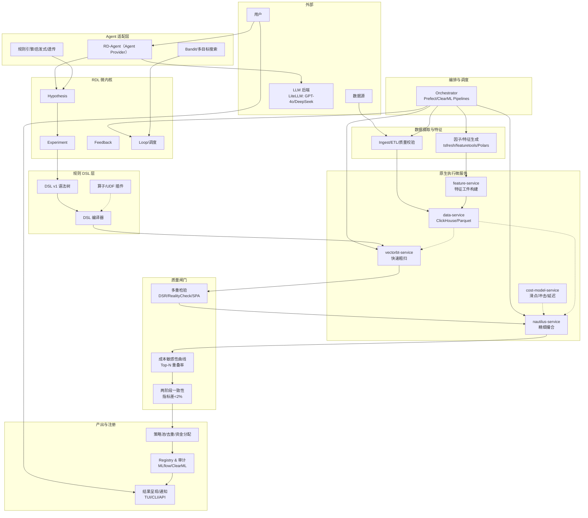
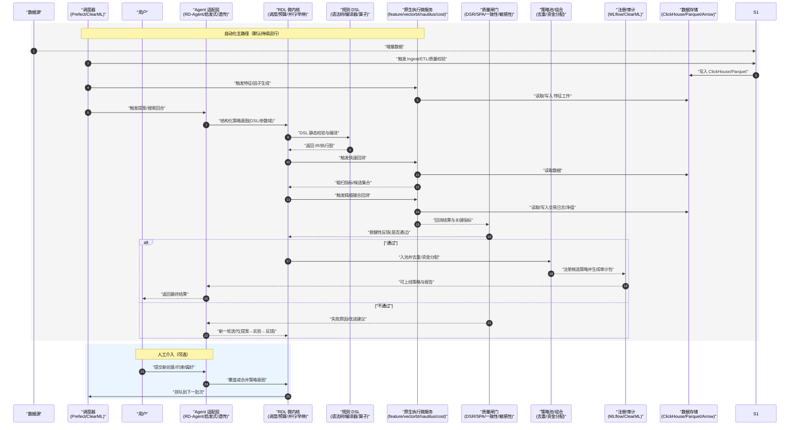

## Qraft 5.0 设计蓝图（RDL 微内核 + 规则 DSL + 原生执行微服务 + Agent 适配层）

### 1. 目标与 SLO
- 目标：在不依赖模型训练的前提下，构建一个高性能、可复现、可审计的规则/因子驱动策略探索与执行平台，并原生适配多智能体（含 RD-Agent）。
- 研究 SLO：
  - 全市场日频粗扫（含成本）≤ 30 分钟；分钟单市场粗扫 ≤ 2 小时。
  - 单策略两阶段回测（快速→精撮）≤ 15 分钟。
- 上线 SLO：
  - 执行服务 P99 ≤ 5 ms（离线回测外），灰度回滚 ≤ 1 分钟。
  - 冷启动复跑关键指标波动 < 1%。
 - 数据驱动自动化 SLO：新增数据落地→特征更新→触发粗扫的端到端延迟 ≤ 10 分钟（可配置，事件/定时皆可）。

### 2. 设计原则
- 轻量化：微内核 + 插件，最小必要耦合；研究侧 Python 编排，执行侧原生（Rust/C++）。
- 极致性能：向量化/并行 + Arrow/IPC 零拷贝 + 计算下推（ClickHouse/Polars）。
- 稳定与无竟态：Actor 模型、幂等作业、内容寻址与原子发布。
- 可扩展：DSL/UDF/算子与服务插件化，跨市场/跨资产即插即用。
- 可复现与可审计：全链路指纹（数据/参数/DSL/代码/版本/工件）。

### 2.1 采用不自研（Adopt-not-build）技术栈与映射
- RDL 微内核：Qraft 轻量自研微内核（调度/预算/并行/早停）
- 多代理接入：RD-Agent（可选 Agent Provider，LiteLLM 接入 GPT‑4o/DeepSeek）
- LLM 接入：LiteLLM（统一接入 GPT‑4o、DeepSeek 等）
- 快速回测：vectorbt（Numba 加速、参数扫描）
- 精细撮合：NautilusTrader（撮合、延迟、成本、风险约束）
- 数据/存储：ClickHouse（日/分钟）、Parquet/Arrow（Tick/L2+）
- 计算/数据框：Polars、PyArrow
- 特征/因子生成：tsfresh、featuretools（自动化时序与 DFS 特征）
- 编排/调度：Prefect 或 ClearML Pipelines（或 Airflow，三选一，优先轻量）
- 观测：Prometheus + Grafana
- 审计/实验登记：MLflow 或 ClearML（择一轻量接入）
- 规则算子库：TA-Lib/vectorbt 内置指标 + 自定义 UDF（最小化编码）

说明：RD‑Agent 与 ClickHouse、vectorbt/Nautilus 等同等地位，作为可插拔 Agent Provider 纳入 Qraft；Qraft 在 RD-Agent 内新增 "Qraft-Rule" 场景与执行工作空间（不依赖 Qlib 场景）。

### 3. 架构总览（与时序图一致的全景图）


### 交互时序图（自动化为默认，人工可介入）

#### 时序图Q&A：
-  S1 是什么?
 S1 指“数据摄取/ETL/质量校验”节点：拉取/接收增量数据→去重/Schema 校验→交易日历/时区对齐→复权/币种转换→生存/前瞻偏差检查→生成 snapshot_id 并落到 ClickHouse/Parquet。其输出供 S2（因子/特征生成）与后续回测使用
 - 自动化是否必须用 Prefect/ClearML?
 否。三种落地方式按轻重选择：
极简：cron/systemd + APScheduler + 事件监听（文件/DB）即可跑 ingest→feature→backtest DAG。
轻量优先（推荐）：Prefect Flow 编排（重试/依赖/缓存/可观测）+ 事件/定时触发。
一体化：ClearML Pipelines 若你顺带用其实验登记/队列。
默认建议 Prefect，后续需要再平滑切到 ClearML。
-  避开模型训练还要 MLflow/ClearML 吗？
要，但用途从“模型登记”转为“策略/实验登记与审计”。需要保存：snapshot_id、DSL/参数哈希、指标、成本敏感性曲线、两阶段一致性、交易日志/净值、审计包 zip。最小化做法：
方案A：本地 MLflow Tracking（轻量），只做 artifact/metrics 存档。
方案B：自建 ClickHouse 表 + 文件系统审计包（最精简）。
方案C：已用 ClearML 当编排器时，顺带用其登记。
- RD-Agent 如何持续反馈、反馈什么、成本如何控?
**反馈通道**：不必每步“调用 LLM 通知用户”。RD-Agent 在本方案仅用于“产出新 DSL/参数域”，用户反馈用“确定性摘要”就够：当且仅当新结果越过门槛才推送（否则静默入库）。
**反馈内容**（计算生成、非 LLM）：
关键信息：策略ID/DSL哈希、样本外 IR/Calmar/MaxDD、Top‑N 重叠率曲线、成本±50%敏感性曲线、两阶段一致性差值、是否通过质量闸门、排队到实盘/灰度的状态。
变更摘要：相对上轮的提升/退化与触发的动作（继续/回滚/降级）。
**成本控制**（避免 LLM 浪费）：
限频与预算：LLM 仅在“需要新假设”时调用；对同等 DSL/参数域去重缓存；设置 token 预算与并发上限。
条件触发：只有当“改进潜力信号”成立（如 Pareto 前沿外、Top‑N 重叠低/指标退化）才请求 LLM 给新提案。
本地摘要：用户侧通知由本地代码生成，不用 LLM。只有“研究报告”类长文解释再用 LLM（低频）。
- 我们能否按设计轻松集成 RD-Agent（基于源代码理解）?
**RD-Agent** 的量化演示以“场景插件”形态接入（Qlib 场景只是其中之一），核心循环与 CLI 已解耦，新增 Qraft 场景可行。证据：
```code
app = typer.Typer()
app.command(name="fin_factor")(fin_factor)
app.command(name="fin_model")(fin_model)
app.command(name="fin_quant")(fin_quant)
app.command(name="data_science")(data_science)
```
**Qlib 场景**是通过工作空间执行 qrun conf.yaml 的“可替换适配层”，并非硬绑定；我们可换成 Qraft-Rule 的执行工作空间（vectorbt/Nautilus）。
```code
execute_qlib_log = qtde.check_output(local_path=str(self.workspace_path), entry=f"qrun {qlib_config_name}", env=run_env)
```
还有 Docker/Conda 的 Qlib 专用配置，说明 Qlib 依赖被限定在场景内而非核心:
```code
class QlibCondaConf(...); class QlibDockerConf(...); class QTDockerEnv(...)
```
RD-Agent 也支持非 Qlib 的“data_science”场景，进一步证明可扩展为新场景：
```code
... scenarios.data_science.share ...
```
**集成方式**：在 RD-Agent 新增 scenarios/qraft_rule/* + 适配器把 Hypothesis/Experiment 映射为 DSL/参数域，执行面调用 Qraft 的 vectorbt/Nautilus 服务；CLI 挂上类似 rdagent qraft_rule。变更局限在“新场景与工作空间”，无需动 RD-Agent 核心循环。


### 4. 组件设计与数据契约

#### 4.1 RDL 微内核（轻量、与场景解耦）
- 职责：定义“假设→实验→反馈→循环”的抽象与数据契约，调度并行探索，管理预算/并行度/早停。
- 产物：以内容寻址的工件（artifacts）落盘，任何产物均可复跑与对比。
- 数据契约（简化示例）：
```json
{
  "hypothesis": {
    "id": "uuid",
    "goal": "improve_IR",
    "constraints": {"turnover_max": 0.8, "universe": "CN_STOCKS"}
  },
  "experiment": {
    "dsl": "dsl://hash",
    "params": {"rebalance": "1D", "topk": 50},
    "data_snapshot_id": "sha256(...)"
  },
  "feedback": {
    "metrics": {"IR": 0.62, "Calmar": 0.8},
    "robust": {"topn_overlap": 0.74, "cost_sensitivity_pass": true},
    "decision": true
  }
}
```

#### 4.2 规则 DSL v1（版本化，可静态校验）
- 能力域：
  - 信号：阈值/分位/窗口交叉/横截面排序选股/多因子加权/多周期共识/状态门限。
  - 组合：持有期/冷却期/再平衡/仓位规则（等权、score→weight、目标波动率）。
  - 风控：止损/止盈/回撤熔断/换手预算/行业与单标的上限。
  - 成本：手续费/点差/冲击成本（α·参与率^β）/延迟/最小价位/合约乘数/资金费率。
  - 执行：限价/市价/TWAP/VWAP/冰山；撮合延迟与失败重试策略。
- 扩展：算子与 UDF 插件化，按 semantic version 管理；DSL→IR（中间表示）→执行图。
- 示例：
```yaml
version: 1
universe: CN_STOCKS
rebalance: 1D
signals:
  long: EMA(close,10) > EMA(close,30) and PCT_RANK(ROC(close,20)) > 0.7
selection:
  mode: topk
  score: ZSCORE(ROC(20))*0.5 + ZSCORE(RSI(14))*0.5
  topk: 50
position:
  scheme: vol_target
  target_vol: 0.15
  max_weight: 0.03
risk:
  stop_loss: 0.1
  max_drawdown: 0.2
costs:
  fee_bps: 2
  slippage:
    spread_bps: 5
    impact: {alpha: 0.1, beta: 0.5}
    latency_ms: 50
hold: {min_days: 5}
cooldown_days: 3
```

#### 4.3 原生执行微服务（高性能、无状态）
- feature-service（Python/Polars/tsfresh/featuretools）：批量计算与更新因子/特征工件（支持事件/定时触发）。
- vectorbt-service（Python/Numba）：大规模参数/规则粗扫，NumPy/Numba 并行；输出指标矩阵与候选集。
- nautilus-service（Rust/Python）：高精度撮合，支持手续费/点差/冲击/延迟/保证金/停牌熔断；输出交易日志与净值序列。
- cost-model-service（Rust/Python）：市场分组参数包（股票/期货/加密），输出成本敏感性曲线（±50%）。
- data-service：ClickHouse（分钟/日）+ Parquet/Arrow（Tick/L2+）；统一交易日历/复权/连续主力。
- 通信：gRPC 首选；Python 侧通过 PyO3/FFI 直连原生库，批量数据用 Arrow/IPC 零拷贝。

#### 4.4 Agent 层（RD‑Agent 等同级 Provider，可插拔）
- 角色：RD‑Agent 提供 R/D 循环与提案生成能力（提案→实验→反馈→演化），通过 LiteLLM 直连 GPT‑4o/DeepSeek；RDL 调度归属于 Qraft 微内核统一编排。
- 边界：RD‑Agent 只产“结构化策略意图（DSL/参数域）/工作流计划”，不直接落策略代码；执行由 Qraft 原生服务承担。
- 扩展：除 RD‑Agent 外，可并行挂载启发式/遗传/Bandit 搜索器，统一输出 DSL。
- 质量门：JSONSchema 校验 + 规则静态检查（无未来函数、窗口闭合一致）+ 预算/并行/早停。
- LLM 成本控制：提案去重缓存（相同 DSL/参数域不重复请求）、限频与 token 预算、仅在“改进潜力”触发（例如 Pareto 外/Top‑N 重叠低/指标退化）时调用 LLM；用户侧通知采用确定性指标摘要（非 LLM）。

#### 4.5 统一因子库与市场子库（版本化与审计）
- 目标：稳定可追溯的因子资产沉淀，支撑跨市场/多频复用与自动化编排。
- 结构：
  - Common 通用库：跨市场/多资产通用因子（动量、波动、价量微结构等）。
  - Per-Market 子库：股票/期货/加密等专用因子；按频率（日/分钟/多频）与数据域细分。
- 元数据（JSONSchema 关键字段）：
  - `name`、`description`、`market_scope`、`frequency`
  - `formula_ast`（或 `dsl_snippet` 映射）
  - `parameters`（域/默认值）
  - `window`、`lag`、`align_policy`（左闭/滞后）
  - `dependencies`（字段/上游因子）
  - `feature_signature`（基于公式+参数+窗口+对齐的哈希）
  - `provenance`（manual/auto/rdagent）、`status`（proposed/approved/deprecated）
  - `validation`：IC/IR、稳定性、缺失率、成本敏感性、Top‑N 重叠（跨期/跨市场）
- 版本与生命周期：
  - 版本采用 semver（MAJOR.MINOR.PATCH）；Approved 版本不可变（仅可新增版本）。
  - 流程：`proposed → QC（泄漏单测/跨期/跨市场验证） → approved`；弃用标记 `deprecated` 并保留历史。
- 存储与工件：
  - 元数据与评估指标：ClickHouse 表（`factors`, `factor_versions`, `factor_metrics`）。
  - 计算工件：Parquet/Arrow（含 `snapshot_id` 与 `feature_signature` 路径），由 `feature-service` 增量构建。
- 使用方式：
  - DSL 中通过因子 URI 引用：`factor://common/ema@1.2.0?window=10` 或 `factor://cn/microstruct/imbalance@0.3.0`。
  - `feature-service` 按注册清单增量计算；回测/执行端按 URI 解析并拉取工件。
- 治理与审计：
  - CI 泄漏单测（未来引用/窗口对齐）强制；审批与变更记录入审计包；报表展示跨期/跨市场稳健性与敏感性曲线。

### 5. 采用不自研的开源组件清单与职责
- RD-Agent：RDL 循环、调度、日志/UI、LiteLLM 多模型接入
- LiteLLM：统一 LLM API（OpenAI/Azure/DeepSeek 等）
- vectorbt：快速规则/参数扫描
- NautilusTrader：精细撮合、成本/延迟建模、风险/保证金约束
- ClickHouse：列式时序库（日/分钟窗口/聚合）、交易日历/复权/连续主力落地
- Parquet/Arrow：Tick/L2+ 分区存储，IPC 交换
- Polars：高性能 DataFrame（懒执行）
- tsfresh/featuretools：自动化特征/因子生成
- Prefect/ClearML Pipelines/Airflow：编排与调度
- 因子库注册：ClickHouse 元数据表 + CLI/REST（最小实现即可）
- MLflow/ClearML：实验记录、模型（策略）注册与版本
- Prometheus/Grafana：指标观测与看板
- TA-Lib/vectorbt 指标：规则算子库（信号/动量/波动/价量）

### 6. 质量闸门与稳健性标准（写入验收）
- 多重检验/选择偏差校正：Deflated Sharpe Ratio、White’s Reality Check/SPA。
- 成本敏感性：成本参数 ±50% 时 Top‑N 重叠率 ≥ 70%（给曲线而非单点）。
- 两阶段回测一致性：vectorbt→Nautilus 关键指标差 < 2%。
- 数据泄漏与对齐：左闭窗口/滞后/对齐器强制；泄漏单测全过。
- 冷启动复跑：同快照/参数/DSL 哈希下，核心指标波动 < 1%。

### 7. 并发模型与内容寻址
- Actor 执行：单任务单 Actor，状态落工件，避免共享可变状态。
- 幂等与缓存：以 `snapshot_id`、`feature_signatures`、`dsl_hash`、`search.yaml` 做键；阶段性结果可复用。
- 原子发布：“写入新目录→校验→符号链接切换”避免脏读。

### 8. 观测、审计与合规
- 研究指标：样本外 IR、Top‑N 重叠、成本敏感性曲线、搜索性价比（收益/算力）。
- 线上指标：延迟 P50/P95/P99、错误率、特征命中率、漂移 PSI、执行偏差（预期 vs 成交）。
- LLM 成本与速率：token 使用、请求频率、命中缓存率、预算余量；异常告警。
- 审计包：snapshot_meta、DSL、search.yaml、因子注册与版本、回测曲线/交易日志、敏感性曲线、审批记录。

### 9. 目录结构建议（含 RD-Agent 融入路径）
```
qraft/
  rdl/
    schemas.py          # Hypothesis/Experiment/Feedback 契约
    loop.py             # 调度/预算/并行/早停
  dsl/
    grammar.yaml        # DSL v1 规范
    compiler.py         # DSL→IR→执行图
    operators/*.py      # 算子/UDF 插件
  exec/
    vbt_service/        # 粗扫
    nautilus_service/   # 精撮
    cost_models.py      # 成本模型与参数包
    data_service.py     # ClickHouse/Parquet 接入
  factor_lib/
    registry.py         # 因子注册/查询/版本治理
    schema.py           # 元数据 JSONSchema 与校验
    storage.py          # 工件路径/签名/读写
    qc.py               # 泄漏单测/稳健性验证
  agent/
    rdagent/            # 以 git submodule 方式引入 RD-Agent（或 vendor）
    rdagent_scen/       # RD-Agent 的 Qraft 场景与 Runner 扩展（不使用 Qlib 场景）
    rdagent_adapter.py  # RD-Agent → DSL/参数域 映射（最小胶水）
    searchers.py        # Bandit/遗传/多目标
  portfolio/
    allocator.py        # 等权/目标波动率/风险平价
    dedup.py            # 信号相似度聚类去重
  ops/
    pipeline.py         # DAG/缓存/重试
    observability.py    # 指标导出
    audit.py            # 审计包
```

### 10. 关键接口（REST/gRPC 草案）
- POST /data/ingest：注册/触发数据摄取任务；返回 snapshot_id。
- POST /feature/build：触发/查询特征/因子构建；返回 feature_signature 列表与工件位置。
- POST /factor/propose：提交新因子元数据（proposed）。
- POST /factor/approve：审核通过并发版（semver），写入 registry。
- POST /factor/deprecate：标记弃用版本。
- GET  /factor/list：按市场/频率/状态查询；支持 by signature/uri。
- GET  /factor/metrics：查询因子验证指标与敏感性曲线。
- POST /rdl/hypotheses：提交/查询假设集合；返回 id。
- POST /dsl/compile：入 DSL 返回 IR 与静态校验报告。
- POST /execute/fast：执行粗扫；返回指标矩阵与候选。
- POST /execute/precise：执行精撮；返回交易日志、净值、指标。
- POST /robust/check：DSR/RealityCheck/SPA 与成本敏感性、Top‑N 重叠率。
- POST /portfolio/construct：策略池去重与资金分配；返回组合与限制。
- POST /registry/register：注册可上线策略与审计包；支持灰度与回滚。

### 11. RD-Agent 融入 Qraft 的方式（等同级 Provider）
- 路径：`qraft/agent/rdagent/` 作为子模块；在 `qraft/agent/rdagent_scen/` 新增 Qraft-Rule 场景（不使用 Qlib 场景）。
- 方案：
  1) 在 RD-Agent 内新增 `scenarios/qraft_rule/*`：场景描述、提示词、实验工作空间（调用 Qraft 的 `dsl/compiler` 与 `exec/*`）。
  2) 映射：RD-Agent 的 Hypothesis/Experiment 产出 → Qraft DSL/参数域；Feedback 使用 Qraft 质量闸门结果回灌。
  3) 配置：沿用 RD-Agent 的 `.env` 与 LiteLLM，统一多模型（GPT‑4o/DeepSeek）。

### 12. 一步一步搭建（可操作清单）
- 第 0 周：仓库与子模块
  - 新建 `qraft` 仓库，添加子模块：`git submodule add https://github.com/microsoft/RD-Agent.git qraft/agent/rdagent`
  - Python 环境：`conda create -n qraft python=3.10 && conda activate qraft`
  - 安装：`pip install -r qraft/agent/rdagent/requirements.txt`、`pip install vectorbt nautilus-trader polars pyarrow clickhouse-connect mlflow prometheus-client`
  - LLM 配置：新增 `.env`（参考 RD-Agent README，配置 CHAT_MODEL/EMBEDDING_MODEL 与 API Key）。

- 第 1 周：数据与执行骨架
  - 数据服务：部署 ClickHouse（Docker Compose），创建日/分钟宽表；Tick/L2+ 存 Parquet/Arrow。
  - `qraft/exec/`：落地 `vbt_service`（粗扫）与 `nautilus_service`（精撮）调用包装，读写 Arrow/Parquet。
  - 成本包：实现 `cost_models.py`（按市场加载参数、输出敏感性曲线）。
  - 编排：部署 Prefect 或 ClearML Pipelines；创建基础 DAG（ingest→feature→fast→precise→robust→pool→register）。
  - 因子库：初始化 ClickHouse 元数据表（factors/factor_versions/factor_metrics），导入 Common 基线（如 EMA/MOM/RSI/ATR），生成 `feature_signature`。

- 第 2 周：DSL 与编译器
  - 定义 `dsl/grammar.yaml` 与 `schemas.py`（JSONSchema）；`dsl/compiler.py` 将 DSL → IR（vectorbt/Nautilus 执行图）。
  - 算子：优先复用 TA-Lib/vectorbt；确需自定义时放入 `dsl/operators/`。
  - 泄漏单测：左闭/滞后/窗口对齐器，纳入 CI。
  - 因子库：接入 `feature-service` 从 registry 拉取清单增量构建工件；完善 QC 验收门槛（IC/IR/Top‑N/敏感性）。

- 第 3 周：RD-Agent 场景接入
  - 在 `qraft/agent/rdagent_scen/` 新增 `scenarios/qraft_rule/*`（不使用 Qlib 场景）。
  - 适配器：`rdagent_adapter.py` 将 RD-Agent Hypothesis/Experiment 映射为 DSL/参数域；调用 `exec/*` 执行，生成 Feedback。
  - 打通循环：`rdagent fin_quant` 等命令指向 Qraft-Rule 场景。
  - 自动化：为 Qraft-Rule 场景的回合迭代在编排器中加上定时/事件触发（例如 5 分钟/新快照触发）。

- 第 4 周：质量闸门与策略池
  - 实现 DSR/RealityCheck/SPA；成本±50% Top‑N 重叠率曲线；两阶段一致性校验。
  - 组合管理：信号相似度聚类去重；资金分配（等权/目标波动率/风险平价）。

- 第 5 周：观测与审计
  - 指标导出（Prometheus）；Grafana 仪表盘；MLflow 实验登记与“审计包”落盘（zip）。

- 验收门槛（阶段性）：
  - P0：粗扫链路 + 泄漏单测 + 冷启动复跑 < 1%
  - P1：两阶段一致性 < 2%；Top‑N 重叠率 ≥ 70%（成本±50%）
  - P2：端到端无人值守、失败可重试、SLO 达标

### 13. 实现难度评估与最小编码点
- RD-Agent 融入（难度：低）
  - 方式：子模块引入 + 新增 Qraft-Rule 场景与适配器
  - 代码量：~200–400 行（场景/映射/Prompt 增补）

- DSL 与编译器（难度：中）
  - 方式：YAML + JSONSchema + 小型编译器（映射到 vectorbt/Nautilus 执行图）
  - 代码量：~600–1000 行（含 Schema/编译/验证/算子注册）

- 执行微服务包装（难度：中）
  - 方式：Python 封装 vectorbt 与 Nautilus，Arrow/IPC 交换；后续热点迁移 Rust/FFI
  - 代码量：~500–800 行

- 质量闸门（难度：中）
  - 方式：引入现成统计检验库 + 自实现 DSR/RealityCheck/SPA 封装
  - 代码量：~300–600 行

- 数据与成本（难度：中）
  - 方式：ClickHouse 表结构 + 成本参数包（YAML）+ 灵敏度曲线计算
  - 代码量：~300–500 行（不含数据接入/采集）

最小化原则：所有“重逻辑”优先用开源库完成；自研仅限 DSL 编译/胶水/质量闸门/成本参数化与审计包装。

### 14. 风险与缓解
- LLM 非确定性：记录 Prompt/Response/模型哈希，强制结构化输出与重放；只产 DSL，不产可执行代码。
- 容量与拥挤：策略池去重、跨市场分散，执行约束（TWAP/VWAP/限价），成本持续校准。
- 复杂度升级：微内核稳定、周边插件化；Rust/C++ 承担关键路径，Python 仅编排。

### 15. 术语与缩略词
- RDL：Research-Development Loop
- DSL：Domain-Specific Language
- DSR：Deflated Sharpe Ratio
- SPA：Superior Predictive Ability (White’s SPA Test)
