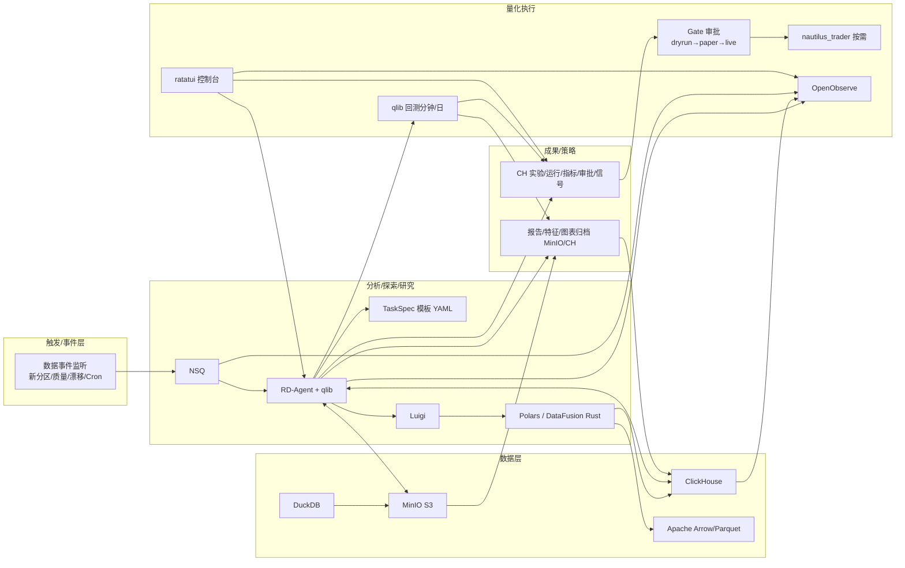
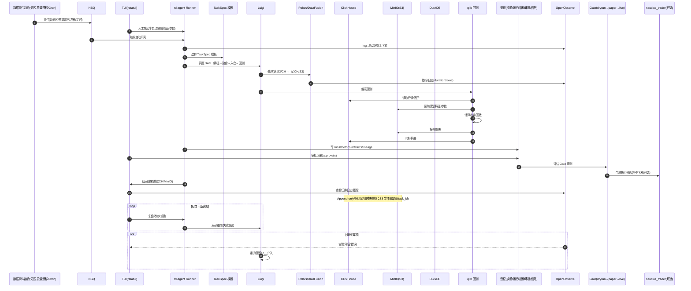
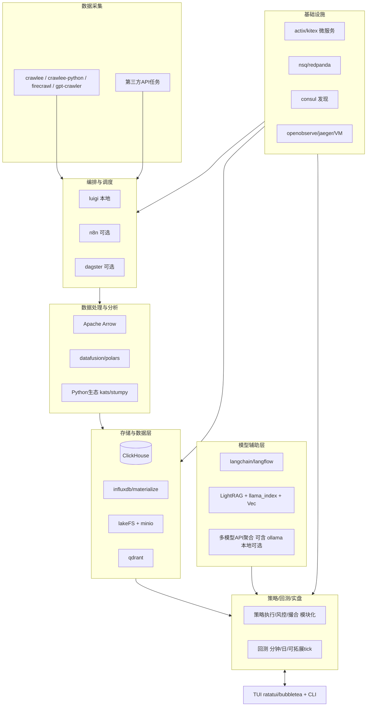

### Qraft 设计方案（GPT5 Cursor 版）

#### 目标与非目标
- **目标**: 面向个人的高性能、轻量化、专业可扩展的量化研究与交易一体平台；在有限资源下实现强功能/高效率/低成本；提供可持续演进的模块化架构与可插拔数据/策略能力。
- **非目标**: 不做重型企业级全家桶；不强制 Web 门户；避免大而全与高耦合设计。

#### 关键原则（来自需求约束）
- **语言优先级**: 核心与基础设施优先 Rust/Go/C++；分析生态兼顾 Python/TS，julia。  
- **表现形式**: 以终端 TUI 为主（优先 ratatui/bubbletea），可选桌面（tauri）与 Web 工具仅作扩展。  
- **数据中台**: 具备数据源管理、ETL/ELT、元数据与版本管理、数据仓库与向量检索；强调治理但保持轻量可选。  
- **大模型协作**: 重任务优先外部 API，多模型比对与投票；支持检索增强与工作流化使用。

---

### 交互顺序与极简四层闭环（最佳实践）

为贴合“轻量化、极致性能、稳定、可扩展、并发无竟态”和语言优先级（Rust/C++/Go/Python/Julia/TS），采用按交互顺序收敛的四层闭环：数据 → 分析/探索/研究 → 成果/策略 → 量化执行。

- 数据层（Data）
  - ClickHouse（C++，主仓）、MinIO（Go，对象湖/S3）、DuckDB（C++，即席）
  - 统一格式：Apache Arrow/Parquet（跨语言零拷边界）
- 分析/探索/研究（Analysis/Explore/Research）
  - 计算：Apache Arrow + Polars/DataFusion（Rust 主导）
  - 编排：Luigi（Python，轻依赖/可重跑）
  - 任务分发：NSQ（Go，轻量稳定）
  - 研究中枢：RD-Agent + qlib（Python 胶水，可按热点用 PyO3 并入 Rust 算子）
- 成果/策略（Outcome）
  - 产出归档：结果与特征入 MinIO/CH
  - 轻元数据：以表+约定目录起步（后续再评估 OpenMetadata）
- 量化执行（Execution）
  - 回测：qlib（分钟/日）
  - 低延迟/实盘（按需）：nautilus_trader（Rust+Python）
  - 可观测：OpenObserve（Rust，一体化日志/指标/追踪）
  - 交互：ratatui（Rust，TUI 控制台）

- 升级/替代触发阈值（摘）
  - NSQ → Redpanda：消息吞吐持续 > 5万/s 或需 Kafka 生态/分层存储
  - 引入 Qdrant（RAG）：知识库/文档问答明确增益且规模 > 10 万段
  - 引入 Cube（语义层）：多角色共享指标/自助报表（>5 人/跨项目）
  - 引入 lakeFS：合规审计/版本分支/对账诉求明确
  - 引入 VictoriaMetrics/Prom：PromQL/遗留面板统一诉求
  - 上 nautilus_trader：低延迟仿真/实盘或 Tick 级高保真成为硬需求

- 与语言优先级契合：
  - Rust/C++/Go 处于核心路径（Polars/DataFusion、ClickHouse、MinIO、NSQ、ratatui、OpenObserve）
  - Python 仅作研究胶水（RD-Agent/qlib/Luigi），热点可用 PyO3 并入 Rust 算子

#### 极简四层闭环 · 时序图（端到端交互）

#### 交互成立性反思（要点）

- 数据一致性与幂等：CH 批量/分区/临时表交换；S3 以 Parquet Append-only 与 task_id 命名避免并发覆写。
- 编排与消息：Luigi 单编排中心；NSQ 至少一次投递，任务需幂等（输出存在即跳过/覆盖安全）。
- 观测与回压：OpenObserve 批量写入；高负载时降级非关键日志，保留关键指标与错误。
- 计算资源：Polars 默认启用，流式/分块处理；超内存退回 CH SQL；DataFusion 按需打开。
- 回测与执行边界：qlib 负责分钟/日；nautilus_trader 仅在低延迟/实盘触发，边界以 gRPC/IPC 解耦。

---

### 扩展总体架构（可选）

---

### 模块设计

#### 1) 数据采集（爬取/抓取/拉取）
- **主选**: `crawlee-python`(Python 简洁可维护)、`crawlee`(TS 生态)；结合 `firecrawl` 与 `gpt-crawler` 做 AI 辅助采集。  
- **设计**: 每个数据源一个“采集模块包”，遵循统一的输入/输出协议（源配置 + 提取逻辑 + 数据落库），通过编排器触发、重试与告警。

#### 2) 数据存储与治理
- **结构化/分析仓库**: 主选 `ClickHouse`（成熟、查询强、社区活跃）；备选 `databend`（云原生、弹性）。  
- **时序/流表**: `influxdb`（TS）、`materialize`（流式 SQL）按场景选用。  
- **对象与湖**: `minio` + `lakeFS` 支持数据湖与版本控制（Parquet/CSV 等）。  
- **向量检索**: `qdrant`（轻量好用）；RAG 侧配合。  
- **元数据/治理可选**: `OpenMetadata`（完整但偏重，单机可简化部署），轻场景可仅保留数据目录与数据字典表。

#### 3) 数据处理与特征工程
- **列式内存与计算**: `Apache Arrow` 作为统一内存格式；`datafusion/polars` 进行高性能变换。  
- **Python 分析**: `kats`/`stumpy` 用于时间序列建模与相似度；与 Arrow 互通。  
- **SQL 增强**: `PRQL` 提升可读性（可编译为 SQL）。

#### 4) 编排与调度
- **本地主选**: `luigi`（轻量、脚本化友好），支持依赖关系、状态落盘、重跑。  
- **可选 GUI**: `n8n`（轻量工作流 UI）；需要更强数据资产编排可选 `dagster`。  
- **定时与分发**: cron/Systemd + `nsq` 作为轻量队列。中长期可接入 `nomad` 进行分布式作业调度（可选）。

#### 5) 策略、回测与实盘
- **策略引擎**: 分层解耦（数据提供器/信号/风控/撮合/成本模型）。回测支持分钟/日，tick 作为后续增强。  
- **实现**: 核心撮合/回放用 Rust，策略胶水用 Python；通过 FFI/IPC/gRPC 解耦。  
- **交易连接器**: 以“适配器”形式接入各交易所 API（后续选型与实现）。

#### 6) 大模型协作与 RAG
- **工作流**: `langchain` 为统一抽象，`langflow` 可视化（可选）；检索增强 `LightRAG + llama_index + qdrant`。  
- **模型来源**: 以云端 API 为主（GPT、Claude、Qwen 等）；本地 `ollama` 可选。  
- **策略**: 重任务交给大模型（分析/生成）、轻任务本地直算；多模型投票/一致性校验作为可选能力。
 - **调用观测（可选）**: 接入 `Helicone` 记录提示词、延迟与成本，支持路由与 A/B；与 OpenObserve 指标联动。

#### 7) 观测与运维
- **日志/指标/追踪**: `openobserve` 统一可观测平台（日志/指标/追踪），`jaeger` 链路，`VictoriaMetrics` 指标 DB。  
- **服务发现与配置**: `consul`。负载入口与限流/熔断可用 `easegress/trae-agent`（可选）。

#### 8) 交互层（TUI/CLI）
- **TUI 主选**: Rust `ratatui`（或 Go `bubbletea`）。
- **设计**: 面板化信息架构：数据源、作业编排、数据资产、研究实验（版本）、策略/回测、RAG 助手、系统状态。支持快捷键/面包屑/搜索。

---

### 技术选型主备及理由

#### 存储与检索
- **ClickHouse（主）**: 性能成熟、生态完善、社区活跃，适合个人与扩展；  
- **Databend（备）**: 云原生弹性强，适合云端按需；  
- **influxdb/materialize（场景）**: 时序与流式 SQL；  
- **qdrant（主）**: 轻量、易部署；  
- **minio + lakeFS（主）**: 本地对象与版本治理；  
- 其它：`doris/ClickHouse` 二选一按查询负载偏好。

#### 采集与编排
- **crawlee-python + firecrawl/gpt-crawler（主）**: 快速搭建与 AI 辅助抽取；  
- **luigi（主）**: 轻、代码友好；`n8n/dagster（备）` 提供 GUI/企业级编排选项；  
- **nsq（主） / redpanda（备）**: 单机优先 nsq，重流量用 redpanda。

#### 计算与分析
- **Arrow + datafusion/polars（主）**: 高性能、跨语言；  
- **kats/stumpy（主）**: 时间序列与相似度；  
- **PRQL（备）**: 提升可读性与协作。

#### 服务与通讯
- **actix（主）/ kitex（备）**: Rust/Go 微服务；  
- **consul（主）**: 服务发现；  
- **easegress/trae-agent（可选）**: 网关与流量治理。

#### 观测
- **openobserve（主）** 一站式；`jaeger + VictoriaMetrics` 为细分组件补充。

#### 交互
- **ratatui（主）/ bubbletea（备）**: 终端优先；  
- **tauri（可选）**: 未来桌面化打包。

#### LLM 协作
- **langchain（主） + LightRAG + llama_index + qdrant**：统一抽象、RAG 能力；  
- **langflow（可选）**: 可视化编排；  
- **ollama（可选）**: 本地模型，按实际效果与资源启用。

---

### 数据与实验资产治理
- 数据分层：原始区（Raw，湖，Append-only）→ 处理区（Refined，CH 分区表）→ 特征/宽表（Feature/Wide）→ 实验与报告（Experiment/Report）。
- 标准化：统一列式存储（Parquet/Arrow），统一时间与主键规范；元数据表维护来源、血缘、版本与质量标签。
- 生命周期：冷热分层（minio/lakeFS）、自动归档、索引加速（CH 物化视图/materialize）。

---

### 安全与策略
- 单用户优先，策略可选 `OPA` 约束关键操作（如账户密钥/下单通道/危险任务）。
- 敏感配置分离（本地加密存储），密钥最小权限使用；作业级审计与追踪。

---

### 性能与稳定性
- Rust/Go 实现性能关键路径（撮合/回放/ETL 热点）；Python 仅作胶水与分析模型容器。
- 早期单机内存/IO 画像：基于 CH 分区与列裁剪；批处理优先、向量化执行；异步 IO（tokio/async-std）。

---

### 交付形态与部署
- 优先二进制/脚本直跑（不强制容器）；若上游提供容器则就地使用；组合 Systemd 服务与 cron 定时。  
- 目录规范：`ingest/`、`orchestrate/`、`storage/`、`processing/`、`strategy/`、`ui/`、`llm/`、`infra/`、`scripts/`。

---

### 路线图（MVP → 可用）
- **M0（1-2 周）**: 基础骨架与 TUI 导航；CH + minio + lakeFS 打底；crawlee-python 示例采集 → CH；luigi 跑通；基础观测。
- **M1（2-4 周）**: 数据处理链（Arrow+datafusion/polars）；时间序列工具接入；RAG 最小闭环（llama_index+qdrant）。
- **M2（2-4 周）**: 策略引擎初版（分钟/日级回测）；LLM 辅助研究（langchain）；TUI 深化（资产/作业/RAG 面板）。
- **M3（4+ 周）**: 实盘连接器（优先常用交易所）；流式能力（materialize/NSQ）；可选 n8n/dagster；治理增强（轻元数据/数据质量）。

---

### 开源项目备选清单与理由（按模块）

#### 存储/检索
- **ClickHouse（主）**: 成熟高性能 OLAP，列式引擎适配量化分析；社区活跃；
- **Databend（备）**: 云原生弹性强，面向云端成本友好；
- **influxdb/materialize（场景）**: 时序/流式 SQL；
- **qdrant（主）**: 轻量易用，个人部署友好；
- **minio + lakeFS（主）**: 本地对象与数据湖版本管理；
- **OpenMetadata（备）**: 完整治理能力，按需开启。

#### 编排/消息
- **luigi（主）**: 轻、无侵入；
- **n8n（备）**: 可视化工作流；
- **dagster（备）**: 数据资产/类型系统友好；
- **nsq（主）/ redpanda（备）**: 轻量 MQ / 高吞吐流平台。

#### 处理/分析
- **Arrow + datafusion/polars（主）**: 高性能、跨语言；
- **kats/stumpy（主）**: 时间序列工具箱；
- **PRQL（备）**: 人类友好 SQL 表达。

#### 采集
- **crawlee-python / crawlee（主）**: 生态完备；
- **firecrawl / gpt-crawler（备）**: AI 辅助抽取复杂页面与内容聚合。

#### 服务/网关/发现
- **actix/kitex（主/备）**: Rust/Go 选型灵活；
- **consul（主）**: 轻量服务发现；
- **easegress/trae-agent（可选）**: 网关与流量治理。

#### 观测
- **openobserve（主）** 一体化；
- **jaeger + VictoriaMetrics（备）**: 追踪/指标细化。

#### 交互
- **ratatui（主）/ bubbletea（备）**: 终端优先；
- **tauri（可选）**: 桌面化封装。

#### LLM 协作
- **langchain（主） + LightRAG + llama_index + qdrant**；
- **langflow（备）** 可视化；
- **ollama（可选）** 本地模型。

---

### 风险与缓解
- CH 写放大与磁盘占用：冷热分层 + 物化视图；
- 多语言混合复杂度：以 Arrow/IPC 与 gRPC 统一边界；
- 观测系统偏重：单机用 openobserve 轻量部署，数据留存周期短；
- LLM 质量波动：多模型投票 + 人在回路；
- 交易接入合规：密钥最小权限，模拟盘先行，灰度放量。

---

### 增量调整（基于阶段性联网与收敛原则）

- 优先交付“极简MVP线”，在单机/轻运维前提下确保高可用与高性能；将其余组件归入“可扩展增强线”，以触发阈值按需启用。
- 收敛观测栈为单一方案优先：OpenObserve 先行，一体化承担日志/指标/追踪，后续如需深度 Prom 生态再补 VictoriaMetrics。
- 收敛消息与流：初期 NSQ（单二进制、稳定、足够）；高吞吐/强一致性再切 Redpanda；实时派生指标显著时引入 Materialize。
- 数据湖版本：先 MinIO + 规范化前缀/快照，满足治理/审计明确诉求后再引入 lakeFS。
- 仓库：ClickHouse 为主；云上弹性/对象存储强依赖时再评估 Databend 作为升级。
- 向量：Qdrant 作为主选；全文检索需求明确再上 Meilisearch。
- 编排：Luigi（代码友好、轻），GUI/资产驱动强诉求再选 n8n/Dagster。
- LLM/RAG：langchain + llama_index + Qdrant 最小闭环；如需“多模型/知识库/工作流”开箱，优先外挂 Dify/FastGPT（API对接），本地模型再启用 ollama。

---

### 极简 MVP 线（建议首期落地）

- 存储：ClickHouse（主），MinIO（对象存储）
- 向量：Qdrant（RAG 检索）
- 消息：NSQ（任务/事件分发）
- 处理：Apache Arrow + DataFusion/Polars
- 编排：Luigi（Cron + Luigi 重跑/依赖）
- 观测：OpenObserve（日志/指标/追踪一体）
- LLM/RAG：langchain + llama_index + Qdrant（可选外挂 Dify/FastGPT）
- UI：TUI（ratatui 为主）

- 即席分析：DuckDB（本地单文件/零运维，适合临时/交互式小数据）

理由：组件数量最小、文档与社区成熟、单机自托管友好、演进空间大。

---

### 可扩展增强线（按需启用）

- 流与消息：Redpanda（替 NSQ，Kafka 兼容，单机可用，后续横向扩展）
- 实时视图：Materialize（低延迟派生指标/实时聚合）
- 湖与版本：lakeFS（对象版本/分支/审计）
- 仓库备选：Databend（对象存储 + 计算分离的云原生弹性）
- 全文检索：Meilisearch（站内与知识库全文检索）
- 观测增强：VictoriaMetrics/Prom 生态（如需 PromQL/现有仪表盘迁移）
- 编排 GUI/资产：n8n/Dagster（可视化工作流/资产编排）
- 无服务器交付：Shuttle（Rust 服务快速上线）
- LLM 托管：ollama（本地模型）/ Dify/FastGPT（对话/KB/路由开箱）

 - LLM 调用观测：Helicone（模型调用监控/成本统计/路由，外挂，不改内核）
 - 模型服务层：BentoML（自托管推理网关/批量部署/AB 路由，按需启用）

- 缓存：Dragonfly（会话/热点指标/短期中间态缓存）
- 通知聚合：Novu（任务失败/风控告警/策略完成通知）
- 列式+向量一体：Lance（RAG 语料与嵌入统一管理，侧车，不替代 CH/MinIO）
- 开发/部署外挂：gitea / code-server / coolify（外部工具，不入内核）
- Web 门户增强（外挂）：Supabase / Appwrite / PocketBase（账号/协作/多端访问）

- 实时推送：Centrifugo（Web 实时订阅/推送，TUI/Web 扩展场景）
- 数据语义/BI：Cube（语义层API）、Metabase（轻BI/自助报表）
- 数据科学管线：Kedro（可复现实验管线/模板化，作为 Luigi 下游 Task）
- 数据App/报告：Evidence（Markdown 驱动 Data Apps/报告，轻交付）
- 元数据/血缘：OpenMetadata（>100 数据集或合规/血缘诉求时小步引入）
- 外部数据侧车：OpenBB（数据拉取/分析 CLI/SDK，非内核）

- 本地向量加速：FAISS（CPU/GPU 本地相似检索/批量评测侧车）
- Web 可视分析：Perspective（浏览器/桌面大表格与实时交互）
- C++ TUI 备选：FTXUI（C++ 生态的终端 UI）
- Web 前端备选：Leptos（Rust SSR/CSR，Web Portal 场景）
- 仓库对照评估：CockroachDB / Doris / OceanBase / CrateDB（仅作对照与迁移评估）
 
 - 并行/分布式计算：Dask（跨进程/多节点任务；由 Luigi 调度 Dask 项目，避免双编排中心）

---

### 量化栈增补（交易接入/行情/回测）

- 交易接入适配层
  - 核心不绑定第三方框架，采用“接口 + 适配器”模式，边界以 gRPC/IPC 定义；策略层可选 Python 侧车。
  - 首选路径：常用交易所自研轻适配；接入国内券商/期货或多市场协同时外挂 `vn.py` 侧车；参考 `nautilus_trader` 的接口/回放设计。
  - 安全：密钥最小权限、本地加密存储、环境隔离。
- 行情数据
  - 优先 `akshare`/`OpenBB`/自研采集；落地 `ClickHouse/MinIO`；标的/日历/行业分类采用 `FinanceDatabase`。
  - 统一列式/时区/标的规范，便于回放与跨市场对齐。
- 回测与撮合
  - Rust 自研内核：先分钟/日，Tick 作为增强；撮合、滑点/费用模型、风控模块化；支持事件回放与断点恢复。
  - 兼容性：提供数据/策略导入导出，与 `Lean/backtrader/qlib` 生态互导，但不引入其框架为内核依赖。
- 研究与工具
  - `FinRL/qlib` 作为实验侧车；`QuantLib` 以工具库方式提供利率/曲线/日历等定价组件。
- 升级触发建议
  - 当接入目标市场/券商/交易所 > 3，或需要国内券商/期货，或下单链路延迟目标 < 10ms：启用 `vn.py` 侧车并固化 gRPC 边界。
  - 当需要 Tick 级高保真/跨市场组合/复杂撮合：增强自研内核的 Tick/回放；仍以自研为主，外部框架仅做参考与互导。

---

### 替代矩阵与触发阈值（示例）

| 领域 | 现用 | 替代/增强 | 触发阈值（任一满足） | 备注 |
| --- | --- | --- | --- | --- |
| 消息/流 | NSQ | Redpanda | 消息吞吐 > 50k/s；跨服务一致性加强；需要 Kafka 生态 | 保持接口抽象，便于平滑切换 |
| 实时视图 | 无 | Materialize | 实时派生指标 > 10k/s 或 <500ms 延迟目标 | 与 CH 批式互补 |
| 仓库 | ClickHouse | Databend | 强对象存储依赖；计算存储分离/上云弹性；多租/成本优先 | 同步链路保持 Arrow/Parquet |
| 湖版本 | MinIO | lakeFS | 合规/审计/版本分支管理诉求明确 | 先以命名/快照治理 |
| 搜索 | 无/CH 简易 | Meilisearch | 全文检索/召回与相关性显著诉求 | 与 Qdrant 共同服务 KB |
| 观测 | OpenObserve | +VictoriaMetrics | 强 Prom 生态/遗留仪表盘迁移 | 仍以 OO 为汇聚层 |
| 编排 | Luigi | n8n/Dagster | 需要 GUI/资产编排/更强类型与监管 | Luigi 保持核心脚本入口 |
| LLM | LC+LI+Qdrant | Dify/FastGPT/ollama | 多模型/KB/路由即用；离线本地化 | 先外挂，后内化 |
| UI | ratatui | bubbletea/tauri | 需 Go 生态/桌面封装 | TUI 为主，桌面为辅 |

| 采集/集成 | 轻量自研采集脚本 | Airbyte/SeaTunnel | 连接器数 > 12；或日入湖 > 50GB；或7日平均失败率 > 1% | 异构源规模化接入与可观测/重试需求增强 |
| LLM 产品化 | LC+LI+Qdrant | Dify/FastGPT | 需要多模型编排/KB 协作；或需要“对话/工单化”UI 与运营 | 先外挂服务，成熟后再考虑内化 |

| 交易接入 | 自研轻适配（Rust 核心，Python 侧车可选） | vn.py / nautilus_trader / StockSharp | 接入目标市场/券商/交易所 > 3；需国内券商/期货；或下单链路延迟目标 < 10ms | 侧车隔离与最小权限；边界 gRPC/IPC，便于迁移 |
| 回测/撮合 | 自研 Rust 内核（分钟/日） | Tick/事件回放增强；或 Lean/backtrader 仅作数据/策略互导 | 需要 Tick 级高保真/跨市场组合/复杂撮合 | 保持数据/订单接口稳定，生态只读互导 |

| 缓存 | 无 | Dragonfly | 会话/热点指标QPS > 5k/s；或需 Redis 协议；或回测/风控需低延迟中间态 | 仅缓存/会话，不做强一致存储 |
| 通知 | 无 | Novu | 作业量 > 200/日；需多渠道通知/抑制/模板化 | 事件驱动，和编排/观测对接 |
| 列式+向量 | Parquet + Qdrant | Lance | KB 切块 > 5e5；频繁重嵌入；同仓管理诉求 | 试点侧车，不替代 CH/MinIO |
| Web 后端 | 无 | Supabase/Appwrite/PocketBase | 多用户/远程访问/移动端需求明确 | 外挂服务，避免耦合内核 |

| 实时推送 | 无 | Centrifugo | 需要 Web 实时订阅/推送；或≥1k 并发订阅 | 仅 Web 侧，内核仍走 NSQ/Redpanda |
| 语义/BI | 无 | Cube/Metabase | 需要自助报表/语义层；干系人可视化需求明确 | 直连 CH，不改内核数据路径 |
| DS 管线 | Luigi | Kedro | 复现实验管线/模板化需求强 | Luigi 调度 Kedro，避免双编排中心 |
| 数据App/报告 | 无 | Evidence | 报告可视化/分享诉求；轻交付 | 直接读 CH/MinIO 出报表 |
| 元数据/血缘 | 目录/字典表 | OpenMetadata | 数据集 > 100；需血缘/合规审计 | 轻量部署，逐步接入源 |
| 量化互导 | 原生格式 | QUANTAXIS/StockSharp 互导 | 需要导入遗留策略/数据格式 | 工具链互导，不引入其内核 |

| 模型观测 | 无 | Helicone | 需要统一记录 Prompt/成本/延迟；多模型路由评测 | 外挂，仅采集调用指标，与 OO 联动 |
| 模型服务 | 直调云API/本地 | BentoML | 需要统一推理网关/批量部署/AB 路由 | 外挂服务层，不改内核 API |

| 本地向量 | 无 | FAISS | 本地离线批量评测/回归；或需 GPU 向量加速 | Qdrant 仍对外服务；FAISS 仅作加速/评测 |
| Web 可视 | 无 | Perspective | 浏览器大表格/增量渲染/交互面板 | 直连 CH，不改内核路径 |
| C++ TUI | ratatui | FTXUI | 选择 C++ 生态或与 C++ 内核强耦合 | 仅替换 UI 层，不改业务边界 |
| Web 前端 | 无 | Leptos | 出现 Web Portal/远程协作诉求 | 与 TUI 并行，Web 为增强 |
| 仓库对照 | ClickHouse | Cockroach/Doris/OceanBase/Crate | 强一致/多主/复杂 MPP/合规 | 以对照评估为主，不替换 CH |

注：阈值需结合实际机器与数据画像微调，建议在试运行期间用 OpenObserve 建立基线，再校准数值。
观测栈原则：OpenObserve 为汇聚层；如引入 Prom 生态，仅增补 VictoriaMetrics/Exporter，不改变汇聚路径。
事件闭环注记：Novu 作为通知聚合可与 NSQ/Redpanda 打通，事件入 OO 以留痕与追踪。
RAG 侧车注记：若引入 Lance，仅作为 KB 管理侧车，Qdrant 仍负责检索服务，对外 API 不变。
Kedro as Task：以 Luigi 作为唯一编排中心，Kedro 项目作为 Task 执行；产物/日志统一入 OpenObserve 与 CH。
Centrifugo 仅 Web 侧：仅承担 TUI/Web 实时推送，不替代 NSQ/Redpanda；事件仍通过 MQ 汇聚再入 OO。
Cube/Metabase 直连仓：语义/BI 工具直连 ClickHouse/MinIO，不改内核数据路径与治理边界。
OpenMetadata 渐进式：先接入仓表/湖区与任务产物，逐步启用血缘/质量规则，避免一次性重。
FAISS 侧车：仅用于本地加速/离线评测，不暴露为主检索服务；对外检索仍由 Qdrant 承担。
Perspective 直连：Perspective/Cube/Metabase/Evidence 等可视层均直连 CH/MinIO，遵循“读仓不改内核”原则。
仓库对照评估：CockroachDB/Doris/OceanBase/CrateDB 仅作对照与迁移评审，满足强一致/多主/合规等硬约束再评替换。

---

### 阶段性联网结果（摘要）

- 存储/湖/检索：ClickHouse、MinIO、Qdrant 仍为个人/轻运维首选；Databend/Materialize/lakeFS 建议按需增强。
- 流与消息：NSQ 在个人单机足够；Redpanda 作为升级路径（Kafka 生态/高吞吐/低延迟）。
- 观测：OpenObserve 一体化落地成本最低；如需 PromQL/遗留整合再补 VictoriaMetrics。
- 处理与分析：Arrow + DataFusion/Polars 持续活跃，跨语言与高性能并重。
- 编排：Luigi 轻且脚本友好；n8n/Dagster 更适合 GUI/资产导向的扩展阶段。
- LLM/RAG：langchain/llama_index 更新活跃；外挂 Dify/FastGPT 可快速提供 KB/多模型能力；ollama 本地化视资源决定。

---