我帮你把这 16 个开源聊天、Agent、IM 与相关生态工具项目做了一个全面分析与对比，涵盖 **功能定位**、**技术语言**、**核心特色**、**适用场景** 和 **差异化优势**，并整理成表格方便横向对照。

---

## 全面分析与对比

| 项目                               | 语言         | 功能定位                   | 核心特色                  | 典型场景                      |
| -------------------------------- | ---------- | ---------------------- | --------------------- | ------------------------- |
| **botpress**                     | JavaScript | 聊天机器人框架 & Agent 构建平台   | 模块化对话流、NLP集成、多渠道部署    | 企业客服、FAQ机器人、内部助理          |
| **UI-TARS-desktop**              | JavaScript | 多模态 AI Agent 堆栈        | 多模态输入（文本/语音/图像）、桌面端集成 | 本地运行的智能助手、多模态交互应用         |
| **NextChat**                     | TypeScript | 多端 AI Agent            | 支持桌面/Web/移动端、可连接多模型   | 跨平台个人AI助理                 |
| **typebot.io**                   | TypeScript | 聊天机器人构建平台              | 拖拽式流程设计、支持嵌入到网站/App   | 营销对话流、用户引导                |
| **simplex-chat**                 | Haskell    | 隐私聊天应用                 | 端到端加密、去中心化传输          | 高安全性IM、隐私通信               |
| **Rocket.Chat**                  | JavaScript | 开源可定制通信平台              | 团队协作、视频通话、插件扩展        | 企业内部通信、社区IM               |
| **novu**                         | TypeScript | 多渠道通知 API              | 一次集成、多渠道推送（邮件、短信、IM）  | SaaS平台消息中心                |
| **chatwoot**                     | Ruby       | 客户支持平台                 | 多渠道工单、客服协作、CRM集成      | 客服团队、呼叫中心                 |
| **wechaty**                      | TypeScript | 聊天机器人框架                | 支持微信/WhatsApp等多平台     | 社交平台自动化运营                 |
| **ChatALL**                      | JavaScript | 多模型聊天平台                | 同时向多个AI模型发送问题并对比回答    | AI模型横向评测                  |
| **lobe-chat**                    | TypeScript | ChatGPT/LLM UI 框架      | 插件化架构、多模型支持           | 自建LLM聊天应用                 |
| **ChatAny**                      | TypeScript | 多模型聊天平台                | 聊天上下文管理、可切换模型         | 开发者调试不同LLM                |
| **Perplexica**                   | TypeScript | AI搜索引擎                 | LLM + 网络搜索、资料总结       | AI驱动的知识检索                 |
| **LangBot**                      | Python     | LLM IM机器人平台            | 即时通讯集成、LLM交互封装        | Telegram/Slack/Discord机器人 |
| **kirara-ai**                    | Python     | 聊天机器人                  | 多模型接口、角色扮演            | 娱乐型对话、虚拟助手                |
| **chatgpt-web-midjourney-proxy** | JavaScript | ChatGPT + MidJourney代理 | 一站式AI对话与绘图            | 聊天+生成式图像服务                |

---

## 核心功能对比矩阵

| 功能类别            | 典型代表                                               | 特征                                 |
| --------------- | -------------------------------------------------- | ---------------------------------- |
| **聊天机器人框架**     | botpress、wechaty、LangBot、kirara-ai                 | 提供 API/SDK，方便构建多平台对话机器人，支持 NLP/LLM |
| **多模态/多模型聊天平台** | UI-TARS-desktop、NextChat、ChatALL、ChatAny、lobe-chat | 跨模型聊天、模型切换、多模态（文本/语音/图像）输入输出       |
| **企业级通信与客服**    | Rocket.Chat、chatwoot、typebot.io                    | 团队协作、客服工单、可嵌入网站或企业系统               |
| **隐私/安全通信**     | simplex-chat                                       | 去中心化、端到端加密，适合敏感信息传输                |
| **通知与消息推送**     | novu                                               | 统一API，多渠道推送，支持队列和模板                |
| **AI 搜索引擎**     | Perplexica                                         | LLM+搜索引擎结合，支持网页总结与信息抽取             |
| **AI绘图集成**      | chatgpt-web-midjourney-proxy                       | 将对话与图像生成（MJ）打通                     |

---

## 差异化亮点

* **企业客服领域**：`chatwoot` 和 `botpress` 更偏客服业务，`Rocket.Chat` 偏协作与内部IM。
* **多模型聊天体验**：`ChatALL` 和 `ChatAny` 强调对比不同AI模型，`lobe-chat` 更注重插件和自定义UI。
* **隐私与安全**：`simplex-chat` 专注于去中心化与加密，而其他平台大多走云端架构。
* **多模态支持**：`UI-TARS-desktop` 是少数开源项目中原生支持多模态交互的桌面方案。
* **垂直场景集成**：`chatgpt-web-midjourney-proxy` 将 LLM 聊天和图像生成服务融合，`Perplexica` 将 LLM 和搜索引擎结合。

---

如果你需要，我可以帮你把这些项目再做一版 **Mermaid 架构关系图**，用功能类别来分层，把它们放进 Qraft 的 Agent/对话/通信生态布局里，这样你一眼就能看到谁属于哪一类、怎么组合成完整系统。
这样你在做 Qraft 的 Agent 模块时就能直接选型。

好的，我给你画一版基于 **功能类别分层** 的 Mermaid 架构关系图，把这些聊天、Agent、通信、搜索等开源项目放进 Qraft 生态视角中。

```mermaid
graph TD
    A[Qraft AI 生态] --> B[对话与Agent框架]
    A --> C[多模型/多模态聊天平台]
    A --> D[企业通信与客服]
    A --> E[隐私与安全通信]
    A --> F[通知与消息推送]
    A --> G[AI搜索与知识检索]
    A --> H[AI绘图与多模态集成]

    %% 对话与Agent框架
    B --> B1[botpress<br/>JS]
    B --> B2[wechaty<br/>TS]
    B --> B3[LangBot<br/>Python]
    B --> B4[kirara-ai<br/>Python]

    %% 多模型/多模态聊天平台
    C --> C1[UI-TARS-desktop<br/>JS]
    C --> C2[NextChat<br/>TS]
    C --> C3[ChatALL<br/>JS]
    C --> C4[ChatAny<br/>TS]
    C --> C5[lobe-chat<br/>TS]

    %% 企业通信与客服
    D --> D1[Rocket.Chat<br/>JS]
    D --> D2[chatwoot<br/>Ruby]
    D --> D3[typebot.io<br/>TS]

    %% 隐私与安全通信
    E --> E1[simplex-chat<br/>Haskell]

    %% 通知与消息推送
    F --> F1[novu<br/>TS]

    %% AI搜索与知识检索
    G --> G1[Perplexica<br/>TS]

    %% AI绘图与多模态集成
    H --> H1[chatgpt-web-midjourney-proxy<br/>JS]

    style A fill:#0f2537,stroke:#0f2537,color:#fff
    style B fill:#1d4ed8,stroke:#1e3a8a,color:#fff
    style C fill:#2563eb,stroke:#1e40af,color:#fff
    style D fill:#0284c7,stroke:#075985,color:#fff
    style E fill:#0d9488,stroke:#134e4a,color:#fff
    style F fill:#16a34a,stroke:#166534,color:#fff
    style G fill:#ca8a04,stroke:#78350f,color:#fff
    style H fill:#9333ea,stroke:#581c87,color:#fff
```

这个图的设计思路是：

* **Qraft AI 生态** 顶层
* 按功能类别分为 7 个主要模块
* 每个模块下列出代表性的开源项目（带语言标签）
* 颜色区分模块类别，方便视觉识别

---

如果你需要，我可以再帮你做一个 **扩展版**，把这些项目之间可能的 **组合路径**（比如 `LangBot` + `novu` + `Perplexica` 组合成智能问答+多渠道推送）画出来，让它变成可执行的选型图。
这样不仅知道谁在哪一类，还知道怎么搭配成完整方案。
