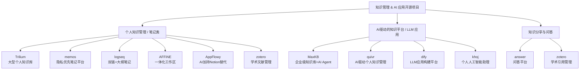

# Qraft 用—知识管理 / Agent / 笔记 与 小型 GenAI 平台 ——全面对比与落地建议

下面把你列的 11 个项目按 **定位、技术栈、核心能力、优势、局限、典型场景、以及在 Qraft 中的推荐角色/整合方式** 做成紧凑而实用的对比，最后给出**优先采纳建议 + 集成要点**。便于你在“面向个体用户、轻而精”的 Qraft 设计原则下做决策。

---

## 快览表（一目了然）

| 项目                  |             语言 | 定位（一句话）                | 适合（单用户/多用户） |      LLM/RAG 友好 | 部署难度 |
| ------------------- | -------------: | ---------------------- | ----------: | --------------: | ---: |
| **Trilium**         |     TypeScript | 大型个人知识库（层级笔记+关系）       |     单用户→小团队 |       中（需外接向量化） |  低→中 |
| **MaxKB**           |         Python | 企业级代理/知识库平台（Agent 管理）  |    多用户 / 企业 | 高（内置 RAG/agent） |  中→高 |
| **quivr**           |         Python | 面向 RAG 的知识库 + 简单 UI    |     单用户/小团队 |    高（内建向量索引/上传） |    低 |
| **memos**           |             Go | 隐私优先的轻量笔记/知识库          |    个人 / 小团队 |          低（可集成） |    低 |
| **AFFiNE**          |     TypeScript | 一体化协作工作区（Notion 类）     |       多用户协作 |               中 |    中 |
| **AppFlowy**        | Dart (Flutter) | 开源 Notion 替代，桌面/移动     |     单用户→小团队 |         中（插件可扩） |    中 |
| **logseq**          |  ClojureScript | 本地优先大纲/笔记/知识图谱         |   单用户（本地优先） |         中（插件生态） |  低→中 |
| **answer (Apache)** |             Go | 问答平台（社区/企业 Q\&A）       |         多用户 |             低→中 |    中 |
| **zotero**          |     JavaScript | 研究级参考管理（书目/引用）         |    个人 / 小团队 |     低（可导出供 RAG） |    低 |
| **dify**            |     TypeScript | LLM 应用开发平台（RAG/部署）     |      单用户→团队 |    高（专为 LLM 应用） |    中 |
| **khoj**            |         Python | 个人/小型 AI 应用/模型托管 + RAG |   单用户/实验性团队 |       高（面向 LLM） |  低→中 |

---

## 单项详解（便于选型）

### 1. **Trilium**

* **定位**：功能强大的个人知识库，支持分层结构、富文本、标签、脚本化、web clipper 与版本历史。
* **优势**：非常适合“长期沉淀”的个人研究笔记；结构化层级与强关系建模适合复杂研究。
* **局限**：UI 稍陈旧；多人实时协作功能弱；LLM/RAG 需外部引擎与索引接入（导出/同步到向量库）。
* **Qraft 角色**：用作“个人分析资产库（原始/中间数据 + 实验记录）”，对接导出器把笔记同步到 MinIO → 向量化入 Qdrant/FAISS → 供 RAG 使用。

### 2. **MaxKB**

* **定位**：企业级知识代理平台（面向多用户、代理管理、自动问答）。
* **优势**：内置知识治理、ACL、多源接入、Agent 管理；开箱适合企业级 RAG/agent。
* **局限**：运维和资源成本更高；可能超出“个体优先”目标（但可裁剪）。
* **Qraft 角色**：当 Qraft 提供“托管/云服务”给付费个人用户时，可作为后台知识/agent 管理层；否则对个人用户显得臃肿。

### 3. **quivr**

* **定位**：轻量 RAG/GenAI 知识库，强调上传文件、快速检索与向量化。
* **优势**：上手快、界面直观、适合把研究材料快速转向可检索知识。
* **局限**：功能较聚焦（不是通用笔记），功能深度不足但足够做 RAG。
* **Qraft 角色**：**首选**的“快速 RAG 驱动知识接入器”——适合个体把数据快速加入检索管线（本地或云端），然后由 Qraft 的向量层和 Agent 层消费。

### 4. **memos**

* **定位**：隐私优先的轻量笔记/知识管理（Go 实现，极简、快速）。
* **优势**：轻量、私密、适合命令行 / 终端场景，部署简单。
* **局限**：并非专为 RAG/LLM 设计；功能精简。
* **Qraft 角色**：作为“低开销的、终端优先笔记存储”，对个人用户很友好。可定期同步到 RAG 管道。

### 5. **AFFiNE**

* **定位**：一体化在线工作区（协作版 Notion/Obsidian 风格）。
* **优势**：富交互、实时协作、组件丰富，适合 GUI 密集型用户。
* **局限**：较重，可能违背“单体/轻量优先”原则。
* **Qraft 角色**：如果未来要提供“桌面协作/可视化工作区”作为可选模块，可考虑；但非首选。

### 6. **AppFlowy**

* **定位**：基于 Flutter 的开源 Notion 替代（桌面与移动端 UX）。
* **优势**：原生体验、离线支持好、UI 感受佳。
* **局限**：仍在丰富功能中；插件与生态不如成熟产品。
* **Qraft 角色**：可作为“桌面端笔记/交互前端”候选，针对那些偏好本地原生应用的个体。

### 7. **logseq**

* **定位**：本地优先的 outliner / 知识图谱（支持 Markdown/Org、本地-first、Git 友好）。
* **优势**：非常贴合研究工作流（可视化、双向链接、本地数据主权），插件生态活跃。
* **局限**：需要用户熟悉大纲笔记范式；直接 RAG 功能需插件。
* **Qraft 角色**：绝佳的“个人研究/实验记录层”——与 Trilium 类似但更偏“笔记本+大纲”风格。非常适合“个体数据科学家”。

### 8. **answer (Apache)**

* **定位**：社区/企业问答平台（类似 StackExchange 类），适合知识共享与 Q\&A。
* **优势**：结构化问答、知识沉淀好、适合社区/组织。
* **局限**：不是个人笔记工具；偏社区产品。
* **Qraft 角色**：当 Qraft 希望提供“FAQ / 公共知识库 / 社区问答”模块时可使用。

### 9. **Zotero**

* **定位**：学术级参考管理工具（采集、注释、引文导出）。
* **优势**：成熟、插件丰富（浏览器抓取、导入 PDF 元数据）、良好的引用格式支持。
* **局限**：并非笔记或 RAG 平台，但可作为来源。
* **Qraft 角色**：研究型用户必备：把 Zotero 的文献/笔记导入 Qraft 的知识层并纳入 RAG 索引（特别适用于研究报告、回测论文引用）。

### 10. **dify**

* **定位**：开源 LLM 应用构建平台（RAG、UI、模型管理）。
* **优势**：面向 LLM 应用开发，内建多模型、插件、向量层兼容。对接方便。
* **局限**：仍在快速演进，需评估稳定性/运营成本。
* **Qraft 角色**：**优秀候选**，作为 Qraft 的“模型/应用编排层” —— 负责多模型管理、API 封装、简单的 UI 接入。

### 11. **khoj**

* **定位**：个人/小团队 AI 应用平台（快速搭建 LLM 接口、展示与调试）。
* **优势**：上手快，适合实验和小规模部署。
* **局限**：面向实验室/个人，企业特性弱。
* **Qraft 角色**：作为“轻量实验台 / 快速 POC”工具，适合用户在本地试验 RAG、LLM prompt、微调小模型。

---

## 对 Qraft 的优先采纳建议（基于“个体优先 / 轻量化 / 高效可扩展”原则）

1. **必须优先（核心组合）**

   * **logseq 或 Trilium**（选择其一或两者并支持导入/同步）：作为个人研究笔记与长期沉淀的主库。
   * **quivr 或 dify**：负责把笔记/文档快速转为 RAG 可用资产（向量化、检索）。quivr 更轻量、dify 更偏平台化/可扩展。
   * **Zotero**：科研/文献支持（导入到 RAG/知识层）。

2. **很有价值（可选，按用户需求启用）**

   * **memos**：对喜欢 CLI/极简私人笔记的用户。
   * **khoj**：快速实验和本地 LLM POC。
   * **answer (Apache)**：当需要社区/FAQ 功能时启用。

3. **非优先/按需（重量/协作需求）**

   * **MaxKB、AFFiNE、AppFlowy**：更偏团队/协作或复杂 UI，若未来提供“云托管的高级用户版”再考虑部署。

---

## 集成建议（具体、可落地）

* **数据流（建议实现）**

  1. 用户笔记（logseq / Trilium / memos / Zotero） → **导出/同步任务** → 存到 `MinIO`（raw docs）
  2. 异步管道（Arroyo / Nuclio）读取新文件 → 文档拆分 + 向量化（embedding） → 写入 `Qdrant` / Faiss（hot） + Lance（cold）
  3. RAG 层（quivr / dify / langchain + llama\_index）查询向量库 → 汇总上下文 → 由模型（transformers / BentoML / remote LLM）返回答案
  4. 所有调用/LLM 使用 `Helicone` + `OpenObserve` 监控（成本、延迟、内容）
  5. 元数据（笔记作者、版本、时间、标签）写入 Postgres（便于治理/追溯）

* **同步与权限**

  * 对于本地-first（logseq/trilium）提供 git 或文件系统同步器，把用户变更推到 Qraft（可选）。
  * 小心个人隐私：允许用户选择哪些笔记上云，哪些仅本地保存（重要）。

* **轻量部署建议**

  * 先上线：`logseq + quivr + qdrant + bento/remote LLM` 的最小可运行产品（MRP）。
  * 后续按需接入：Zotero importer、dify（做为应用编排层）、memos（终端轻量版）。

* **工程细节要点**

  * 文档分片策略：按语义段/段落分片（最长 500–1000 tokens）并存 metadata。
  * 向量维度与索引：使用 1536/2048 的 embedding（视模型），Qdrant 做实时热检索，FAISS 做大规模离线检索。
  * 版本记录：笔记与向量应绑定版本 ID；当笔记更新，作“增量 re-embed”或标记失效再重建。
  * Prompt + 多模型策略：对敏感/重要结论启用“多模型投票/汇总”策略（你提到的多模型冗余）。

---

## 小结（一句话建议）

* 对 **“个体研究者 / 量化个体”**：首推 **logseq（或 Trilium）+ quivr/dify + Qdrant + transformers/BentoML（或云 LLM）** 的组合——既能保证**长期沉淀**（笔记/数据），又能提供**轻量、可控、快速**的 RAG/Agent 助手能力。

---

要不要我：

* A）把上面的**集成数据流**直接绘成 Mermaid（把 logseq/Trilium/quivr/dify/Qdrant/BentoML 等在 Qraft v0.7 图中定位）？
* B）为你生成一份\*\*“最小可运行产品（MRP）清单与部署矩阵”\*\*（包含节点规格、端口、持久化与监控要点）——可马上用于 PoC？

你选 A 或 B（或都要）我就立刻给出可复制的 Mermaid 或部署矩阵。

好的，我会把方案A的分类关系画成 Mermaid 架构关系图，用树状结构直观展现各个开源项目的功能定位。

这个图里我把项目分成三大类：

* **个人知识管理 / 笔记类**：偏重个人数据沉淀与隐私记录
* **AI驱动的知识平台 / LLM 应用**：重点在 AI 赋能与自动化
* **知识分享与问答**：适合开放式或团队知识交流

如果你需要，我还可以再做一版**带功能对比标签的关系图**，让每个节点旁边显示主要特色。这样会更适合用来汇报或做方案对比。
