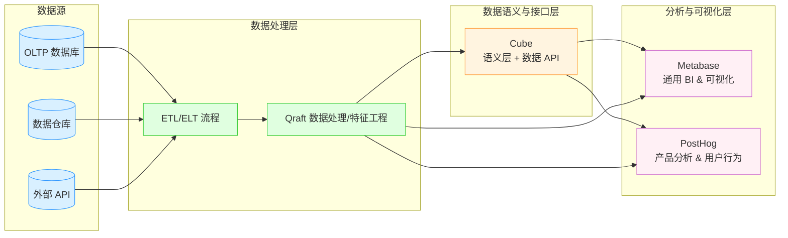

我帮你把 **Metabase**、**Cube**、**PostHog** 三个开源数据分析相关项目做了全面的功能特色对比：

---

## **1. Metabase**

**定位**

* 开源、易用的 BI（Business Intelligence）数据可视化与分析平台
* 主要面向企业用户，支持快速搭建报表和仪表盘

**技术栈**

* 核心：Clojure（后端）
* 前端：React
* 部署：支持 Docker、云原生

**功能亮点**

* **零代码查询**：支持通过 GUI 生成 SQL 查询，也能直接写 SQL
* **多数据源**：支持 MySQL、PostgreSQL、ClickHouse、BigQuery 等
* **交互式可视化**：折线图、柱状图、饼图等多种图表
* **权限与共享**：细粒度用户权限，仪表盘共享
* **自动化问答**：内置简单的自然语言查询（不过不如 LLM 智能）

**适用场景**

* 业务报表、运营监控、数据可视化分析
* 需要快速部署的 BI 平台

---

## **2. Cube**

**定位**

* **现代数据应用的语义层 + API 层**
* 将底层数据仓库抽象成统一的业务语义视图，并提供高速查询 API
* 适合构建 AI 驱动的实时数据产品

**技术栈**

* 核心：Rust（Cube Store 高性能内存列存储引擎）
* 控制层：TypeScript/Node.js
* 支持多种数据仓库（Snowflake、BigQuery、ClickHouse、Postgres 等）

**功能亮点**

* **语义建模**：定义度量（metrics）、维度（dimensions），避免业务逻辑分散
* **多协议访问**：REST API、GraphQL API、SQL API
* **高速缓存**：内存列存储 + 预聚合
* **AI 集成**：可将语义层数据直接供 LLM 使用
* **多租户支持**：支持 SaaS 场景

**适用场景**

* 构建多租户数据 API 服务
* 为 AI 应用提供语义化数据接口
* 实时 BI 应用

---

## **3. PostHog**

**定位**

* **开源产品分析平台**（类似 Mixpanel、Amplitude 的自建替代方案）
* 更偏向用户行为分析和产品增长分析，而不是通用 BI

**技术栈**

* 核心：Python（Django）
* 前端：React
* 存储：ClickHouse（事件数据）、PostgreSQL（元数据）

**功能亮点**

* **事件采集**：前端、后端、移动端 SDK
* **用户分群**：基于行为条件动态分组
* **漏斗分析**：跟踪用户转化路径
* **留存分析**：分析用户回访率
* **实验平台**：A/B 测试
* **Session Recording**：回放用户操作过程

**适用场景**

* SaaS 产品、移动应用的用户行为分析
* 数据驱动的产品迭代和增长策略

---

## **对比总结表**

| 项目           | 核心定位            | 技术栈             | 核心功能                   | 最佳适用场景          |
| ------------ | --------------- | --------------- | ---------------------- | --------------- |
| **Metabase** | 通用 BI 数据可视化     | Clojure + React | 报表、仪表盘、多数据源连接、零代码查询    | 企业通用数据可视化与报表    |
| **Cube**     | 语义层 + 高性能数据 API | Rust + Node.js  | 语义建模、多协议 API、高速缓存、实时查询 | AI 应用数据接口、实时 BI |
| **PostHog**  | 产品分析平台          | Python + React  | 事件跟踪、漏斗分析、留存分析、A/B 测试  | 用户行为分析、增长优化     |

---

我建议：

* 如果是 **通用数据可视化** → Metabase
* 如果是 **为 AI 或应用开发提供统一数据语义与高速 API** → Cube
* 如果是 **专注于用户行为与产品迭代分析** → PostHog

---

如果你愿意，我可以把它们和你之前的 **Qraft 架构** 做一个 **Mermaid 集成图**，让这三者在整体数据分析/AI 生态里可视化地归位。这样一眼就能看出它们在数据流的哪个环节发挥作用。
你要我帮你画吗？

好的，我会把 **Metabase**、**Cube**、**PostHog** 集成进之前的 **Qraft 架构**，并在 Mermaid 图里标明它们所处的数据流环节和功能定位。

**结构说明**

* **数据源**：包括 OLTP 数据库、数据仓库、外部 API
* **数据处理层**：ETL + Qraft 完成数据清洗、特征工程
* **语义层**（Cube）：抽象数据结构、提供 API 给上层工具
* **分析与可视化**：

  * **Metabase** → 通用 BI 与可视化
  * **PostHog** → 用户行为与产品分析

这样可以直观看出 **Cube 在 Qraft 架构中位于数据接口中间层**，而 **Metabase 和 PostHog 都是消费数据的分析工具**，但应用领域不同。

---

如果你想的话，我可以帮你把 **你之前的聊天机器人/AI Agent 项目** 也加到这张图里，变成一个 **统一的 Qraft AI+数据架构图**。这样数据和 AI 流程就会打通。
你要我直接加吗？
