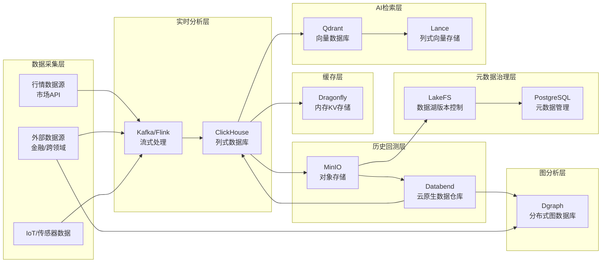

## 数据类开源项目备选：
- 实时分析 / 金融 Tick 数据 → ClickHouse / Doris / Materialize + HoraeDB
- 长周期金融数据归档 / 历史回测 → Databend / LakeSoul + MinIO
- AI 辅助检索 / 模型推荐 → Qdrant + Lance
- 元数据 & 分析资产沉淀 → LakeFS + PostgreSQL
- 高并发内存缓存 → Dragonfly

评分说明：

* **★★★★★**：顶级水平
* **★★★★☆**：优秀
* **★★★☆☆**：中等
* **★★☆☆☆**：一般
* **★☆☆☆☆**：较弱

---

## 数据存储项目对比表

| 项目          | 类型             | 性能               | 扩展性           | 易用性                   | 生态成熟度          | 成本            | 备注            |
| ----------- | -------------- | ---------------- | ------------- | --------------------- | -------------- | ------------- | ------------- |
| CockroachDB | 分布式SQL         | ★★★★☆ 高并发事务，延迟可控 | ★★★★★ 跨区域自动扩展 | ★★★☆☆ 运维复杂            | ★★★★☆ 银行/企业应用多 | ★★☆☆☆ 资源需求高   | 强一致性OLTP/HTAP |
| OceanBase   | 分布式SQL         | ★★★★★ 金融级性能      | ★★★★★ 超大规模集群  | ★★★☆☆ 安装复杂            | ★★★★☆ 国内金融行业成熟 | ★★★☆☆ 社区版功能限制 | 金融交易核心库       |
| CrateDB     | 分布式SQL/时序      | ★★★★☆ 吞吐高        | ★★★★☆ 易横向扩展   | ★★★★☆ SQL友好           | ★★★☆☆ 小众       | ★★★★☆ 成本适中    | IoT/日志分析      |
| Doris       | OLAP           | ★★★★★ 查询快        | ★★★★☆ 节点可扩展   | ★★★★☆ 部署简单            | ★★★★☆ 活跃度高     | ★★★★☆         | 实时分析、广告       |
| ClickHouse  | OLAP           | ★★★★★ 极致聚合性能     | ★★★★☆ 高扩展     | ★★★☆☆ 学习曲线陡           | ★★★★★ 全球广泛使用   | ★★★★★ 高性价比    | 金融行情、日志分析     |
| Materialize | 实时SQL流处理       | ★★★★☆ 实时性好       | ★★★☆☆ 单节点受限   | ★★★★☆ 类SQL            | ★★★☆☆ 新兴       | ★★★★☆ 轻量部署    | 流数据实时分析       |
| Dgraph      | 图数据库           | ★★★★☆ 原生分布式性能高   | ★★★★☆ 易扩展     | ★★★★☆ GraphQL支持       | ★★★☆☆ 生态较小     | ★★★★☆         | 实时图查询         |
| HugeGraph   | 图数据库           | ★★★☆☆ 单机性能一般     | ★★★★☆ 多语言支持   | ★★★★☆ 开发门槛低           | ★★★★☆ Apache生态 | ★★★★★ 成本低     | 知识图谱          |
| SurrealDB   | 文档+图+SQL混合     | ★★★☆☆ 性能中等       | ★★★★☆ 多模型支持   | ★★★★★ 易用性强            | ★★☆☆☆ 新项目      | ★★★★☆         | Web后端/协作      |
| Qdrant      | 向量DB           | ★★★★★ 检索快        | ★★★★☆ 支持分布式   | ★★★★☆ API简单           | ★★★★☆ AI生态增长快  | ★★★★☆         | 语义检索/推荐       |
| Meilisearch | 全文搜索           | ★★★★☆ 高查询性能      | ★★★☆☆ 单机优先    | ★★★★★ 极易用             | ★★★★☆ 活跃       | ★★★★☆         | 网站/应用搜索       |
| InfluxDB    | 时序             | ★★★★☆ 吞吐高        | ★★★☆☆ 水平扩展有限  | ★★★★★ 易用              | ★★★★★ 成熟生态     | ★★★★☆         | 监控、IoT        |
| HoraeDB     | 时序             | ★★★★☆ 云原生性能好     | ★★★★☆ 分布式支持   | ★★★☆☆ 相对复杂            | ★★★☆☆ 新兴       | ★★★★☆         | Tick数据        |
| LakeFS      | 数据湖版本控制        | ★★★☆☆ 主要依赖底层存储性能 | ★★★★★ 任意规模扩展  | ★★★★☆ 操作类似Git         | ★★★★☆ 稳定       | ★★★★☆         | 数据治理          |
| LakeSoul    | 湖仓一体           | ★★★★☆ 高并发批处理     | ★★★★☆ 扩展性好    | ★★★☆☆ 部署依赖Spark/Flink | ★★★☆☆ 新兴       | ★★★★☆         | 实时+离线分析       |
| Databend    | 云数仓            | ★★★★☆ 向量化执行      | ★★★★☆ 云原生扩展   | ★★★★☆ 类SQL            | ★★★☆☆ 生态初期     | ★★★★☆         | 混合分析          |
| Lance       | 列式存储格式         | ★★★★☆ 读取快        | ★★★★☆ 可分布式    | ★★★★☆ API直观           | ★★☆☆☆ 新兴       | ★★★★★         | AI特征存储        |
| MinIO       | 对象存储           | ★★★★☆ 高并发吞吐      | ★★★★★ 任意规模扩展  | ★★★★★ 易用              | ★★★★★ 成熟       | ★★★★★         | 模型/数据湖存储      |
| RustFS      | 对象存储           | ★★★★☆ 并发性能高      | ★★★★☆ 分布式     | ★★★★☆ API友好           | ★★☆☆☆ 生态小      | ★★★★☆         | MinIO替代       |
| Seafile     | 文件同步           | ★★★☆☆ 针对文件优化     | ★★★☆☆ 限制于文件管理 | ★★★★★ 用户友好            | ★★★★☆ 成熟       | ★★★★★         | 文档协作          |
| PocketBase  | 嵌入式后端          | ★★★☆☆ SQLite为主   | ★★☆☆☆ 不适合分布式  | ★★★★★ 单文件部署           | ★★★★☆ 活跃       | ★★★★★         | 小型应用          |
| Supabase    | BaaS(Postgres) | ★★★★☆ 性能取决于PG    | ★★★★☆ 云端扩展    | ★★★★★ 易用              | ★★★★★ 活跃       | ★★★☆☆ 云成本     | Web/SaaS      |
| Dragonfly   | 内存KV           | ★★★★★ 超高并发       | ★★★☆☆ 需更多节点支撑 | ★★★★★ Redis兼容         | ★★★★☆ 稳定增长     | ★★☆☆☆ 内存贵     | 缓存/会话         |
| Dynamo      | AI推理           | ★★★★★ 针对推理优化     | ★★★☆☆ 特定场景    | ★★★★☆ API清晰           | ★★☆☆☆ 新兴       | ★★★☆☆         | AI推理          |
| Agno        | 多Agent框架       | ★★★☆☆ 性能取决于组件    | ★★★★☆ 可扩展     | ★★★★☆ 逻辑清晰            | ★★☆☆☆ 新兴       | ★★★★☆         | AI决策系统        |

---

## **Qraft 存储层组合方案表**

| 功能层                            | 推荐组件                     | 推荐优先级 | 选型理由                                       | 替代方案                              | 注意事项                                           |
| ------------------------------ | ------------------------ | ----- | ------------------------------------------ | --------------------------------- | ---------------------------------------------- |
| **实时分析层** （处理高频金融行情 / 实时统计） | **ClickHouse**           | ★★★★★ | 极致列式聚合性能，金融/行情分析成熟案例多，社区强大                 | Doris（易用性更好）、Materialize（适合流式分析）  | ClickHouse 不适合频繁小事务，需要批量写入；实时流接入可用 Kafka/Flink |
| **历史回测层** （长期数据归档与批量分析）     | **Databend** + **MinIO** | ★★★★★ | Databend 云原生数仓，向量化执行高性能；MinIO 作为对象存储支持数据湖化 | LakeSoul（湖仓一体），CrateDB（时序+SQL）    | 历史数据定期压缩归档到 MinIO，查询时用 Databend 外部表            |
| **缓存层** （加速模型预测 / 高频API）    | **Dragonfly**            | ★★★★☆ | Redis 协议兼容，吞吐量更高，适合金融 Tick 缓存              | Redis（生态丰富）                       | 内存占用高，需合理规划容量；建议冷热分层存储                         |
| **元数据治理层** （版本控制 / 分析资产沉淀）  | **LakeFS** + PostgreSQL  | ★★★★★ | LakeFS 提供数据湖 Git 化版本控制，PostgreSQL 管理元数据    | Supabase（如果想顺便做API后端）             | 建议将分析 Notebook、模型文件、结果数据都纳入版本管理                |
| **AI 检索层** （向量搜索 / 语义检索）    | **Qdrant** + Lance       | ★★★★☆ | Qdrant 高性能向量检索，Lance 存储 AI 特征数据            | Milvus（大规模分布式）、Weaviate（知识库集成）    | 向量索引需要定期重建；Lance 可与 MinIO 集成做冷存储               |
| **图分析层** （跨领域关系挖掘）          | **Dgraph**               | ★★★★☆ | 原生分布式，支持高性能图查询，金融关系网络分析好用                  | HugeGraph（多语言兼容）、SurrealDB（多模型混合） | 图数据规模大时需独立集群                                   |

---

## **组合架构建议**

* **实时层** → ClickHouse 主导，Kafka/Flink 接入行情数据
* **批量层** → MinIO 归档，Databend 负责大规模回测分析
* **缓存层** → Dragonfly 缓存短期高频数据（盘口、预测结果）
* **治理层** → LakeFS 管数据湖版本，PostgreSQL 管作业/元数据
* **AI 层** → Qdrant 语义搜索，Lance 做冷向量存储
* **图层** → Dgraph 做跨市场/跨领域资金关系分析

---

### **最终优先部署建议（分阶段落地）**

1. **第一阶段（核心可用）**

   * ClickHouse（实时分析）
   * MinIO + Databend（历史归档）
   * Dragonfly（缓存）

2. **第二阶段（增强能力）**

   * LakeFS + PostgreSQL（治理）
   * Qdrant + Lance（AI检索）

3. **第三阶段（拓展分析）**

   * Dgraph（图计算）

---

明白，那我帮你用**Mermaid**绘制 Qraft 存储层架构图，保持纯文本形式，方便你直接在 Markdown 或文档里使用。
我会按照你刚才的五大核心功能层 + 数据流向画出来，让你一眼看到数据在 Qraft 中的采集、分析、归档、AI 检索和治理的全链路。

---
## Qraft Mermaid V0.1 架构

---

### **图解说明**

* **数据采集层**

  * 直接接入**行情API**、**外部数据源**（跨领域套利信息）、IoT等
  * Kafka/Flink 进行流式处理，送入 ClickHouse 实时计算
* **实时分析层**

  * ClickHouse 负责 Tick 数据、盘口数据、实时聚合分析
  * 高频结果放入 Dragonfly 缓存，加速 API 响应
* **历史回测层**

  * 数据定期落地到 MinIO（对象存储）
  * Databend 直接从 MinIO 读取，进行批量历史回测分析
* **元数据治理层**

  * LakeFS 管理数据湖的版本，PostgreSQL 管理作业、模型、指标等元数据
* **AI 检索层**

  * ClickHouse 或历史数据输出特征向量
  * Qdrant 进行向量检索，Lance 做冷向量存储
* **图分析层**

  * Databend/外部数据送入 Dgraph，做跨领域关系图分析

---
