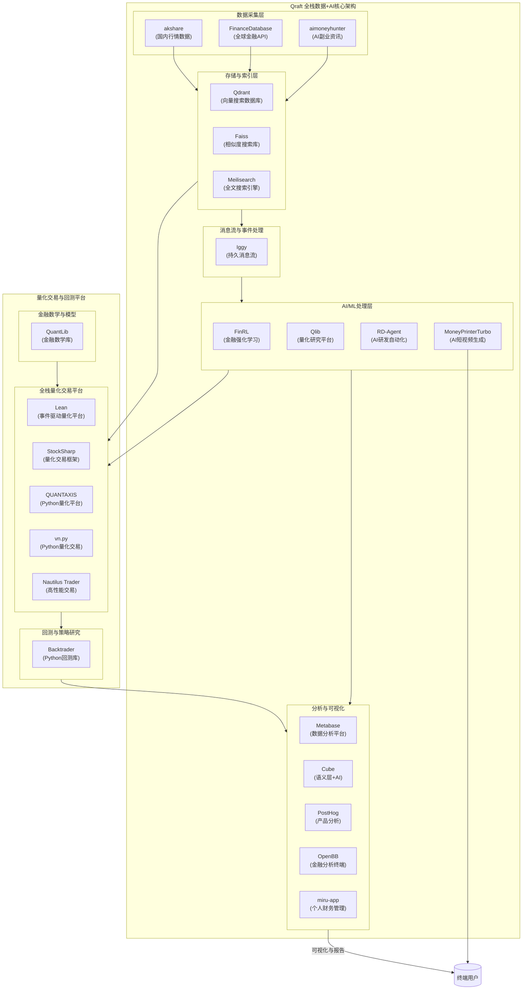

我帮你把这些金融与量化相关的开源项目按功能分类、对比分析，并补充它们在 **Qraft + 数据/AI 自动化全栈体系** 里可能的定位。

---

## **一、底层金融数学与核心算法**

| 项目                   | 核心特性                       | 优势                    | 劣势/局限     | Qraft 集成作用    |
| -------------------- | -------------------------- | --------------------- | --------- | ------------- |
| **QuantLib**         | 金融数学与定价模型库，支持衍生品、利率曲线、期权定价 | C++高性能，模型全面，行业认可度高    | 门槛高、无交易功能 | 提供底层定价、风险计算引擎 |
| **nautilus\_trader** | 高性能交易所接入、撮合、回测，低延迟         | Rust+Python混合高性能，面向生产 | 社区体量小     | 高频/低延迟交易与回测引擎 |

---

## **二、全栈量化交易平台（实盘+回测）**

| 项目             | 核心特性                       | 优势                         | 劣势/局限               | Qraft 集成作用           |
| -------------- | -------------------------- | -------------------------- | ------------------- | -------------------- |
| **Lean**       | 支持股票/期货/加密货币的事件驱动交易平台，云部署  | 功能全，社区活跃，支持QuantConnect云数据 | C#主导，对Python用户友好度较低 | 全市场量化平台，配合Qraft数据流   |
| **StockSharp** | C#量化交易框架，交易所对接丰富           | 金融市场接入全，功能模块化              | 生态国内较弱              | 与Qraft消息流结合，做低延迟策略执行 |
| **QUANTAXIS**  | Python量化平台，含数据采集、回测、模拟盘、实盘 | 全流程打通，国内社区活跃               | 性能偏弱                | 可作为Qraft的Python端量化框架 |
| **vn.py**      | Python量化交易框架，CTP等接入广       | 国内量化生态成熟，插件丰富              | 数据端较依赖第三方           | Qraft流数据接入后执行策略      |
| **OpenBB**     | 金融数据与分析终端，支持命令行与API        | 可视化好，数据接口丰富                | 交易执行能力弱             | 作为Qraft的前端数据分析终端     |

---

## **三、回测与研究框架**

| 项目             | 核心特性              | 优势           | 劣势/局限       | Qraft 集成作用       |
| -------------- | ----------------- | ------------ | ----------- | ---------------- |
| **backtrader** | Python回测框架，策略编写简洁 | 社区庞大，策略开发快速  | 不适合高频交易     | 接Qraft数据，低门槛策略研发 |
| **FinRL**      | 金融强化学习库           | RL训练模板全，内置数据 | 需ML背景，性能非核心 | AI量化实验平台         |
| **qlib**       | 微软开源量化研究平台        | 数据处理与特征工程强   | 偏学术，执行弱     | 量化研究与因子挖掘        |
| **RD-agent**   | 数据驱动的AI研发自动化      | 可驱动ML管道自动运行  | 与金融无直接绑定    | 驱动金融AI策略全生命周期    |

---

## **四、金融数据与API**

| 项目                  | 核心特性          | 优势         | 劣势/局限    | Qraft 集成作用 |
| ------------------- | ------------- | ---------- | -------- | ---------- |
| **FinanceDatabase** | 金融产品与元数据API集合 | 覆盖全球多品种，免费 | 缺实时行情    | 数据源        |
| **akshare**         | Python金融数据接口  | 中国市场覆盖好    | 对高频数据支持弱 | 国内行情接口     |

---

## **五、AI+金融副业工具**

| 项目                    | 核心特性     | 优势       | 劣势/局限  | Qraft 集成作用  |
| --------------------- | -------- | -------- | ------ | ----------- |
| **MoneyPrinterTurbo** | AI生成短视频  | 高速批量视频生成 | 非金融专用  | 金融策略可视化内容生产 |
| **aimoneyhunter**     | AI副业信息抓取 | 自动化资讯采集  | 应用场景分散 | 金融副业数据流输入   |
| **miru-app**          | 个人财务管理   | 前端体验好    | 无交易功能  | 零售金融用户端     |

---

## **功能层级总结图**

```
金融数学与核心算法  →  全栈量化平台  →  回测/研究框架  →  数据源API  →  AI/副业工具
(QuantLib, Nautilus)   (Lean, StockSharp, QUANTAXIS, vn.py)  (backtrader, FinRL, qlib) (FinanceDatabase, akshare) (MoneyPrinterTurbo, aimoneyhunter, miru-app)
```

---

如果你愿意，我可以把 **这些金融/量化工具和之前的 Qraft 全栈数据+AI架构** 画成一张 **金融增强版 Mermaid 集成架构图**，让数据流、交易流、AI增强流都一目了然，并且标出它们各自的链路位置。这样会是一个“数据到交易到可视化”的端到端全景。

好的，我会把 **之前的 Qraft 全栈数据+AI 架构** 作为核心，把你列出的 **金融/量化工具** 按功能模块融入，形成一个端到端的 **金融增强版架构图**。

下面是 **Mermaid v0.6** 架构图代码，你直接放到 Mermaid 在线渲染器即可看到全景结构：



---

### 架构说明：

1. **数据采集层**：akshare、FinanceDatabase、aimoneyhunter 负责不同类型的金融与资讯数据输入 Qraft。
2. **存储与索引层**：Qdrant/Faiss/Meilisearch 提供结构化、向量化与全文检索能力。
3. **消息流层**：Iggy 保证数据的实时流转。
4. **AI处理层**：FinRL、Qlib、RD-Agent 驱动金融机器学习、因子挖掘与自动化研发，MoneyPrinterTurbo 用于生成可视化视频。
5. **分析与可视化层**：Metabase/Cube/PostHog/OpenBB/miru-app 提供从BI到金融终端的分析服务。
6. **量化交易平台**：Lean、StockSharp、QUANTAXIS、vn.py、Nautilus Trader 执行策略交易；Backtrader 负责回测；QuantLib 提供底层金融模型支持。
7. **用户端**：终端用户通过分析平台、视频、财务管理界面获取信息。

---

如果你愿意，我可以帮你做一个 **金融版 Qraft 架构的「三层颜色编码版」**，用颜色区分 **数据流 → AI流 → 交易执行流**，这样更直观地看清数据和交易的流向。这样在全栈金融场景里非常清楚。
你要我直接画这个彩色版吗？

