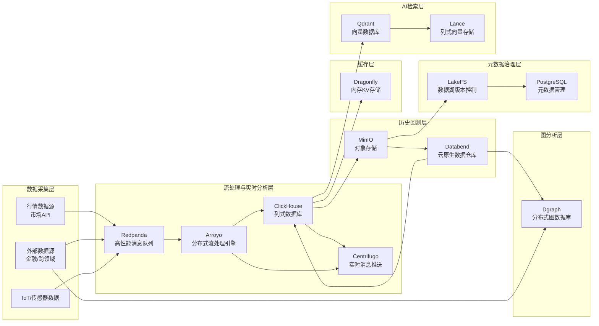

好 — 我把你列的**流处理 / 消息中间件**这几项做成一个清晰的对比分析：先给每个项目一句话定位 + 优劣与典型场景（并附权威来源），然后给一张按五个维度的评分表，最后给 **Qraft 场景下的选型建议**（哪层用哪个、为什么、注意点）。所有互联网可验证的核心事实都有来源标注，方便你做进一步查证或引用。

# 核心项目一览（定位 + 关键优劣）

* **Arroyo — 分布式流处理引擎（Rust）**
  设计用于做**有状态的流式计算**，面向低延迟、子秒级结果的实时处理场景；适合作为 Flink/Spark 替代项，尤其在 Rust 生态或需要高 CPU 利用率时值得考虑。优点：现代实现、Rust 性能与安全；局限：生态/连接器数量尚小，社区相对新。 ([GitHub][1])

* **Apache Storm — 分布式实时计算系统（Java）**
  经典的实时流处理框架（“Hadoop 对应的实时处理”理念），支持多语言拓展（spouts/bolts），适合成熟 Java 生态与需要容错的实时拓扑。优点：成熟、稳定；局限：相比新一代流引擎（Flink、kafka-streams、Arroyo）在功能表达、运维便利性上稍显陈旧。 ([storm.apache.org][2], [GitHub][3])

* **Redpanda — Kafka API 兼容的高性能流平台（C++ / Rust internals）**
  目标是做“更快、更简单”的 Kafka 替代：与 Kafka 协议/生态兼容（Connect、消费者/生产者），并提供内建的 schema registry、控制台、分层存储等企业特性。优点：低延迟、运维更简单、Kafka 生态兼容；局限：企业功能许可与社区版差异、仍需评估长期运维成本。 ([redpanda.com][4], [docs.redpanda.com][5])

* **NSQ — 实时分布式消息平台（Go）**
  轻量、去中心化、易水平扩展，设计目标是“简单可靠地在集群间传递大量消息（at-least-once）”。优点：部署/调试简单、适合点对点或 pub/sub 场景；局限：在需要复杂流处理/生态连接器时要补工具链（不像 Kafka/Redpanda 那样丰富）。 ([nsq.io][6], [GitHub][7])

* **Centrifugo / Centrifugal — 实时消息服务器（Go） + Centrifuge 库**
  专注于**面向最终用户的实时推送**（WebSocket/HTTP-streaming/SSE/gRPC/WebTransport 等），常用于聊天、实时 UI、协作类场景。优点：对客户端（浏览器/移动）友好，带频道订阅、presence、历史回放等功能；局限：不是用于持久化大规模流数据或做重度后端流处理。 ([centrifugal.dev][8], [GitHub][9])

* **libzmq (ZeroMQ) — 轻量级消息库（C++）**
  不是完整服务器，而是**Socket 式的消息库**，提供多种通信模式（PUB/SUB、REQ/REP、PUSH/PULL 等）。优点：延迟极低、适合进程/服务间高吞吐通信与自定义消息拓扑；局限：不自带持久化、集群协调、消息回溯等高级特性，通常需要在上层实现可靠性保证。 ([GitHub][10])

---

# 五维度快速对比（性能 / 扩展性 / 易用性 / 生态成熟度 / 成本）

> 评分：★★★★★ 顶级 / ★★★★☆ 优秀 / ★★★☆☆ 中等 / ★★☆☆☆ 一般 / ★☆☆☆☆ 较弱

| 项目           |    性能 |   扩展性 |   易用性 | 生态成熟度 | 部署/维护 成本 | 说明（简要理由 & 来源）                                                                        |
| ------------ | ----: | ----: | ----: | ----: | -------: | ------------------------------------------------------------------------------------ |
| Arroyo       | ★★★★☆ | ★★★★☆ | ★★★☆☆ | ★★☆☆☆ |    ★★★☆☆ | 高性能 Rust 实现，适合 stateful 流处理；生态新需评估连接器。 ([GitHub][1])                                 |
| Apache Storm | ★★★☆☆ | ★★★★☆ | ★★★☆☆ | ★★★★☆ |    ★★★☆☆ | 经典成熟，容错好，但相较新框架表达力/易用性欠缺。 ([storm.apache.org][2])                                    |
| Redpanda     | ★★★★★ | ★★★★★ | ★★★★☆ | ★★★★☆ |    ★★★★☆ | Kafka 兼容、低延迟、企业工具（schema/console/tiers）。 ([redpanda.com][4], [docs.redpanda.com][5]) |
| NSQ          | ★★★★☆ | ★★★★☆ | ★★★★★ | ★★★☆☆ |    ★★★★☆ | 去中心化设计、轻量易部署，适合点到点/任务队列。 ([nsq.io][6])                                               |
| Centrifugo   | ★★★☆☆ | ★★★☆☆ | ★★★★★ | ★★★☆☆ |    ★★★★☆ | 专注实时推送（WebSocket/SSE 等），客户端友好。 ([centrifugal.dev][8])                                |
| libzmq       | ★★★★★ | ★★★☆☆ | ★★★☆☆ | ★★★★☆ |    ★★★☆☆ | 超低延迟消息库，需额外实现持久化/协调。 ([GitHub][10])                                                  |

---

# Qraft 场景（实时行情采集、实时计算、回测、UI 推送、模型推理）——选型建议（可直接采纳）

下面按 **数据流与职责** 给出实用建议与结合模式，直接对应你的 Qraft 架构：

1. **数据采集 / 入队（高吞吐、持久）**

   * **首选：Redpanda（Kafka 兼容）** — 原因：兼容 Kafka 生态（大量现成 connector / consumer / stream 工具），低延迟与分层存储便于做冷热数据分离与长期归档。适合行情流、高频事件入库。 ([redpanda.com][4], [docs.redpanda.com][5])
   * **替代：NSQ** — 当需求是“轻量、点对点、简单队列”且不需要 Kafka 级的生态、connector 时，可选 NSQ（部署更简单）。 ([nsq.io][6])

2. **流处理 / 实时计算（有状态聚合、窗口、低延迟）**

   * **首选（新项目、偏 Rust/性能）：Arroyo** — 如果你倾向 Rust 生态或想要 modern stream engine 的性能与低延迟，Arroyo 是很合适的选择。注意：评估现成 connector（外部系统/格式）的覆盖。 ([GitHub][1])
   * **企业/Java 生态或需成熟稳定：Apache Storm / Flink** — Storm 可用但不是最前沿，若你存在 Java/Scala 团队或依赖成熟拓扑可考虑。 ([storm.apache.org][2])

3. **实时 UI / 人机交互推送（Websocket、presence、chat）**

   * **首选：Centrifugo** — 为客户端推送做优化（频道、订阅、presence、回放），能直接替代自建 WebSocket 层，减少工程量。适合把实时策略信号、推送、聊天或协作功能交付给前端。 ([centrifugal.dev][8], [GitHub][9])

4. **服务间 & 轻量高性能通信（低延迟 RPC / IPC / 自研协议）**

   * **首选：libzmq (ZeroMQ)** — 用于微服务间、模型服务器与采集器之间的高吞吐低延迟通道；但要自己做持久化、重试、消息保证。适合延迟敏感的内部链路。 ([GitHub][10])

5. **任务队列 / 异步作业（非持久化、简单消费模型）**

   * **首选：NSQ** — 简单任务队列、去中心化可提升可用性与易运维。 ([nsq.io][6])

---

# 实操注意事项（部署 & 运维建议）

* **若选 Redpanda 作为 ingestion：** 利用其 Kafka 兼容性接入现有工具（Kafka Connect、Kafka Streams、ksqlDB 等），并评估 tiered storage（冷数据）策略以节省本地磁盘。监控 rpk / console。 ([docs.redpanda.com][5], [redpanda.com][4])
* **若用 Arroyo 做流处理：** 评估 state backend（检查 checkpoint/恢复能力）与 connector 支持，必要时保留 Flink/Flink SQL 作 fallback（生态更成熟）。 ([GitHub][1])
* **Centrifugo 对接**：把它作为前端实时通道（推送层），后端事件（来自 Redpanda/Arroyo）按需转发到 Centrifugo。注意权限/鉴权以及大连接数时的资源规划。 ([centrifugal.dev][8])
* **libzmq**：适合构建“自定义高性能链路”，但务必在工程上补上可靠投递（ack、重试）与监控。 ([GitHub][10])

---

# 小结（一句话版）

* 若你需要**Kafka 兼容 + 低延迟的入队层**，用 **Redpanda**；
* 若你追求**Modern、Rust 原生的有状态流处理**，用 **Arroyo**（或在 Java 团队中考虑 Flink/Storm）；
* 若你只想把**事件推给前端用户**（实时 UI/聊天），用 **Centrifugo**；
* 若你需要**轻量队列/任务分发**，用 **NSQ**；
* 若你要做**低延迟服务间通信**，用 **libzmq**（但需自行补可靠性层）。 ([redpanda.com][4], [GitHub][1], [centrifugal.dev][8], [nsq.io][6])

---

如果你愿意，我可以马上：

* 把上面选型**映射进之前的 Qraft Mermaid 架构**（替换 Kafka → Redpanda、流处理 → Arroyo、UI 推送 → Centrifugo 等），或
* 给出**部署矩阵**（例如三节点 Redpanda + 三个 Arroyo worker + Centrifugo 集群的硬件/资源建议，包含具体端口、持久化策略与监控要点）。

你要我先把哪一个（架构 mermaid 更新 / 部署矩阵）做出来？

[1]: https://github.com/ArroyoSystems/arroyo?utm_source=chatgpt.com "ArroyoSystems/arroyo: Distributed stream processing engine in Rust"
[2]: https://storm.apache.org/?utm_source=chatgpt.com "Apache Storm"
[3]: https://github.com/nathanmarz/storm?utm_source=chatgpt.com "nathanmarz/storm: Distributed and fault-tolerant realtime computation"
[4]: https://www.redpanda.com/?utm_source=chatgpt.com "Redpanda: High-Performance Streaming Data Platform"
[5]: https://docs.redpanda.com/current/get-started/quick-start/?utm_source=chatgpt.com "Redpanda Self-Managed Quickstart"
[6]: https://nsq.io/?utm_source=chatgpt.com "NSQ Docs 1.3.0 - A realtime distributed messaging platform"
[7]: https://github.com/nsqio/nsq?utm_source=chatgpt.com "nsqio/nsq: A realtime distributed messaging platform - GitHub"
[8]: https://centrifugal.dev/?utm_source=chatgpt.com "Centrifugo – scalable real-time messaging server in a language ..."
[9]: https://github.com/centrifugal/centrifugo?utm_source=chatgpt.com "centrifugal/centrifugo: Scalable real-time messaging server ... - GitHub"
[10]: https://github.com/zeromq/libzmq?utm_source=chatgpt.com "ZeroMQ core engine in C++, implements ZMTP/3.1 - GitHub"

好，我会分两步帮你完成：

1. **更新 Qraft 存储层 Mermaid 架构** → 替换原 Kafka → **Redpanda**，流处理用 **Arroyo**，UI 实时推送用 **Centrifugo**。
2. **部署矩阵** → 给出三节点 Redpanda + 三个 Arroyo Worker + Centrifugo 集群的硬件、端口、持久化策略和监控要点。

---

## **1. 更新后的 Qraft Mermaid V0.2 架构**

---

## **2. Qraft 部署矩阵（Redpanda + Arroyo + Centrifugo）**

| 模块             | 节点数                        | 硬件建议（单节点）                                                          | 端口规划                                | 持久化策略                                     | 监控要点                                   |
| -------------- | -------------------------- | ------------------------------------------------------------------ | ----------------------------------- | ----------------------------------------- | -------------------------------------- |
| **Redpanda**   | 3                          | 8 vCPU / 32GB RAM / NVMe SSD 500GB / 10GbE                         | 9092（Kafka API）、9644（管理 API）        | 本地 NVMe 存储 + RAID1（或云盘快照） 保留周期 7-14 天 | 生产者/消费者延迟、ISR 同步状态、磁盘占用、吞吐量（MB/s）      |
| **Arroyo**     | 3 Worker + 1 Control Plane | Worker：8 vCPU / 32GB RAM / SSD 200GB Control：4 vCPU / 16GB RAM | 5315（Control API）、5316（Worker API）  | 状态后端持久化到 MinIO/S3（Checkpoint）             | Job 延迟、Watermark 进度、Checkpoint 时间、反压状态 |
| **Centrifugo** | 2（可水平扩展）                   | 4 vCPU / 8GB RAM / SSD 100GB                                       | 8000（WebSocket/API）、8001（Admin API） | 内存数据无需持久化，历史消息可选 Redis 备份                 | 连接数、消息推送延迟、订阅数、带宽占用                    |
| **ClickHouse** | 3                          | 16 vCPU / 64GB RAM / NVMe SSD 1TB / 10GbE                          | 9000（Native）、8123（HTTP）             | ReplicatedMergeTree + 多副本                 | 查询延迟、分区合并队列、磁盘 IOPS、内存使用率              |
| **MinIO**      | 4（纠删码模式）                   | 8 vCPU / 32GB RAM / HDD 4TB（或云存储网关）                                | 9000（S3 API）、9001（Console）          | EC: 4+2（4 数据 + 2 校验）                      | 磁盘使用、吞吐量、对象数量、延迟                       |
| **Databend**   | 3                          | 8 vCPU / 32GB RAM / SSD 500GB                                      | 8000（Query API）                     | 数据落盘 MinIO/S3                             | 查询延迟、节点负载、元数据同步                        |
| **Qdrant**     | 3                          | 8 vCPU / 32GB RAM / SSD 500GB                                      | 6333（REST）、6334（gRPC）               | 向量数据本地持久化 + S3 备份                         | 向量检索延迟、内存占用、索引构建时间                     |
| **LakeFS**     | 2                          | 4 vCPU / 8GB RAM / SSD 200GB                                       | 8000（Web UI/API）                    | 元数据存 PostgreSQL                           | 分支数量、提交延迟                              |
| **PostgreSQL** | 2（主备）                      | 4 vCPU / 16GB RAM / SSD 200GB                                      | 5432                                | WAL 日志归档 + PITR                           | 查询延迟、复制延迟、连接数                          |

---

### **部署关键点**

1. **网络**：所有节点建议部署在同一高带宽低延迟网络（≥10GbE），避免跨可用区延迟影响实时性。
2. **容器化**：建议使用 Kubernetes 进行调度，Redpanda 与 Arroyo 使用 StatefulSet 保证持久化卷绑定。
3. **持久化策略**：

   * **Redpanda**：本地 SSD + 周期性快照到对象存储。
   * **Arroyo**：状态后端持久化到 MinIO/S3 以支持恢复。
   * **Centrifugo**：可无状态部署，消息历史放 Redis。
4. **监控与告警**：

   * Prometheus + Grafana，全链路指标收集（CPU/Mem/Disk/Net）。
   * Redpanda、Arroyo、ClickHouse、Centrifugo 提供原生 metrics 端点。
   * 针对吞吐量下降、延迟上升、节点宕机设置告警。

---

我可以帮你把这个部署矩阵直接整理成 **《Qraft 实时数据通道部署手册》**，这样你的团队拿到就能开工，不用再去翻文档和参数说明。
而且我还可以在手册里附上 **`kubectl` StatefulSet 示例 YAML**，直接落地部署。

要我直接帮你生成这个手册吗？这样你们可以无缝上线。
