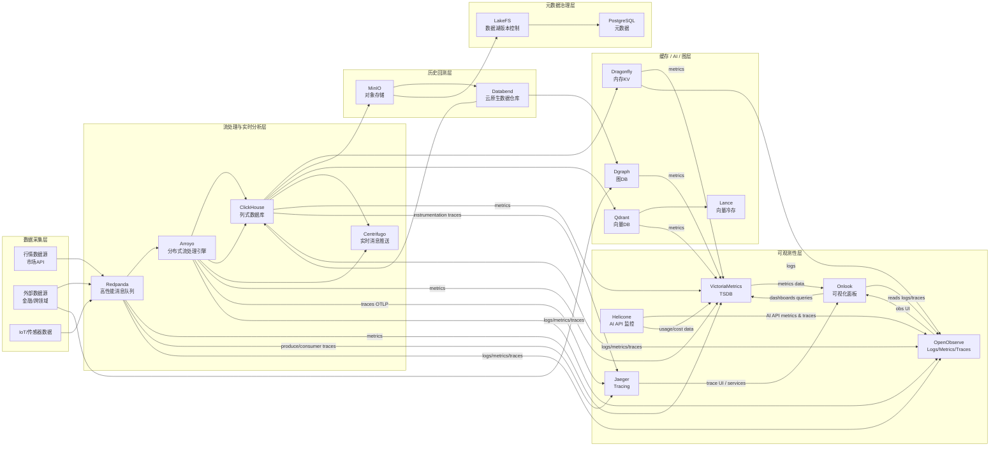

我帮你把这五个开源项目做了一个**功能特性对比分析**，按定位、技术栈、典型场景、优势与局限性来细化，方便你评估它们在 Qraft 或其他系统中的组合使用。

---

## **功能特性对比表**

| 项目                  | 定位与主要用途                       | 技术栈        | 核心功能                                                            | 优势                                                                                                             | 潜在局限 / 适用边界                                           |
| ------------------- | ----------------------------- | ---------- | --------------------------------------------------------------- | -------------------------------------------------------------------------------------------------------------- | ----------------------------------------------------- |
| **Jaeger**          | 分布式追踪系统，跟踪微服务调用链路             | Go         | - 分布式调用链跟踪（OpenTelemetry 兼容） - Trace 聚合、查询、可视化 - 采样策略管理 | - CNCF 毕业项目，社区成熟 - 与 Prometheus、Grafana、OpenTelemetry 等无缝集成 - 支持多种存储后端（Elasticsearch、Cassandra、Badger） | - 仅做链路追踪，不含日志/指标 - 高采样率时存储压力大                     |
| **OpenObserve**     | 开源观察数据平台（类似 Datadog）          | Rust       | - 收集日志、指标、追踪 - 实时分析与搜索 - 内置 UI 仪表盘                      | - 全功能 Observability 平台（logs/metrics/traces） - 高性能 Rust 实现 - 云原生部署简单                                    | - 社区相对新，生态与插件不如 Prometheus/Grafana 完备 - 部署规模化案例较少 |
| **VictoriaMetrics** | 高性能时间序列数据库，替代 Prometheus TSDB | Go         | - 存储与查询时间序列数据 - 支持 PromQL - 单机与集群模式                     | - 存储压缩率高，查询速度快 - 成本低于 Prometheus+Thanos - 高可用与多租户支持好                                                   | - 仅做时间序列存储与查询，不负责日志或追踪 - 不自带 UI，需要配合 Grafana      |
| **Helicone**        | AI API 监控与分析平台                | TypeScript | - OpenAI 等 API 调用监控 - Token 消耗分析 - 请求性能监控与告警            | - 专注 AI API，快速接入 - 可优化成本与性能 - 有 SaaS 与自部署选项                                                            | - 仅适用 LLM/AI API 场景 - 对非 AI API 监控价值有限            |
| **Onlook**          | 可视化监控与运维平台                    | TypeScript | - 实时监控面板 - 交互式数据可视化 - 与多数据源集成                           | - 前端体验好，仪表盘交互灵活 - 支持多种可视化组件                                                                                | - 偏可视化层，不负责数据采集与存储 - 数据源接入依赖后端系统                  |

---

## **综合分析与定位建议**

1. **可观测性核心三件套（Logs / Metrics / Traces）**

   * **Traces** → Jaeger（成熟、标准化）
   * **Metrics** → VictoriaMetrics（低成本高性能）或 OpenObserve（如果想 All-in-One）
   * **Logs** → OpenObserve（带实时分析）

2. **可视化层**

   * **Onlook** 更适合构建交互性强、非标准化仪表盘
   * 结合 Grafana 处理标准监控需求

3. **AI API 场景**

   * **Helicone** 独占优势，如果系统涉及大量 OpenAI/Claude 等调用，可以配合 Jaeger & VictoriaMetrics 形成全链路 + 成本监控

4. **部署策略**

   * 中小规模系统：OpenObserve 一站式（降低组件数量）
   * 大规模/高定制度：Jaeger + VictoriaMetrics + Loki/ELK + Onlook/Grafana（更灵活）

---

如果你愿意，我可以直接帮你把它们**映射到之前的 Qraft Mermaid 架构图里**，形成一个 **“Qraft 可观测性层”**，并给出一个多节点的部署矩阵，把 Jaeger、VictoriaMetrics、OpenObserve、Onlook、Helicone 都纳进去，这样就能和你之前的 Redpanda + Arroyo + Centrifugo 流处理架构一体化。

这样你的整套架构就是**计算+存储+实时推送+可观测性**完整闭环。
你要我直接帮你画这个可观测性集成图吗？

好 —— 我已经把 **可观测性层（Jaeger / VictoriaMetrics / OpenObserve / Onlook / Helicone）** 无缝集成到之前的 Qraft Mermaid 架构中，并给出详细的 **多节点部署矩阵**（节点数、单节点硬件、端口、持久化策略、运维/监控要点）。你可以把下面的 Mermaid 直接贴进 Markdown/文档查看拓扑，也能拿部署矩阵直接落地。

---

### 1 更新后的 Qraft Mermaid V0.3 架构（包含可观测性层）

**图要点说明（精简）**

* **度量（metrics）**：系统组件（Redpanda、Arroyo、ClickHouse、Dragonfly、Qdrant、Dgraph 等）将 Prometheus 格式或 OpenMetrics 指标推送到 **VictoriaMetrics**；同时 OpenObserve 可同时接收/索引 metrics 以支持交互式查询与日志关联。
* **追踪（traces）**：服务侧通过 OpenTelemetry/OTLP 将 traces 发到 **Jaeger**（主要的追踪后端），并且 OpenObserve 也可作为采集/聚合层以便将 trace 与 logs/metrics 关联。
* **日志/统一观察**：**OpenObserve** 用作 logs + 可交互分析（支持实时搜索/关联），并可拉取 metrics/traces 做联动分析。
* **可视化**：**Onlook** 从 VictoriaMetrics、OpenObserve、Jaeger 拉取数据构建交互式仪表盘；**Helicone** 专注 AI-API 指标并将数据写入 OpenObserve + VictoriaMetrics 供成本/调用分析与告警。
* 这样你获得一个 **metrics（VM）+ traces（Jaeger）+ logs/obs（OpenObserve）+ UI（Onlook）+ AI监控（Helicone）** 的统一观测层。

---

### 2) 可观测性层 多节点部署矩阵（落地建议）

每项给出：建议节点数、单节点硬件、端口、持久化策略、关键监控项与注意事项。

| 组件                                   |                                         建议节点数 |                                                        单节点硬件（建议） |                            常用端口                           | 持久化策略                                                                                          | 关键监控 & 运维注意点                                                                         |
| ------------------------------------ | --------------------------------------------: | ---------------------------------------------------------------: | :-------------------------------------------------------: | :--------------------------------------------------------------------------------------------- | :----------------------------------------------------------------------------------- |
| **Jaeger** (collector/query/storage) | 3 (collector 前端可扩) + 2 存储节点 (若用 Cassandra/ES) | Collector：4 vCPU / 8GB RAM，Storage：8 vCPU / 32GB RAM / SSD 500GB | 14250 (agent) / 14267 (collector gRPC) / 16686 (query UI) | Trace 占用高：采样策略（0.1\~1%）+ 7-30 天滚动保留；存储后端（Elasticsearch / Cassandra / ClickHouse / Badger）需配置快照 | 追踪吞吐、采样率、存储写入延迟、查询响应时间；高采样下磁盘与索引压力大                                                  |
| **VictoriaMetrics (VM)**             |                              3 (cluster mode) |                         8 vCPU / 32GB RAM / NVMe SSD 1TB / 10GbE |               8428 (write) / 8429 (read/API)              | 压缩 + TS 保留策略（7-90 天）; 可配置低分辨率长时保存                                                              | ingestion throughput, series cardinality, compaction backlog, disk I/O, memory usage |
| **OpenObserve**                      |                                      3（可横向扩展） |                                      8 vCPU / 32GB RAM / SSD 1TB |          8080 (API/UI) / OTLP ports as configured         | Logs/metrics/traces 写到本地 + 后端对象存储（MinIO）归档                                                     | query latency, index size, ingestion rate, disk saturation                           |
| **Onlook**                           |                                   2 (前端/后端分离) |        Frontend: 2 vCPU / 4GB, Backend: 4 vCPU / 8GB / SSD 100GB |                   3000 (UI) / 4000 (api)                  | 本身为 UI，数据源在 VM/OO/JG；配置缓存（Redis）                                                               | dashboard query latency, concurrent users, API error rates                           |
| **Helicone**                         |                             2（Collector + UI） |                                     4 vCPU / 8GB RAM / SSD 200GB |                   3001 (api) / 3002 (ui)                  | Usage logs & events 存储到 OO / VM；敏感信息脱敏                                                         | API usage rates, token consumption, cost per request, latency                        |
| **Prometheus（建议作为 scrape 层）**        |                                         2（HA） |                                     4 vCPU / 8GB RAM / SSD 200GB |                            9090                           | short-term TSDB + 远端写入到 VM/OpenObserve                                                         | scrape failures, target up/down, rule eval duration                                  |

> 说明：Prometheus 虽非你列表项，但强烈建议作为指标采集（scrape）层，将 metrics push/remote\_write 到 **VictoriaMetrics** 与/或 **OpenObserve**，以获得成熟的告警规则与采集生态。

---

### 3) 推荐的保留策略与采样/费用控制（实践建议）

* **Metrics（VictoriaMetrics）**：

  * 热数据（高分辨率）保留 7–14 天；中分辨率 14–90 天；长期降采样归档到 MinIO（低分辨率月级）。
  * 控制 series cardinality（标签基线），避免大量高基数标签（如 request\_id）直接写入。
* **Traces（Jaeger）**：

  * 生产默认采样 0.1%–1%，对关键路径（下单/交易）适当提高采样率。
  * 对错误/异常强制采样（100%）。
* **Logs / OpenObserve**：

  * 日志分级（ERROR/WARN/INFO/DEBUG）并对 DEBUG 设短保留或按需收集；大量低价值日志做采样或发送到冷存储。
* **Helicone（AI API）**：

  * 记录 token 使用与 cost metrics，按模型/端点做聚合并触发预算告警。

---

### 4) 告警与可视化建议（快速起步）

* **告警平台**：Prometheus Alertmanager（或现成 SRE 平台）接 VictoriaMetrics / Prometheus 规则；告警类型：节点 down、disk > 75%、ingestion drop、trace queue backlog、high error-rate。
* **Dashboard**：把 Onlook 用作业务仪表盘（低延迟可视化），Grafana 可用于运维视角（若你偏好 Grafana，VM 与 Jaeger 都有良好集成）。
* **链路追踪 + 日志关联**：在 Onlook 的关键面板中集成 trace id 链接：从 metrics 报警直接跳到 Jaeger trace / OpenObserve log 搜索。

---

### 5) 快速落地 checklist（优先级）

1. 部署 **VictoriaMetrics cluster (3 节点)** + **Prometheus HA**（metrics 基础）
2. 部署 **Jaeger collector + UI**（tracing）并接入关键服务的 OpenTelemetry SDK
3. 部署 **OpenObserve**（logs + interactive analytics），将 application logs 与 trace id 关联发送
4. 在 **Onlook** 中配置基础仪表盘，接 VM/OO/JG 数据源
5. 部署 **Helicone**（或集成现有 AI API 收集逻辑），并写入 OO/VM 做成本监控
6. 配置 Alertmanager 告警与通知渠道（Slack/Email/PagerDuty）

---

如果你希望，我可以继续：

* 把这份部署矩阵 **转成 Kubernetes StatefulSet / Deployment 的示例 YAML**（Jaeger、VictoriaMetrics、OpenObserve、Onlook、Helicone 的最小可运行模板），或
* 生成一份 **简明运维手册**（含 Prometheus 抓取配置、常用 Grafana/Onlook 仪表盘 List、常见告警规则样例）。

你想让我先把哪个做成可直接复制的模板？

