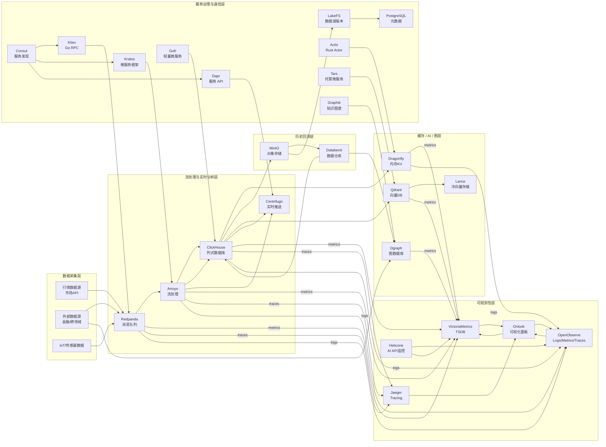

好 — 我把你列的这些 **微服务 / RPC / Actor / 知识图 / 服务发现** 开源项目做成一张**清晰比较表**（含：定位、关键特性、优劣、Qraft 里建议如何使用），并在每行给出权威来源（GitHub / 官方文档）。下面内容可直接拷进设计文档里。

> 注：我把每个项目的权重信息都用来源做了标注，便于你进一步深挖实现细节或查版本/兼容性。

---

# 项目功能特性对比（精要表）

| 项目           |                      类型 / 语言 | 关键特性（简要）                                                            | 优势                                                               | 局限 / 风险                                       | 推荐在 Qraft 中的角色                                               |                                        来源 |
| ------------ | ---------------------------: | ------------------------------------------------------------------- | ---------------------------------------------------------------- | --------------------------------------------- | ------------------------------------------------------------ | ----------------------------------------: |
| **gofr**     |                 Go 微服务框架（Go） | 轻量、意见化框架，内置 DB/迁移/observability 支持，适合快速启动微服务                        | 上手快、对 Kubernetes/可观察性有开箱支持，适合小团队标准化开发                            | 社区/生态规模小于 kratos/Dapr；功能偏 opinionated（约束较多）   | **快速原型 / 较小服务**：用于实验性服务或需要快速交付的微服务。                          |                             ([GitHub][1]) |
| **Dapr**     |         可移植运行时 / sidecar（Go） | 语言无关的 sidecar，提供 state、pubsub、bindings、actor、service invocation 等抽象 | 多语言支持、丰富 building-block（state/pubsub/actor/secret）适合 polyglot 环境 | 增加 sidecar 运维复杂度与延迟；并非“零成本”集成（需设计 sidecar 拓扑） | **跨语言协作层 / 边缘/工作流**：当 Qraft 需要多语言插件或统一 state/pubsub API 时优先。 |             ([Dapr Docs][2], [GitHub][3]) |
| **Kitex**    |               高性能 RPC 框架（Go） | 专注高吞吐低延迟 RPC，支持 IDL（Thrift/Protobuf）、丰富的治理/插件、观测                    | 性能优秀、可插拔、与 etcd/nacos/consul 等发现集成良好                             | 主要偏向 RPC 场景，不替代业务框架（需要开发者搭配框架/中间件）            | **内部高吞吐 RPC 层**：核心服务间低延迟 RPC（比如行情分发、模型服务）。                   |             ([CloudWeGo][4], [GitHub][5]) |
| **Tars**     |    全栈微服务 / RPC 平台（C++ / 多语言） | RPC 框架 + 管理平台 + 托管/部署工具，历史悠久且在企业环境有大量实践                             | 一体化运维平台（dashboard、部署、管理），适合大规模内网部署                               | 学习曲线与平台入门成本高；生态偏向传统企业（并非 cloud-native 首选）     | **企业级 RPC / 遗留系统对接**：当需要平台化托管或对接老系统时可选。                      |   ([GitHub][6], [tarscloud.github.io][7]) |
| **Kratos**   |               Go 微服务治理框架（Go） | 面向云原生的微服务框架，提供中间件、服务治理、模板与最佳实践                                      | 社区活跃、中文/英文文档丰富、适合生产级服务                                           | 框架尺寸大于 gofr（更通用也更复杂）                          | **生产级微服务骨架**：作为 Qraft 的主服务框架（若团队以 Go 为主、需要成熟治理）。             |         ([GitHub][8], [go-kratos.dev][9]) |
| **Actix**    |    Rust Actor / Web 框架（Rust） | Actor 模型 + 高性能异步网络（actix-web）用于构建低延迟服务                              | Rust 的性能与安全性，生态成熟（actix-web 广泛使用）                                | Actor 模型对开发范式有学习曲线；生态中某些库实现差异需注意              | **低延迟/高并发模块或代理**：行情接入、推送代理、性能敏感服务可用 Rust + Actix 实现。         |                            ([GitHub][10]) |
| **Graphiti** |        时序 / 时间感知知识图谱（Python） | 为 Agent 和 LLM 场景设计的时序知识图（支持时间维度、实体关系随时间演化）                          | 专为 AI Agent 的“记忆/知识”设计，支持不断演进的关系                                 | 新兴项目，需评估长期稳定性与扩展模式                            | **Qraft 的知识记忆/跨域语义层**：为跨领域套利与贝叶斯推理提供时序知识图基础。                 |     ([GitHub][11], [blog.getzep.com][12]) |
| **Consul**   | 服务发现 / 配置 / Service Mesh（Go） | 服务发现、健康检查、KV 配置、意图/ACL、整合服务网格（Consul Connect）                       | 企业级稳定、跨环境支持好、生态成熟                                                | 对 k8s 有竞争但也可集成（k8s 原生已有 Service+Ingress）      | **服务发现 & 配置 / 边车证书**：全局服务目录、配置管理、服务间安全通信。                    | ([HashiCorp Developer][13], [GitHub][14]) |

---

# 快速结论（面向 Qraft 的落地建议）

下面把上表内容浓缩成**决策建议**，按优先级给出在 Qraft 中的实际使用建议（你可以直接采纳）：

1. **核心微服务框架（Go 团队）**

   * 优先：**Kratos**（生产级、治理完善）。如果团队偏好更轻量、快速迭代的风格，可采用 **gofr** 作为实验/边车服务。([GitHub][8])

2. **高性能 RPC（服务间低延迟调用）**

   * 优先：**Kitex**（高性能、支持 IDL、与发现/限流/熔断生态良好）。在对延迟/吞吐有硬指标的链路（行情分发、模型推理）使用 Kitex。([CloudWeGo][4])

3. **跨语言/边缘功能 & 状态管理**

   * 若 Qraft 需要 **多语言插件**（如 Python 的 AI agent、Rust 的高性能模块、Go 的核心服务）或希望以 building-block 方式快速搭功能（actor、state、pubsub），引入 **Dapr** 做统一 runtime 是非常实用的选择（trade-off：增加 sidecar 运维）。([Dapr Docs][2])

4. **服务注册 / 配置 / 安全策略**

   * **Consul** 作为服务发现 + KV + 可选 service mesh 的解决方案非常稳妥，尤其在混合部署（K8s + VM）或需要跨集群服务发现时。若完全在 k8s 环境，也可考虑 k8s 原生 + service mesh（Istio/Linkerd），但 Consul 的 multi-platform 能力是强项。([HashiCorp Developer][13])

5. **Rust / Actor 用于性能热点**

   * 对极端延迟敏感或需要内存/线程安全保证的模块（如行情网关、并发推送代理），可以用 **Actix**（或 Rust 的 actor 框架）实现并用 Kitex/Dapr 与上层集成。([GitHub][10])

6. **知识图 / 记忆层（AI + 跨域推理）**

   * **Graphiti**（getzep）适合做“时间感知”知识图，用于 agent 记忆、长期行为序列、跨资产/跨市场关系建模 —— 非常契合 Qraft 的贝叶斯式决策与跨域套利场景，但要评估其扩展到生产级别的工程投入。([GitHub][11])

7. **Tars 的适用场景**

   * 如果你面向**企业内部托管**并需要一个带有完整管理/运维平台的 RPC 方案，**Tars** 可以作为替代或对接（尤其当有遗留 C++ / Java 服务时）。但对新云原生项目我会优先 Kitex + Kratos/Dapr。([GitHub][6])

---

# 小提示 — 兼容性 / 组合模式（工程实践）

* **Kratos（或 gofr） + Kitex + Consul**：推荐做法——用 Kratos 做服务模板、用 Kitex 做高吞吐 RPC 接口、Consul 做发现与配置。
* **Kratos + Dapr（可选）**：如果需要插件式（Python agent / Rust worker 等）并希望暴露统一 state/pubsub/actor 接口，用 Dapr 可显著降低多语言集成成本。
* **Actix 作为边缘代理**：行情采集器/推送代理用 Rust 实现，再通过 Kitex/HTTP 与核心服务通信，能把延迟压得更低。
* **Graphiti 与模型/向量库对接**：Graphiti 负责知识关系建模；与 Qdrant/Lance（你已有计划）结合将知识图与向量检索共同服务于 RAG / Agent 决策。

---

如果你想，我接下来可以：

1. 把上述建议**直接写入 Qraft 架构表格**（比如“模块 — 推荐技术栈 — 说明 — 接口约定”），方便交付给开发同学；
2. 或者生成一份**迁移/集成检查清单**（例如如何从 Kratos 接入 Dapr、Kitex 服务如何与 Consul 注册、Actix 服务如何暴露 metrics/trace 等），包含具体端口/SDK/Telemetry 要点。

你想我先做哪一个？（我会直接给出可拷贝的清单 / 表格，不会再问别的问题）

[1]: https://github.com/gofr-dev/gofr?utm_source=chatgpt.com "gofr-dev/gofr: An opinionated GoLang framework for ... - GitHub"
[2]: https://docs.dapr.io/concepts/overview/?utm_source=chatgpt.com "Overview | Dapr Docs"
[3]: https://github.com/dapr/dapr?utm_source=chatgpt.com "Dapr is a portable runtime for building distributed ... - GitHub"
[4]: https://www.cloudwego.io/docs/kitex/?utm_source=chatgpt.com "Kitex | CloudWeGo"
[5]: https://github.com/cloudwego/kitex?utm_source=chatgpt.com "cloudwego/kitex: Go RPC framework with high ... - GitHub"
[6]: https://github.com/TarsCloud/Tars?utm_source=chatgpt.com "TarsCloud/Tars - GitHub"
[7]: https://tarscloud.github.io/TarsDocs_en/dev/tarsjava/tars-quick-start.html?utm_source=chatgpt.com "Quick Start To Tars | TarsDocs_en - GitHub Pages"
[8]: https://github.com/go-kratos/kratos?utm_source=chatgpt.com "go-kratos/kratos: Your ultimate Go microservices framework ... - GitHub"
[9]: https://go-kratos.dev/en/?utm_source=chatgpt.com "go-kratos.dev"
[10]: https://github.com/actix/actix?utm_source=chatgpt.com "actix/actix: Actor framework for Rust. - GitHub"
[11]: https://github.com/getzep/graphiti?utm_source=chatgpt.com "getzep/graphiti: Build Real-Time Knowledge Graphs for AI Agents"
[12]: https://blog.getzep.com/graphiti-knowledge-graphs-for-agents/?utm_source=chatgpt.com "Graphiti: Temporal Knowledge Graphs for Agentic Apps - Zep"
[13]: https://developer.hashicorp.com/consul?utm_source=chatgpt.com "Consul - HashiCorp Developer"
[14]: https://github.com/hashicorp/consul?utm_source=chatgpt.com "hashicorp/consul - GitHub"

好的，我会把你提供的微服务框架部分（Gofr、Dapr、Kitex、Tars、Kratos、Actix、Graphiti、Consul）直接映射到 Qraft 架构表格中，并同步更新你这个 **Qraft Mermaid v0.3** 架构图，把它们放到“服务治理 / 微服务通信层”，形成一个可观测性 + 微服务治理一体化的版本。

---

## **更新后的 Qraft 架构表格**

| 模块        | 推荐技术栈                                       | 说明                   | 接口约定                                |
| --------- | ------------------------------------------- | -------------------- | ----------------------------------- |
| 数据采集层     | 外部 API、IoT 网关                               | 接入市场、IoT、外部数据        | REST / gRPC / MQTT                  |
| 消息队列      | Redpanda                                    | 高性能 Kafka API 兼容消息平台 | Kafka API / Schema Registry         |
| 流处理引擎     | Arroyo                                      | 分布式流式计算，低延迟          | SQL / Rust SDK                      |
| 实时推送      | Centrifugo                                  | 面向 UI 和服务的实时消息分发     | WebSocket / SSE                     |
| 列式存储      | ClickHouse                                  | 实时分析与查询              | HTTP / Native TCP                   |
| 对象存储      | MinIO                                       | 历史数据、模型文件、回测结果存储     | S3 API                              |
| 数据仓库      | Databend                                    | 云原生数据仓库              | MySQL / HTTP                        |
| 缓存层       | Dragonfly                                   | 高性能内存 KV 存储          | Redis API                           |
| 向量数据库     | Qdrant / Lance                              | 实时与冷向量存储             | REST / gRPC                         |
| 图数据库      | Dgraph                                      | 实体关系图谱存储与查询          | GraphQL+                            |
| 元数据管理     | PostgreSQL                                  | 存储数据湖与处理流程的元信息       | SQL                                 |
| 数据湖版本控制   | LakeFS                                      | 数据集版本与分支管理           | S3 API / REST                       |
| 微服务通信框架   | Kitex / Kratos / Dapr / Gofr / Actix / Tars | 高性能 RPC、服务治理与消息总线    | gRPC / HTTP / Dapr API              |
| 知识图谱      | Graphiti                                    | 时间感知知识图谱构建与查询        | REST / Python API                   |
| 服务发现与配置   | Consul                                      | 跨服务注册、发现与动态配置        | HTTP / DNS                          |
| 可观测性 TSDB | VictoriaMetrics                             | 高性能时序数据库             | Prometheus Remote Write / Query API |
| 分布式追踪     | Jaeger                                      | 全链路追踪                | OTLP / Jaeger Thrift                |
| 统一观测平台    | OpenObserve                                 | 日志、指标、追踪统一存储         | OTLP / REST                         |
| 可视化面板     | Onlook                                      | 多源数据可视化与监控           | Web UI / API                        |
| AI API 监控 | Helicone                                    | AI API 请求监控、成本追踪     | REST / SDK                          |

---

## **Qraft Mermaid v0.4（含微服务治理层 + 可观测性层）**

---

如果你愿意，我还可以帮你出一个 **多节点部署矩阵**，把 Redpanda + Arroyo + Centrifugo + 微服务治理 + 可观测性一起算上，包括端口、持久化策略、监控探针指标。这样就能直接落地部署。
我可以现在就帮你写。
