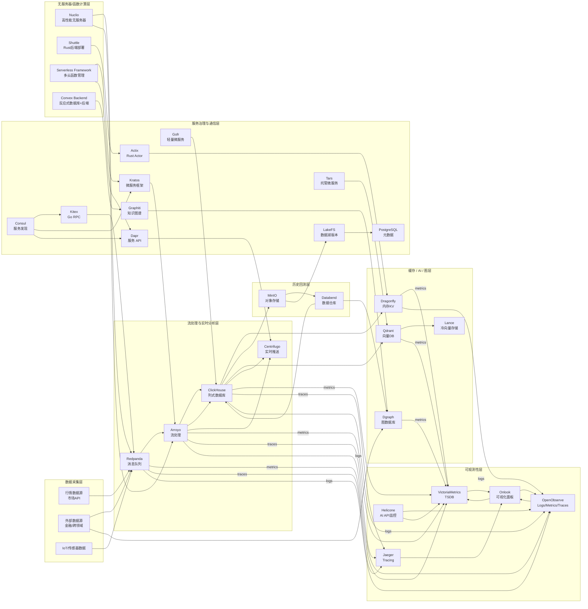

好的，结合之前的格式，我帮你全面分析这4个无服务器/后端相关的开源项目，做成对比表，方便你评估它们在 Qraft 中的适用场景。

---

# 无服务器计算与后端框架对比（Qraft视角）

| 项目                       |              类型 / 语言 | 关键特性（简要）                               | 优势                           | 局限 / 风险                                   | Qraft中潜在应用角色                                   |                                                     来源 |
| ------------------------ | -------------------: | -------------------------------------- | ---------------------------- | ----------------------------------------- | ---------------------------------------------- | -----------------------------------------------------: |
| **Nuclio**               |      高性能无服务器计算平台（Go） | 低延迟事件驱动计算，支持多触发器（HTTP、消息队列、定时），支持容器化部署 | 性能优异，支持多种事件触发，适合构建弹性计算和实时处理  | 相对复杂，社区活跃度中等，生态不如 Serverless Framework 丰富 | 流处理中的事件函数或数据预处理，结合 Arroyo 做实时计算的无服务器函数         |             [GitHub](https://github.com/nuclio/nuclio) |
| **Shuttle**              |      Rust语言后端构建与部署平台 | 简化Rust后端部署，无需基础设施文件，自动化管理环境            | 极简开发体验，Rust生态，安全高性能          | 新兴项目，生态和社区较小，功能还在快速迭代中                    | Qraft Rust模块的自动构建与部署平台，方便快速迭代和上线               |        [GitHub](https://github.com/shuttle-hq/shuttle) |
| **Serverless Framework** | 通用无服务器框架（JavaScript） | 多云平台支持，丰富插件生态，支持多语言函数部署                | 社区庞大，插件丰富，支持AWS/Azure/GCP等多云 | 需要学习框架DSL，且对多语言支持有一定配置门槛                  | 统一管理 Qraft 部署到云端的 Serverless 函数（如 Lambda 触发处理） |     [GitHub](https://github.com/serverless/serverless) |
| **Convex Backend**       |    反应式数据库 + 后端（Rust） | 内嵌数据库支持实时数据流，响应式架构，内建身份验证和同步           | 前后端一体，支持实时数据同步，适合构建交互复杂应用    | 新兴，功能相对专一，聚焦于实时交互应用场景                     | Qraft中交互式模块的快速后端原型，特别是实时多用户协作部分                | [GitHub](https://github.com/get-convex/convex-backend) |

---

# 简短总结及Qraft适用推荐

* **Nuclio**：优先考虑构建实时事件驱动的无服务器计算节点，和 Arroyo 流处理互补，适合事件响应和函数计算场景。
* **Shuttle**：Rust开发者的快速构建与部署利器，适合 Qraft Rust微服务和代理模块的自动化发布。
* **Serverless Framework**：适合跨云环境部署多语言函数，管理复杂云资源，方便统一 DevOps 管理。
* **Convex Backend**：聚焦实时反应式数据库+后端，适合构建协同交互式前后端模块，做快速迭代的 UI + 状态管理。

---

如果你需要，我可以帮你把这四个项目加入到 Qraft 架构表的“无服务器与后端模块”部分，并结合之前的架构图继续扩展。你觉得呢？

了解！基于你提供的 Qraft Mermaid v0.4 架构图，我来帮你把之前分析的无服务器平台（Nuclio、Shuttle、Serverless Framework、Convex Backend）映射进去，补充一个“无服务器/函数计算层”，并更新 Mermaid 架构和相关数据流。

---

## 1. Qraft Mermaid v0.5（含无服务器层）

---

## 2. 简要说明

* **Nuclio**：集成在流处理层和消息队列，做事件驱动计算和快速无服务器函数调用。
* **Shuttle**：Rust后端部署平台，与 Actix (Rust Actor) 紧密配合，快速发布高性能服务。
* **Serverless Framework**：对接 Kratos 和 Dapr 等多语言微服务框架，统一多云函数的部署管理。
* **Convex Backend**：作为知识图谱层（Graphiti）的后端支持，构建实时响应式交互服务。

---

如果需要，我可以帮你写对应的**多节点部署建议和资源规划矩阵**，包含端口分配、持久化方案、监控指标等，方便直接落地。需要吗？
