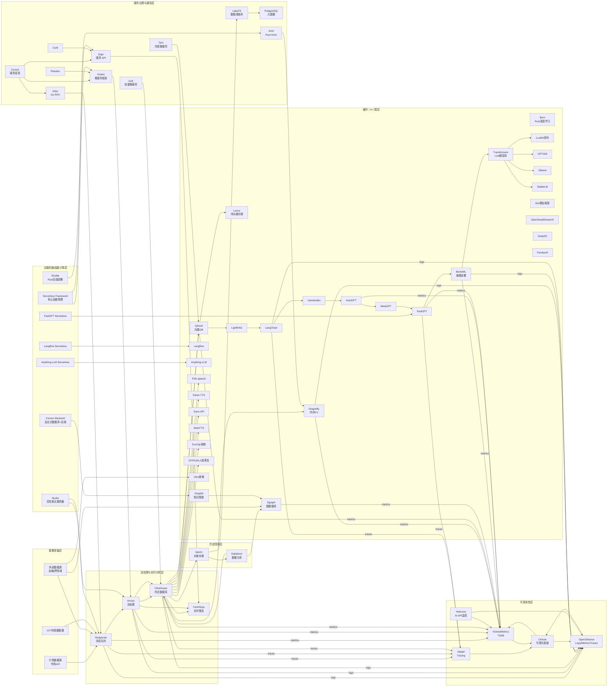

好 —— 我把你列的这些 **AI/ML / Agent / 推理 / 多媒体** 开源项目按功能类别分组，做成紧凑且实用的对比表（每行：项目｜语言｜一句话定位｜优势｜局限｜在 Qraft 的推荐角色）。表格后我给出**Qraft 优先采纳清单（核心栈）**与**落地注意事项**，方便你直接决策和工程对接。

> 说明：条目力求简洁可落地。若你想要我把任一项展开成「集成方案 + Kubernetes / BentoML / Ollama 示例 YAML」或「本地 GPU 部署说明」，我可以接着做。

# 模型训练 / 框架 / 推理基础设施

| 项目           |           语言 | 定位（一句）               | 优势                  | 局限                  | Qraft 角色                |
| ------------ | -----------: | -------------------- | ------------------- | ------------------- | ----------------------- |
| burn         |         Rust | 下一代深度学习库（Rust）       | Rust 性能与安全、适合嵌入式/边缘 | 生态较小、模型资源不如 PyTorch | 若偏 Rust 路线：用于高性能本地训练/推理 |
| h2o-3        | Jupyter/Java | AutoML / 企业级 ML 平台   | 自动化建模、可视化强          | 不适合大规模深度学习          | 快速做传统因子/回归模型与 AutoML 对比 |
| transformers |       Python | 主流 Transformer 模型库   | 模型种类多、社区与生态最大       | 资源消耗大、需要 GPU        | Qraft 的主力模型库（训练+推理）     |
| StableLM     |      Jupyter | 开源 LLM 系列（Stability） | 开源模型可本地化            | 模型质量/规模需评估          | 作为可替代 LLaMA/开放模型选择      |
| llama        |       Python | Meta 开源 LLM（家族）      | 优秀基础模型（适配多工具）       | 许可/使用受限、需注意合规       | 本地化 LLM 的重要候选（若许可允许）    |
| gpt4all      |          C++ | 本地化轻量 LLM 运行         | 设计供本地 CPU/低资源运行     | 表现低于大型 LLM          | 用于本地快速原型与离线推理           |
| deepclaude   |         Rust | 高性能 LLM 推理 API（Rust） | 高吞吐、低延迟             | 新兴、生态小              | 用于高并发推理微服务（若 Rust 团队）   |

# 模型部署 / 推理服务 / 管理

| 项目               |      语 | 定位           | 优势               | 局限        | Qraft 角色        |
| ---------------- | -----: | ------------ | ---------------- | --------- | --------------- |
| BentoML          | Python | 模型打包与服务化框架   | 生产化友好、支持多后端与部署   | 需配置 CI/CD | 模型部署 + 推理微服务标准化 |
| ollama           |     Go | 本地 LLM 管理与运行 | 易管理本地模型、便于团队共享   | 功能专注本地化   | 本地/私有化 LLM 管理层  |
| plandex          |     Go | 终端 AI 开发工具   | 便于终端快速开发与实验      | 功能较专用     | 快速开发原型与工程师效率工具  |
| anything-llm     |     TS | 全栈 LLM 应用模板  | 快速搭建 ChatGPT 式服务 | 非深层定制化    | 业务层快速交付模板       |
| ollama / gpt4all | Go/C++ | 本地模型管理/运行    | 本地化、隐私友好         | 模型质量受限    | 离线/隐私场景的推理层选择   |

# Agent / 自动化代理 / 工作流

| 项目       |          语 | 定位              | 优势                | 局限       | Qraft 角色                      |
| -------- | ---------: | --------------- | ----------------- | -------- | ----------------------------- |
| AutoGPT  |     Python | 自动化 GPT 代理示例    | 生态活跃、演示 Agent 流程  | 不成熟、易失控  | 做概念验证（自动化策略 / backtesting 辅助） |
| MetaGPT  |     Python | 多 Agent 协作框架    | 任务分工与 Agent 协同    | 工程化投入高   | 复杂协作式策略模拟或研究平台                |
| FastGPT  | TypeScript | AI Agent 平台     | 工程化较好、前端集成便利      | 仍偏平台化产品  | 快速构建交互式 Agent 界面              |
| sim      | TypeScript | 轻量 Agent / 工作流  | 轻量、友好             | 功能有限于工作流 | 快速试验 Agent 流程                 |
| LangFlow |     Python | 可视化 Agent & 流编辑 | 可视化构建 RAG/Agent 流 | 生产化需包装   | 非工程师也能设计策略/agent 流            |

# RAG / 索引 / 检索（向量 + 知识索引）

| 项目            |      语 | 定位             | 优势                | 局限       | Qraft 角色                   |
| ------------- | -----: | -------------- | ----------------- | -------- | -------------------------- |
| llama\_index  | Python | 数据到索引层（RAG 工具） | 灵活的数据源适配          | 需工程封装    | RAG 管道核心：文档→向量→索引          |
| langchain     | Python | LLM 应用/链构建工具   | 生态极广，各种 connector | 灵活但可复杂   | Agent / RAG / Prompt 模块化首选 |
| LightRAG      | Python | 轻量 RAG 实现      | 轻快易上手             | 功能被更大库覆盖 | 小规模 RAG 快速原型               |
| anything-llm  |     TS | 全栈 LLM+向量模版    | 快速部署              | 非深度定制    | 业务层 RAG 快速交付               |
| WrenAI / coai |     TS | 前端整合 LLM 平台    | 方便前端接入            | 需后端配套    | 前端/产品层的快速集成方案              |

# Agent 平台 / 可视化 / 流程构建

| 项目                       |      语 | 定位         | 优势                   | 局限           | Qraft 角色         |
| ------------------------ | -----: | ---------- | -------------------- | ------------ | ---------------- |
| LangFlow                 | Python | 可视化流程编辑器   | 非工程师友好、RAG/Agent 可视化 | 生产化需接入 infra | 策略构建的可视化工具       |
| ComfyUI                  | Python | 模型工作流可视化编辑 | 组件式、适合多模型流程          | 偏图像/生成流程     | 可视化设计模型推理流水线     |
| LangChain / llama\_index | Python | （见上）       | N/A                  | N/A          | Agent / RAG 的基础库 |

# 知识图谱 / 信息抽取 / NLP 工具

| 项目                       |      语 | 定位          | 优势             | 局限      | Qraft 角色                 |
| ------------------------ | -----: | ----------- | -------------- | ------- | ------------------------ |
| DeepKE                   | Python | 知识抽取 / KGC  | 专注关系抽取与知识构建    | 需要标注数据  | 构建跨市场/企业知识图（结合 Graphiti） |
| Graphiti                 | Python | 时间感知知识图谱    | 时间维度优秀，适合贝叶斯流程 | 新兴需工程打磨 | 作为 Qraft 的记忆与长期知识层       |
| llama\_index / LangChain | Python | 数据连接器 / 工具链 | N/A            | N/A     | 把结构化数据映射到 LLM 查询层        |

# AutoML / 低代码 / 数据科学工具

| 项目        |              语 | 定位          | 优势              | 局限        | Qraft 角色               |
| --------- | -------------: | ----------- | --------------- | --------- | ---------------------- |
| pycaret   | Jupyter/Python | 低代码 ML      | 快速试验、流水线        | 对深度学习支持有限 | 快速 baseline & 特征实验     |
| pandas-ai |         Python | 用 AI 驱动数据分析 | 交互式分析便捷         | 依赖 LLM 质量 | 分析师 explorations 与报告生成 |
| h2o-3     |        Jupyter | AutoML 企业方案 | 强大的 AutoML 与可视化 | 深度学习并非其强项 | 大量特征工程与回测基线对比          |

# 听觉 / 语音 / 多媒体（TTS / STT / 视频）

| 项目          |      语 | 定位        | 优势        | 局限          | Qraft 角色       |
| ----------- | -----: | --------- | --------- | ----------- | -------------- |
| fish-speech | Python | 高级 TTS 模型 | 现代 TTS 能力 | 需 GPU       | 语音告警、交互系统语音输出  |
| parler-tts  | Python | 轻量 TTS    | 适合低资源环境   | 音质不如大型模型    | 低成本语音通知        |
| Suno-API    | Python | 语音生成 API  | 端到端语音合成   | 商业/部署细节需看实现 | 生成语音报告         |
| MeloTTS     | Python | 端到端语音合成   | 现代架构      | 训练成本高       | 高质量语音输出        |
| GFPGAN      | Python | 人脸修复 GAN  | 图像后处理好用   | 非实时推理可重     | 多媒体展示/回放时的图像增强 |
| FunClip     | Python | 自动视频剪辑    | 自动化生产短片   | 需特定模型       | 做策略演示视频/报告生成   |

# 多模态 / 应用级平台 / 工具集

| 项目                                     |      语 | 定位          | 优势               | 局限         | Qraft 角色       |
| -------------------------------------- | -----: | ----------- | ---------------- | ---------- | -------------- |
| Transformers / HuggingFace             | Python | 模型库 + hub   | 最大模型资源、生态        | 需 infra 支撑 | 中枢模型仓库与实验平台    |
| BentoML                                | Python | 推理服务化       | 生产就绪、容器 & k8s 支持 | 需要工程化接入    | 部署模型至在线服务      |
| ComfyUI                                | Python | 可视化模型流水线    | 直观构建复杂流程         | 偏生成工作流     | 快速构建多模型推理链路    |
| anything-llm / FastGPT / coai / WrenAI |  TS/Go | 全栈应用 & 前端整合 | 快速交付 UI & chat   | 需后端 infra  | 产品层快速原型和客服类 UI |

---

# Qraft — 推荐“核心采纳”清单（优先级排序，直接可立项）

1. **基础模型与开发**：`transformers` + `huggingface` hub（必选）
2. **部署/推理**：`BentoML`（模型服务化） + `deepclaude` 或 `ollama`（若需 Rust / 本地高效推理）
3. **RAG / 索引**：`langchain` + `llama_index`（管线化文档检索/聚合）
4. **Agent / 流程可视化**：`AutoGPT`（PoC） + `LangFlow`（可视化流程）
5. **知识图谱 / 抽取**：`Graphiti`（时间感知知识） + `DeepKE`（关系抽取）
6. **本地/轻量模型**：`gpt4all` / `ollama`（快速离线/隐私场景）
7. **多模态 / TTS / 视频**：`fish-speech` / `MeloTTS` / `FunClip`（报告与演示自动化）
8. **工程化工具**：`ComfyUI`（可视化工作流）、`anything-llm`（全栈模板）、`plandex`（终端开发便捷）

# 落地注意事项（工程层面）

* **资源**：大模型需 GPU（A100/V100/40GB+）或推理集群；本地化轻量模型适合 CPU。
* **许可合规**：LLaMA/StableLM/某些模型在使用与再发布上有许可限制，生产化前请核查许可。
* **向量存储接入**：Qraft 已选 Qdrant/Lance，保证 `llama_index` / `langchain` 的 connector 正确配置并做索引分层（hot/cold）。
* **推理延迟与吞吐**：对高频交易或低延迟策略，只把模型用于非关键路径或将推理异步化（缓存/批推理/二级缓存）。
* **安全与隐私**：所有外部 LLM 调用（SaaS）应在 Helicone + OpenObserve 中监控成本与数据流出，敏感数据须脱敏或本地化处理。
* **工程化**：把模型服务包装成 BentoML 容器镜像并纳入 CI/CD（镜像签名、依赖扫描、模型版本控制）。
* **测试**：用 unit tests + adversarial prompt 测试，验证模型在极端市场情况下的行为（防止盲目执行）。

---

如果你同意，我的下一步可以是（任选其一，直接产出可复制内容）：

* A — 为 **推荐采纳清单** 中的前 6 项，生成**一键部署蓝图**（包含：BentoML 服务模板、llama\_index to Qdrant 示例、LangChain Agent 示例）；
* B — 给出 **模型服务化 + CI/CD** 的标准化工程文档（包括模型版本管理、容器化、K8s Deployment YAML 模板、Prometheus 指标规范）；
* C — 把选中的 TTS / 视频工具做成 **自动报告流水线示例**（输入回测结果 → 生成语音报告与自动剪辑短片）。

你想先要哪一个？

我可以直接帮你把你上面那批 AI/ML 开源项目按功能模块映射到 **Qraft Mermaid v0.5** 里，形成一个扩展版架构，把它们放到合适的层（缓存/AI/图层、无服务器层、可观测性层等），并保持你原本的流处理 + 可观测性整合思路。

我会先把它们分类，再在 Mermaid 里补进去。

---

### 1. 分类映射

| 模块                        | 项目                                                                                                                                   | 说明              |
| ------------------------- | ------------------------------------------------------------------------------------------------------------------------------------ | --------------- |
| **AI 模型/推理框架**            | burn, h2o-3, BentoML, flair, transformers, pycaret, llama, StableLM, gpt4all, ollama, deepclaude                                     | 模型训练与推理核心       |
| **AI Agent / 多智能体 / 工作流** | AutoGPT, MetaGPT, LightRAG, FastGPT, sim, open-deep-research, langchain, llama\_index, langflow, anything-llm, WrenAI, coai, plandex | Agent 构建与数据链路编排 |
| **AI 数据与知识管理**            | DeepKE, pandas-ai, GRAPHITI（原有）                                                                                                      | 知识图谱、向量索引、AI+DB |
| **语音/多模态生成**              | GFPGAN, fish-speech, parler-tts, Suno-API, MeloTTS, FunClip                                                                          | 语音合成、视频剪辑、多模态   |
| **无服务器/部署**               | BentoML（也可归这里），ollama（本地模型部署）                                                                                                        | 模型服务化与部署优化      |
| **观测/监控**                 | Helicone（原有），扩展 AI API 监控到更多推理框架                                                                                                     | 推理调用监控与优化       |

---
好的，我直接在你 v0.5 的基础上做扩展，把这批 AI / LLM / 多模态 / Agent 项目完整映射进 **Qraft Mermaid v0.6**，并保持你的分层风格。
这里会在 **Cache / AI / Graph 层** 加细分区块，同时在 **Serverless** 和 **Observability** 增加 AI 部署与监控流向。

---

---

这样，**v0.6** 相比 v0.5 的改进有：

1. **CacheAI 层细分**，增加了：

   * LLM / 推理框架
   * Agent / Workflow
   * RAG / 知识增强
   * 多模态 AI（TTS / 视频 / 图像 / 特殊领域）
2. **Serverless 层** 直接挂接了 FastGPT、Langflow、Anything-LLM 等无服务器化部署。
3. **Observability 层** 增加 AI 推理与 Agent 工作流的 metrics / logs / traces。
4. 维持原有数据流逻辑，并新增 AI 模块之间的推理链路。

---

如果你愿意，我还可以帮你出一个 **颜色分层版本**，让 AI / Serverless / Observability / Data 层在视觉上更好区分，这样你做 PPT 或架构文档会更直观。
你要我帮你画这个彩色版本吗？这样可视化效果会更强。
