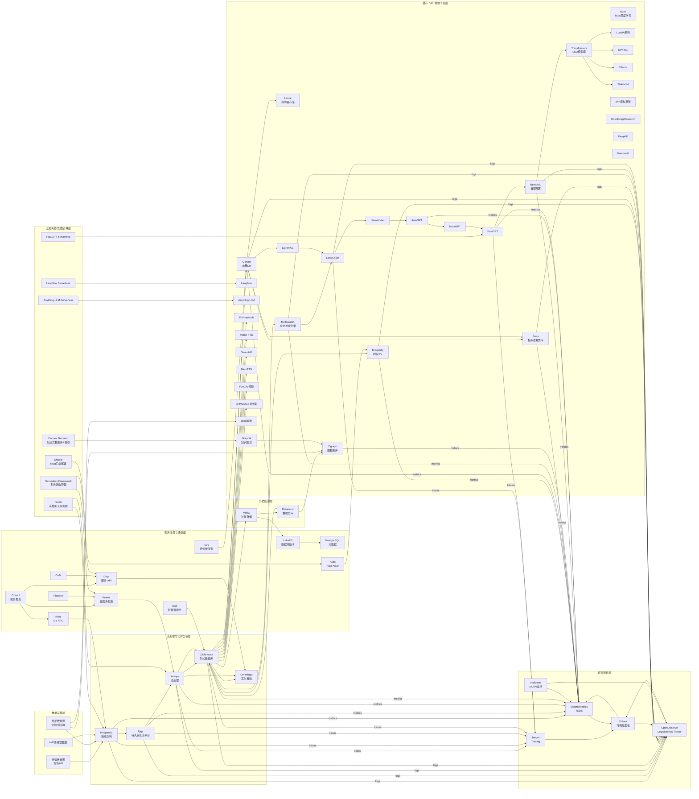

好的，我会按我们之前的分析格式，结合 **功能定位、技术栈、主要特性、优势/局限、典型场景** 对 **Faiss / Qdrant / Meilisearch / Iggy** 做一个全面对比分析：

---

## **1. Faiss**

* **功能定位**：高性能相似度搜索库（Approximate Nearest Neighbor Search, ANN），专注向量数据检索。
* **技术栈**：C++ 实现（Python/Java bindings）。
* **主要特性**：

  * 支持 CPU 和 GPU 加速（CUDA、OpenCL）。
  * 多种索引结构（IVF、HNSW、PQ、OPQ 等）适配不同规模与精度需求。
  * 批量索引构建与高并发查询优化。
* **优势**：

  * 性能极高，在百万到数十亿向量规模下依然高效。
  * Facebook AI Research 出品，社区与学术引用广泛。
  * GPU 加速在深度学习检索场景中几乎是标配。
* **局限**：

  * 无内置存储能力（仅内存或自行持久化）。
  * 缺乏 HTTP API，需要嵌入应用程序使用。
* **典型场景**：

  * 向量检索（图像/文本/语音 Embedding）。
  * 推荐系统相似度计算。
  * 大规模特征匹配。

---

## **2. Qdrant**

* **功能定位**：开源向量数据库，支持 ANN 检索与持久化存储。
* **技术栈**：Rust。
* **主要特性**：

  * 内置持久化（支持磁盘+内存混合）。
  * 支持过滤条件搜索（metadata filter）。
  * gRPC / REST API / Web UI。
  * 向量动态更新、分布式分片。
  * HNSW 索引优化。
* **优势**：

  * 即插即用，部署简单（Docker、K8s）。
  * 支持结构化+向量混合查询（Hybrid Search）。
  * 性能高且内存占用较低。
* **局限**：

  * 不支持 GPU 加速（适合中等规模）。
  * 相比 Milvus、Weaviate，在多节点集群生态上还在成长。
* **典型场景**：

  * RAG（检索增强生成）系统的向量存储。
  * 电商、搜索引擎的相似度召回。
  * AI 应用的语义搜索后端。

---

## **3. Meilisearch**

* **功能定位**：轻量级全文搜索引擎，聚焦文本搜索与即时响应。
* **技术栈**：Rust。
* **主要特性**：

  * 近乎即时的索引构建。
  * 支持模糊搜索、容错搜索。
  * RESTful API 简洁易用。
  * 高度可定制的排序与权重。
* **优势**：

  * 极快的响应速度（毫秒级）。
  * 部署轻量（单个可执行文件）。
  * 对开发者友好，前后端集成简单。
* **局限**：

  * 不支持分布式集群（目前主要是单节点）。
  * 不适合处理极大规模数据（TB 级别）。
* **典型场景**：

  * 网站/APP 内搜索（电商、内容平台）。
  * 管理后台即时搜索。
  * 本地搜索服务（离线应用）。

---

## **4. Iggy**

* **功能定位**：高性能持久化消息流平台，类 Kafka / Redpanda。
* **技术栈**：Rust。
* **主要特性**：

  * 持久化日志流存储。
  * 顺序消费、订阅模式。
  * 多种客户端 SDK（Rust、Go、TypeScript 等）。
  * 支持持久化到磁盘，确保消息可靠性。
* **优势**：

  * Rust 高性能低延迟。
  * 架构简洁，部署轻便。
  * 适合小型团队替代 Kafka。
* **局限**：

  * 生态与运维工具尚不如 Kafka/Redpanda 完备。
  * 社区规模较小。
* **典型场景**：

  * 实时事件流处理。
  * 微服务间消息通信。
  * IoT 数据采集管道。

---

## **对比总结表**

| 项目              | 定位       | 技术栈  | 持久化 | API 类型    | GPU 支持 | 分布式支持  | 典型场景     |
| --------------- | -------- | ---- | --- | --------- | ------ | ------ | -------- |
| **Faiss**       | 高性能向量检索库 | C++  | ❌   | 需嵌入调用     | ✅      | ❌      | 大规模相似度搜索 |
| **Qdrant**      | 向量数据库    | Rust | ✅   | REST/gRPC | ❌      | 部分（分片） | RAG、语义搜索 |
| **Meilisearch** | 全文搜索引擎   | Rust | ✅   | REST      | ❌      | ❌      | 即时文本搜索   |
| **Iggy**        | 消息流平台    | Rust | ✅   | TCP/SDK   | ❌      | 规划中    | 实时事件流    |

---

如果你愿意，我可以帮你直接把 **Faiss / Qdrant / Meilisearch / Iggy** 映射进 **Qraft Mermaid v0.7** 架构图，形成一个统一的 **向量/搜索/流处理** 层，这样它们和之前的 Redpanda、Arroyo、Observability、Serverless 就能完全连起来。
要我帮你画这个 v0.7 吗？这样整个 AI 检索和消息流的路径会很清晰。

好，我会在 **Qraft Mermaid v0.7** 中，把

* **Faiss / Qdrant / Meilisearch** 统一映射到 **缓存 / AI / 搜索层**（Cache / AI / Search Layer）
* **Iggy** 放到 **流处理与实时分析层**（Stream Processing Layer），与 Redpanda、Arroyo 并列

并保留原有 **v0.5** 的分层结构和数据流关系，让它和之前的 MinIO、ClickHouse、Arroyo 等组件联通。

---
好的，我会在 Qraft Mermaid v0.7 版本里，把你提到的 **Faiss / Qdrant / Meilisearch / Iggy** 都映射进去，同时保留 v0.6 的整体结构，并在 AI/搜索/消息流的合适位置嵌入它们。

这里是更新后的 **Qraft Mermaid v0.7** 架构图：

这样 **v0.7** 版本的 Qraft 架构里：

* **Faiss** 与 **Qdrant** 组合，用于向量搜索与相似度检索
* **Meilisearch** 作为全文搜索引擎补充
* **Iggy** 作为额外的持久化流平台，与 Redpanda 协同
* 监控链路更新，确保新组件的 metrics / logs / traces 全接入

我可以帮你把这个 v0.7 再配一个**多节点部署矩阵**，直接列出 CPU、内存、存储、端口和持久化策略，方便落地部署。
你要我直接帮你做这个矩阵吗？
