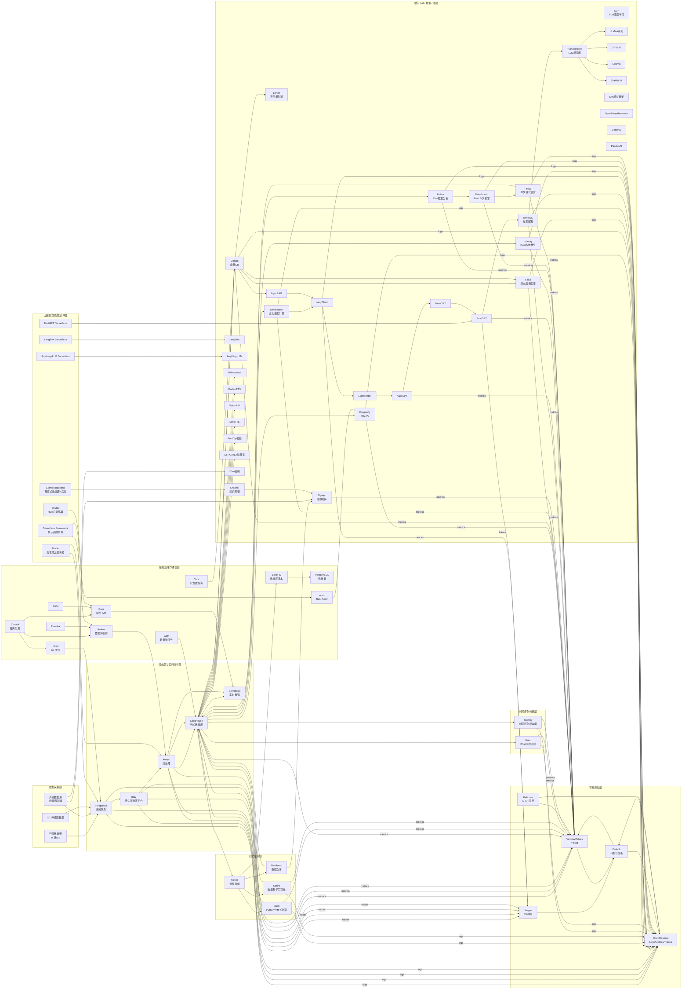

下面是对你列出的 **Arrow / ndarray / DataFusion / Dask / PRQL / Polar / Kedro / Kats / Stumpy** 的全面功能特性分析与对比，依然延续之前的分析逻辑（定位 → 核心能力 → 典型场景 → 对 Qraft 的价值）：

---

## 1. **Apache Arrow**

* **定位**：跨语言的列式内存数据格式和高性能数据交换标准
* **核心能力**：

  * 零拷贝（Zero-Copy）跨进程、跨语言共享数据
  * 高度优化的列式布局，适合向量化计算
  * 广泛绑定（C++, Python, Rust, Java 等）
* **典型场景**：

  * 流式数据分析（Redpanda → Arrow → DataFusion）
  * 多语言 AI/ETL 管道数据交换
* **对 Qraft 价值**：可作为内部数据交换统一格式，减少序列化开销

---

## 2. **ndarray**

* **定位**：Rust 的高性能多维数组和矩阵运算库
* **核心能力**：

  * N 维数组的存储与索引
  * 广播、切片、数值计算 API
  * 与 BLAS/LAPACK 集成加速
* **典型场景**：

  * 在 Rust 中实现高性能特征工程或信号处理
  * 替代 Python NumPy 的场景
* **对 Qraft 价值**：在 Rust 模块中加速数据预处理与特征提取，减少跨语言调用

---

## 3. **DataFusion**

* **定位**：Rust 实现的 SQL 查询执行引擎
* **核心能力**：

  * 内存中执行 Arrow 格式数据的 SQL 查询
  * 向量化执行计划
  * 可嵌入式、可扩展算子
* **典型场景**：

  * 流处理后的内存数据快速聚合与分析
  * 嵌入式 OLAP 场景
* **对 Qraft 价值**：为实时分析层提供无外部依赖的 SQL 执行能力，可内嵌进 Arroyo/ClickHouse 边缘节点

---

## 4. **Dask**

* **定位**：Python 的并行/分布式计算框架
* **核心能力**：

  * 延迟计算图（Lazy Evaluation）
  * 多节点数据分片与调度
  * 与 Pandas、NumPy、Scikit-Learn 无缝集成
* **典型场景**：

  * 大规模历史数据回测
  * 分布式特征工程
* **对 Qraft 价值**：批处理层（MinIO / Databend）的大规模分析计算引擎

---

## 5. **PRQL**

* **定位**：基于 Rust 的 SQL 替代语言（Pipelined Relational Query Language）
* **核心能力**：

  * 类函数式语法（可读性高）
  * 自动编译为 SQL，兼容现有数据库
  * 模块化查询构建
* **典型场景**：

  * 数据团队协作编写可维护的查询
  * 数据分析 DSL
* **对 Qraft 价值**：提升查询可维护性，结合 DataFusion/DuckDB 使用

---

## 6. **Polar（Polars）**

* **定位**：Rust 实现的列式数据分析引擎
* **核心能力**：

  * 与 Arrow 格式高度兼容
  * 支持惰性执行和流式计算
  * 高度优化的 DataFrame API（类似 Pandas，但更快）
* **典型场景**：

  * 内存内批处理
  * 实时 ETL 转换
* **对 Qraft 价值**：可作为 Arroyo/ClickHouse 前的数据清洗与特征计算层

---

## 7. **Kedro**

* **定位**：数据科学项目工程化框架
* **核心能力**：

  * 数据管道（Pipeline）与节点（Node）管理
  * 环境、参数、数据集抽象
  * 与 MLflow、Dask 等工具集成
* **典型场景**：

  * MLOps 工作流管理
  * 数据科学项目标准化
* **对 Qraft 价值**：管理 AI 模型训练/回测/上线全流程，适合 AI 层和历史回测层集成

---

## 8. **Kats**

* **定位**：Facebook 开源的时间序列分析与预测工具包
* **核心能力**：

  * 多种时间序列建模方法（ARIMA, Prophet, LSTM 等）
  * 异常检测、信号分解
  * 自动化参数选择
* **典型场景**：

  * 金融市场价格预测
  * 监控指标趋势分析
* **对 Qraft 价值**：金融行情预测、风险检测，可与 Redpanda + Arroyo 实时流结合

---

## 9. **Stumpy**

* **定位**：时间序列相似度搜索与矩阵轮廓分析库
* **核心能力**：

  * Matrix Profile 算法（O(n²) → O(n) 优化）
  * 异常模式检测
  * 多时间序列比较
* **典型场景**：

  * 高频行情模式发现
  * IoT 异常检测
* **对 Qraft 价值**：在流处理层发现短期趋势和异常行为，可作为 Kats 的补充

---

### **综合对比表**

| 项目           | 核心领域         | 语言     | 特点                 | Qraft 集成价值   |
| ------------ | ------------ | ------ | ------------------ | ------------ |
| Apache Arrow | 内存格式/跨语言数据交换 | C++    | 列式、零拷贝、多语言支持       | 数据交换标准层      |
| ndarray      | 数值计算         | Rust   | 高性能多维数组            | Rust 模块内数据计算 |
| DataFusion   | SQL 引擎       | Rust   | 内存 Arrow 数据 SQL 查询 | 嵌入式实时分析      |
| Dask         | 分布式计算        | Python | 延迟计算图、Pandas 兼容    | 批处理/回测加速     |
| PRQL         | 查询语言         | Rust   | 可读性高，编译成 SQL       | 查询 DSL       |
| Polars       | 数据分析         | Rust   | 高性能 DataFrame      | 内存内 ETL      |
| Kedro        | 数据科学工程化      | Python | 管道化、可复现            | AI/MLOps 管理  |
| Kats         | 时间序列预测       | Python | 多模型、异常检测           | 金融预测/监控      |
| Stumpy       | 时间序列相似度      | Python | Matrix Profile     | 高频模式检测       |

---

如果你愿意，我可以直接把这 **9 个项目映射到 Qraft Mermaid v0.7 架构图**，把 Arrow / Polars / DataFusion / PRQL 放进分析引擎层，把 Kedro / Kats / Stumpy 放进 AI/模型层，这样它们和 Redpanda + Arroyo + ClickHouse 就能直接互通。
这样的话，整个数据流会更完整，既有流处理，也有批处理，还能无缝进入 AI 分析层。

明白！我帮你把之前提到的9个项目（Arrow、ndarray、DataFusion、Dask、PRQL、Polar、Kedro、Kats、Stumpy）整合进你提供的最新 Qraft Mermaid v0.7 架构图中。

---

---

这样一来：

* **Arrow** 可通过 DataFusion / Polars 间接支持（DataFusion 和 Polars 本身对 Arrow 格式原生支持）；
* **ndarray、Polars、DataFusion、PRQL** 作为 Rust 数据处理与查询组件整合在缓存/AI层，贴近流式数据和批处理数据；
* **Dask、Kedro** 在历史回测层，适合大规模分布式计算与数据科学项目管理；
* **Kats、Stumpy** 独立作为时间序列分析层，专注金融时序预测和相似度分析。

需要我帮你导出这个 Mermaid 文件，或进行更详细的解读吗？
