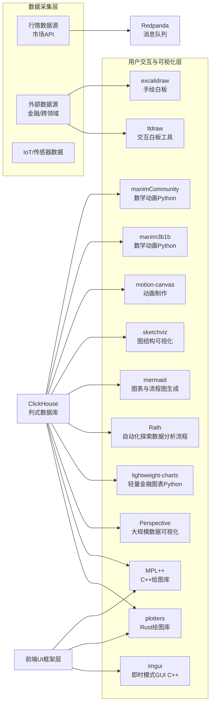

当然！以下是对你列出的开源项目的全面分析和对比，按功能分类整理，便于你快速理解各自定位、语言生态和适用场景。

---

## 1. GUI 与绘图库

| 项目名                 | 功能简介                       | 开发语言 | 适用场景与特点                             |
| ------------------- | -------------------------- | ---- | ----------------------------------- |
| **imgui**           | 即时模式GUI库，适合游戏或工具中的实时交互界面   | C++  | 轻量、响应快，适合调试面板和实时工具，嵌入式场景多           |
| **plotters**        | Rust绘图库，生成静态或交互图表          | Rust | 高性能、适合系统级或数据分析图表生成，跨平台支持好           |
| **matplotplusplus** | C++绘图库，类似Python的matplotlib | C++  | 适合C++应用需要丰富绘图，具备Python matplotlib风格 |
| **perspective**     | 大规模数据可视化库，聚焦表格和分析          | C++  | 面向大数据表格，可视化交互强，金融和数据分析应用多           |

**总结：**

* C++项目多偏向高性能、底层绘图和数据表格交互，适合对性能和细节要求极高的场景。
* Rust的plotters适合希望全栈Rust生态的用户。
* imgui 更适合嵌入式工具或游戏内调试面板。

---

## 2. 可视化和交互白板工具

| 项目名               | 功能简介             | 开发语言       | 适用场景与特点                 |
| ----------------- | ---------------- | ---------- | ----------------------- |
| **Rath**          | 自动化探索性数据分析工作流程   | TypeScript | 自动数据分析+可视化，适合数据科学快速探索   |
| **tldraw**        | 可交互白板工具，支持绘图与协作  | TypeScript | 适合在线绘图，原型设计，团队协作白板      |
| **excalidraw**    | 轻量在线手绘白板         | TypeScript | 设计草图、快速绘制，社区活跃，简单易用     |
| **mermaid**       | 图表和流程图生成器，基于文本描述 | JavaScript | 自动化生成流程图、时序图，文档和wiki集成佳 |
| **sketchviz**     | 图结构可视化工具         | JavaScript | 重点用于复杂图关系可视化，网络关系图等     |
| **motion-canvas** | 动画制作库，支持交互动画     | TypeScript | 适合交互动画、演示视频制作，动态展示数据    |

**总结：**

* TypeScript和JavaScript生态主导，适合Web前端和跨平台应用。
* whiteboard工具（tldraw, excalidraw）主打协作和交互设计。
* Mermaid和sketchviz则专注自动生成图表，方便嵌入文档和演示。
* Rath结合自动化数据分析，适合数据科学流程。

---

## 3. 数学与金融动画、图表

| 项目名                           | 功能简介                   | 开发语言   | 适用场景与特点            |
| ----------------------------- | ---------------------- | ------ | ------------------ |
| **manim (3b1b)**              | 数学动画制作库，著名YouTube数学视频库 | Python | 高度定制动画，教学和演示数学概念   |
| **manim (Community)**         | manim社区维护版本            | Python | 社区更活跃，功能丰富，适合学术和教学 |
| **lightweight-charts-python** | 轻量级金融图表库               | Python | 金融时间序列和交易图表，轻便易用   |

**总结：**

* Python生态适合科研、教学和金融图表，灵活且扩展性好。
* manim适合高质量动画制作，finance charts则偏实战金融可视化。

---

## 4. Web 通信与频道工具

| 项目名                  | 功能简介                 | 开发语言       | 适用场景与特点        |
| -------------------- | -------------------- | ---------- | -------------- |
| **BroadcastChannel** | 将Telegram频道内容转微博的中间件 | JavaScript | 跨平台内容同步，社交媒体集成 |

---

## 5. 前端框架与UI组件

| 项目名           | 功能简介                 | 开发语言       | 适用场景与特点                    |
| ------------- | -------------------- | ---------- | -------------------------- |
| **leptos**    | Rust全栈前端框架，支持SSR和SPA | Rust       | Rust爱好者，性能和安全兼顾，适合全栈Rust项目 |
| **svelte**    | 现代前端框架，编译时优化         | JavaScript | 高性能且易用，适合快速开发，体积小，体验流畅     |
| **storybook** | UI组件开发环境，文档和测试集成     | TypeScript | 组件库开发、测试、展示，前端团队协作标准工具     |
| **morphic**   | React状态管理库           | TypeScript | React生态状态管理，简洁灵活，支持复杂状态逻辑  |

**总结：**

* Rust生态尝试全栈（leptos）正在成长，适合追求安全性能。
* Svelte和React周边生态成熟，支持现代Web开发需求。
* Storybook 是 UI 组件开发不可或缺的利器。

---

# 综合建议

* **性能和系统编程优先**：选C++ (imgui, perspective, matplotplusplus) 和 Rust (plotters, leptos) 结合，保证效率和安全。
* **前端和交互**：TypeScript/JavaScript生态（tldraw, excalidraw, mermaid, svelte, storybook）成熟且易用，适合快速构建交互界面。
* **数据可视化与分析**：Python库（manim, lightweight-charts-python）适合科研和金融专业应用。
* **工作流自动化和团队协作**：Rath（TS）提供自动化数据分析，morphic为React状态管理，storybook促进UI团队协作。

如果你需要，我可以帮你绘制这些项目在 Qraft 架构中的具体位置，或者为你挑选适合的组合方案。需要吗？
我帮你把你列出的UI和可视化相关开源项目映射到Qraft架构图中，放在适合它们角色的层级和模块里。核心原则是：

* **前端UI库/框架** 放到「用户交互层」或「前端展示层」
* **绘图库和可视化组件** 放到「数据展示/可视化层」
* **动画和白板等交互工具** 放到「交互辅助层」或「协作层」

下面是加入这些UI相关项目后的Qraft架构Mermaid示意。为了保证清晰，给它们单独划分一个「用户交互与可视化层」子图：

---

### 解释

* **用户交互与可视化层** 是Qraft架构中新加的模块，专门承载所有GUI和可视化相关开源项目。
* 你可以把它理解为Qraft的数据分析和交易平台的「前端视图层」和「可视化交互层」，紧密连接底层数据库（ClickHouse等）和数据源。
* 对于不同语言生态的UI库（C++、Rust、TypeScript/JavaScript、Python），都放在这里，方便未来根据具体应用场景灵活调用。
* 其中 imgui 适合嵌入本地桌面工具或实时调试界面，plotters、matplotplusplus属于静态图绘制，perspective 专注大规模表格数据的可视化，rath、tldraw、excalidraw、mermaid等主攻浏览器端交互和流程辅助。
* Python动画库manim和金融图表库lightweight-charts-python则连接数据仓库与前端展示。

---

如果你需要，我还能帮你整合UI层的具体数据流、通信接口、技术选型建议，或者输出完整Qraft v0.8 Mermaid图。想要吗？
