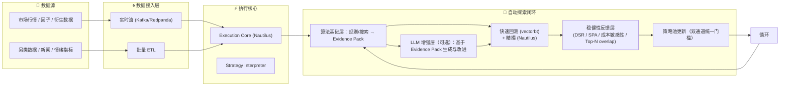

# Qraft 6.0 设计蓝图（可落地版）

> 目标：在不自研高难度内核/DSL 的前提下，基于成熟开源组件与少量胶水代码，搭建一套**跨市场、可复现、可扩展**的量化研究与执行平台；支持规则/因子、套利、组合优化与风险管理、贝叶斯与鲁棒评估，并可选接入 LLM 做策略探索与解释。

---

## 0. 设计原则

* **先落地，后完美**：优先以成熟组件拼装出可用闭环，避免“自研微内核/DSL”导致的不可交付。
* **算法优先，LLM 后置增强**：先将算法层做到“证据完备”（因子挖掘、暴力/启发式搜索、时序与稳健性评估、组合与风控）并形成可复现的 Evidence Pack，再在此基础上以 LLM 进行“假设生成/解释/重组”，LLM 始终受限于协议与证据包。
* **分层解耦**：数据、特征、策略、回测执行、组合优化、风险、评估与上线全分层，模块可替换。
* **回测=实盘接口一致**：一套策略接口，既能回测也能实盘，降低迁移风险。
* **跨市场可适配**：将市场差异收敛在 Data Adapter 与 Calendar/Contract 规则层。
* **人机协作**：LLM 用于“策略假设生成/解释/代码骨架”，数值拟合、回测和风控交给确定性模块。
* **可审计与鲁棒**：所有结果可复现，参数与数据版本化；引入贝叶斯后验与稳定性评估。

---

## 1. 顶层流程（Qraft 6.0）

```
原始数据 → 因子/特征生成 → 策略候选生成（算法深挖 → LLM 增强，可选） → 统一回测执行 → 组合优化 → 风险评估/鲁棒性检验 → 策略池 → 人工审查 → 实盘上线（同构接口） → 监控/复盘
```

* **与 Qraft4.0 的区别**：将“策略生成”明确拆分为“算法基础层”与“LLM 增强层（可选）”，LLM 在算法证据包的强约束下工作；其余沿用多阶段回测与稳健性筛选；不再追求 Qraft5.0 的 RDL 微内核与自研 DSL。

---

## 2. 分层架构

### 2.1 逻辑分层

1. **数据层**：历史/实时行情、基本面、衍生数据（新闻情绪、另类数据）。
2. **适配层（Adapters）**：交易日历、合约规则、撮合细则、手续费/滑点模型；经纪商/交易所 API。
3. **特征层（Feature/Factor）**：标准化流水线（缺失值、去极值、归一化、行业中性化等）。
4. **策略层（分层）**：

   - 算法基础层：规则/组合/搜索（网格、遗传、启发式），形成 Evidence Pack（见第 20 节）。
   - LLM 增强层（可选）：在 Evidence Pack 约束下进行模式识别、假设生成与策略重组，输出同一策略协议。
5. **回测/执行层（统一）**：事件驱动引擎；回测与实盘同构。
6. **组合优化层**：均值-方差、Black–Litterman、HRP、鲁棒/约束优化（含交易成本）。
7. **风险与评估层**：风险分解、压力测试、贝叶斯后验、样本外鲁棒性。
8. **上线与监控层**：审批流、参数冻结、风控阈值、预警与归因、灰度与回滚。

### 2.2 组件映射（推荐）

* **执行内核**：Nautilus Trader（回测/实盘同构，事件驱动，组合级）
* **组合优化**：PyPortfolioOpt / Riskfolio-Lib（复杂约束下落 CVXPY）
* **定价与风险扩展**：QuantLib（固定收益/衍生品）
* **贝叶斯/鲁棒**：PyMC / Stan（后验、层次模型、稳定性）
* **数据/券商**：IB / Oanda / CCXT / 历史数据供应商（通过 Adapters 收敛）
* **策略生成（可选）**：LangGraph/LangChain + LLM API（GPT/Claude/Sonnet 等），或简单函数式模板；亦可通过 RD‑Agent 场景插件对接。

---
## Qraft6.0 的数据流架构图（实时 vs 存储）
```mermaid
flowchart LR

    subgraph Providers["📡 数据提供商 (交易所 / API / 第三方)"]
        Mkt[市场行情数据]
        Alt[另类数据源]
    end

    subgraph Ingest["🌀 数据接入层"]
        RT["实时流 (Kafka/Redpanda)"]
        Batch["批量拉取 (ETL)"]
    end

    subgraph Processing["⚡ 数据处理引擎"]
        StreamProc["实时流处理 (Flink / Faust)"]
        BatchProc["批处理 (Spark / DuckDB / Polars)"]
    end

    subgraph Storage["💾 数据存储"]
        Clickhouse[(ClickHouse 数据仓库)]
        MinIO[(MinIO / S3 对象存储)]
    end

    subgraph Core["🧩 Execution Core (Nautilus)"]
        StratInterp["Strategy Interpreter (expr → signals)"]
        Engine["回测 / 实盘执行引擎"]
        Risk["组合优化 & 风险管理"]
    end

    subgraph Agents["🤖 Agent 层"]
        Algo[算法基础层 (Evidence Pack 产出)]
        LLM[LLM 增强层 (可选)]
    end

    %% 数据流向
    Mkt -->|订阅/推送| RT
    Alt -->|API/批量| Batch

    RT --> StreamProc
    Batch --> BatchProc

    StreamProc --> Core
    BatchProc --> Clickhouse

    Clickhouse --> BatchProc
    Clickhouse --> Core
    MinIO --> BatchProc
    BatchProc --> MinIO

    Algo --> LLM
    Core --> Algo
    LLM --> Core
```
---

## Qraft6.0 探索闭环架构图


---

## 3. 技术栈与语言分工

* **Python**：主导（策略/特征、优化、风险、贝叶斯、LLM 集成、胶水层）
* **C++/Rust（可选）**：热点计算/自定义撮合/高速指标（后期按需优化）
* **Go（可选）**：微服务调度、API 网关、作业编排（规模化后再引入）

> 初期以 Python 为主，降低门槛；性能热点再逐步下沉。

---

## 4. 核心接口规范（统一“策略协议”）

### 4.1 数据与特征接口

```yaml
Bar:
  ts: datetime
  sid: string   # 证券ID
  o,h,l,c,v: float
  extra: {...}

FeatureFrame:
  index: [ts, sid]
  columns: [feature_name]
  values: float
  meta: {universe, freq, transform_pipeline_version}
```

### 4.2 策略输出 Schema（规则/LLM 同一套）

```json
{
  "name": "string",
  "universe": ["symbol", ...],
  "signals": [
    {"expr": "(MA(close,20) > MA(close,50)) and (RSI(14) < 70)", "weight": 1.0}
  ],
  "positioning": {"type": "long_only|long_short", "gross_max": 1.2, "leverage": 1.0},
  "risk_constraints": {"max_dd": 0.2, "vol_target": 0.15, "sector_neutral": true},
  "exec": {"algo": "twap|participation|market", "slice": 0.2}
}
```

> 说明：`expr` 可由算法层生成或 LLM 生成；统一由策略解释器解析为可执行信号函数。

### 4.3 回测任务描述

```json
{
  "strategy": { ... },
  "data_span": {"start": "YYYY-MM-DD", "end": "YYYY-MM-DD", "freq": "1d|1m"},
  "cost_model": {"commission_bps": 1.0, "slippage_bps": 5.0},
  "benchmarks": ["SPY"],
  "portfolio_opt": {"method": "HRP|BL|MV", "constraints": {...}},
  "reports": ["tear_sheet", "risk_decomp", "bayesian_ppc"]
}
```

---

## 5. 策略生成：算法深挖基础层 →（可选）LLM 增强

- **算法基础层（必须）**：保留并强化 Qraft4.0 的暴力/遗传/启发式搜索，覆盖表达式模板、参数网格、指标窗口与滞后、截面/时序混合等；对每一候选生成 Evidence Pack（性能、稳健性、成本敏感性、对齐检验）。
- **LLM 增强层（可选，后置）**：
  - 输入为 Evidence Pack 的摘要与边界（算子白名单、滞后约束、市场规则），输出严格符合策略 Schema 的 JSON。
  - 验证环：JSON Schema + 可执行性；若失败或收益不达阈值，回退算法通道，不影响主流程。
  - 作用定位：生成“可解释假设/重组建议”和“参数起点”，不替代数值优化与回测。

> 进阶（可选）：LangGraph/LangChain 将“生成→校验→回测→对比→再生成”封装为 DAG；或使用 RD‑Agent 场景插件承载该闭环。

---

## 6. 回测与执行（统一内核）

* 采用 **Nautilus Trader**：事件驱动、组合回测、与实盘一致的策略接口；撮合、订单、风控、持仓统一管理。
* 成本/滑点模型与交易日历/合约规则在 **Adapter 层**集中实现，跨市场迁移只改 Adapter。
* 输出标准化报表：收益、波动、夏普、最大回撤、换手、交易成本、胜率、持仓集中度等。

---

## 7. 组合优化与风险管理

* **PyPortfolioOpt / Riskfolio-Lib**：MV/HRP/BL/因子风险约束，一键求解。
* **CVXPY**：当存在交易成本、分段线性费用、因子/行业暴露、持仓上下限等复杂约束时，落到通用凸优化求解。
* **风控**：

  * 事前：VaR/ES 约束、行业/风格中性、杠杆与仓位上限、单票风控
  * 事中：最大回撤熔断、波动目标、仓位动态缩放
  * 事后：风险归因（Brinson/因子）、滑点与成本归因

---

## 8. 贝叶斯与鲁棒评估

* **PyMC/Stan**：对关键策略参数设定先验，进行后验推断与**后验预测检查（PPC）**，评估样本外表现不确定性。
* **鲁棒性面板**：滚动窗口、不同市场周期、不同成本假设、噪声注入（标签扰动/价量抖动）。
* **模型风险清单**：数据窥探、过拟合、幸存者偏差、参数漂移、执行滑点偏差。

---

## 9. 市场适配与数据治理

* **Adapters**：

  * Calendar：时区、开收盘、节假日、竞价、熔断
  * Contract：最小变动价位、合约乘数、保证金
  * Fees/Slippage：按市场与券商配置
* **数据治理**：版本化（`dataset@version`）、谱系（记录来源/清洗/特征流水线）、不可变快照（回测重现）。

---

## 10. 部署与运维

* **形态**：单机研究→Docker 化→多节点调度（Ray/Celery，可选）
* **监控**：Prometheus + Grafana（策略指标、延迟、错误率、成交率、偏离度）
* **审批与发布**：策略冻结、参数锁定、灰度（纸上交易/小资金）、回滚开关
* **密钥与权限**：API 密钥与账户隔离、最小权限、审计日志

---

## 11. 最小可用产品（MVP）范围

* 数据导入（CSV/Parquet + 1 个经纪商/交易所 API）
* 特征流水线与 10+ 常用技术/统计特征
* 策略协议 + 规则/网格/遗传搜索（算法基础层）
* Nautilus 回测（含成本模型）、一键切实盘接口
* PyPortfolioOpt 权重分配 + 基础风控约束
* 报表与策略池管理（Top-N，去相关、换手/集中度阈值）
* 可选：LLM 增强层闭环（生成策略 JSON + 自动校验 + 回测），失败不影响主流程

---

## 12. 渐进式增强（非必须）

* 盘口/微观结构研究：接 ABIDES 思想自研轻量撮合沙盒，或直接在 Nautilus 自定义执行器
* 因子库扩展：行业/风格中性化、截面/时序混合因子
* 衍生品与定价：接 QuantLib 完成收益率曲线与希腊值
* 分布式调度与多市场多账户：引入 Go 微服务与队列
* 可视化工作台：Dash/FastAPI + 前端看板

---

## 13. 代码规模与投入（估算）

* **以整合开源为主的胶水代码**：\~5k–10k 行（Python 为主；含接口、校验、作业、报表）
* **热点性能优化/自定义撮合（可选）**：\~2k–5k 行（C++/Rust）
* **微服务化/编排（可选）**：\~2k–4k 行（Go/Rust）

> 注：为方案选择与落地规划依据，非刚性指标。

---

## 14. 风险与对策

| 风险          | 影响          | 对策                                          |
| ----------- | ----------- | ------------------------------------------- |
| 开源兼容性/维护    | 组件升级破坏接口    | 设“适配层”，接口契约测试；锁定版本与变更日志                     |
| LLM 生成失真/幻觉 | 不可执行策略/违规约束 | JSON Schema 校验 + 单元回测 + 风控规则硬约束；失败即回退规则通道   |
| 跨市场差异       | 回测与实盘偏移     | Calendar/Contract/Fees 独立配置，模拟撮合一致；上线前小资金灰度 |
| 数据质量        | 回测无效        | 数据版本化 + 谱系记录 + 样本外校验；必要时双源对账                |
| 过拟合         | 上线亏损        | 多周期/多市场检验 + 贝叶斯后验 + 鲁棒性压力测试                 |

---

## 15. 交付物清单（落地需要）

* 代码仓结构（mono-repo 或 multi-repo）与模块边界说明
* 统一策略 Schema/数据 Schema 文档与示例
* 回测/实盘一体化 Runner（CLI + API）
* 组合优化与风控配置模板（YAML/JSON）
* 报表模板（性能指标、风险归因、交易统计）
* LLM 策略生成的 Prompt 模板与校验器（可选）
* 运维脚本（Dockerfile、compose、环境依赖锁定）

---

## 16. 结论与硬边界（务实版）

- 核心共识：坚持“拼装成熟组件 + 统一协议 + 可审计流程”，在最小自研前提下快速交付可用闭环。 
- 硬边界（强约束）：
  - 禁止自研 DSL/编译器/撮合引擎/调度平台；规则表达采用“可执行表达式模板 + 向量化指标库（vectorbt/pandas-ta/TA-Lib）”，复杂约束落 PyPortfolioOpt/CVXPY；回测/实盘统一采用 NautilusTrader。 
  - LLM 为可选加速器，默认关闭；启用时必须基于算法 Evidence Pack 的上下文提示，且通过 JSON Schema 校验与可执行性检查，失败即回退算法通道。 
  - 单机优先、轻量优先：MVP 不引入分布式编排/消息队列；按需再引入 Prefect/队列。 
  - 不做 Web UI：CLI/TUI 输出 + 报表工件（CSV/Parquet/PNG/SVG）即可；监控采用现成开源（Prometheus/Grafana）按需对接。 
  - 回测=实盘接口同构：策略协议一处定义，两处复用；上线前必须通过“两阶段一致性”门槛。 
  - 全链路可复现：数据快照、参数、规则表达、成本/撮合配置与指标统一存档，工件以内容寻址。 

---

## 17. 落地作战手册（MVP → Alpha）

- 一句话目标：在不自研复杂内核/DSL 的前提下，打通“数据 → 特征 → 规则策略回测 → 组合权重 → 审计入库”的单机闭环，并提供一键切换实盘的 Runner。优先完成算法基础层，LLM 为 Alpha 阶段可选增强。

- 周度节奏与交付物：
  - 第 0–1 周（数据与契约就绪 — 算法基础）
    - 建立数据快照机制（CSV/Parquet 导入 + snapshot_id 规则）；实现交易日历/复权/时区对齐的最小管线（Polars/PyArrow）。
    - 定义并落地“策略协议 v1”（JSONSchema）与“回测任务描述 v1”；提供 schema 校验 CLI。 
    - 交付：样例数据集 + 快照产物 + schema 校验器 + 最小 CLI。 
  - 第 2–3 周（统一回测与报表 — 算法基础）
    - vectorbt 快速粗扫（参数网格/规则模板）；NautilusTrader 精撮（成本/滑点/日历/合约来自 Adapter 配置）。
    - 输出统一指标与报表（收益/波动/夏普/最大回撤/换手/成本/集中度），生成“审计包”。
    - 交付：两阶段回测闭环 + 报表/审计包 + 两阶段一致性校验脚本。 
  - 第 4–5 周（组合与风控 — 算法基础）
    - PyPortfolioOpt/Riskfolio-Lib 计算权重（MV/HRP/BL 至少一种），支持持仓上下限/行业约束的最小实现；复杂约束下落 CVXPY。 
    - 组合层风控阈值（杠杆/仓位/单票上限/波动目标），纳入 Runner 与报表。 
    - 交付：组合优化与风控 CLI + 报表 + 回测/实盘同构 Runner。 
  - 第 6 周（LLM 可选增强与灰度）
    - 可选接入 LLM：基于 Evidence Pack 的上下文提示，按策略协议 v1 生成 JSON（受限算子清单）；失败即回退算法通道。 
    - 引入“纸上交易/小资金”灰度与回滚开关；最小监控指标导出（Prometheus）。 
    - 交付：LLM 可选闭环 + 灰度切换脚本 + 监控导出器。 

- 里程碑验收（硬门槛）：
  - 冷启动复跑（同 snapshot/参数/规则）核心指标波动 < 1%。 
  - 两阶段一致性：vectorbt → NautilusTrader 关键指标差 < 2%。 
  - 成本敏感性：成本参数 ±50% 时 Top‑N 重叠率 ≥ 70%。 
  - 泄漏与对齐：左闭/滞后/对齐器单测全通过。 

---

## 18. 依赖与版本锁定（建议）

- 版本锁定策略：
  - 研究栈全部 pin 到次要版本（~=）或精确版本（==），关键组件记录 commit/发行说明；提供 constraints.txt。 
  - Python 3.10/3.11 优先；系统依赖（TA-Lib/Numba/编译链）写入安装脚本。
- 关键依赖（示例，按需精简）：
  - 数据/计算：numpy、pandas、polars、pyarrow、duckdb（或直接 ClickHouse 客户端）。 
  - 指标与回测：vectorbt、pandas-ta/TA‑Lib（按平台选择其一）。 
  - 执行与撮合：nautilus‑trader（回测/实盘统一）。 
  - 组合与优化：PyPortfolioOpt、riskfolio‑lib、cvxpy。 
  - 存储与注册：clickhouse‑driver（或 clickhouse‑connect）、mlflow（可选最小化）。 
  - CLI/TUI 与校验：typer/rich、pydantic/jsonschema、ruamel.yaml。
  - LLM（可选）：langchain/langgraph（二选一或均可），openai/anthropic 客户端（启动后再引入）。

---

## 19. 统一策略协议 v1（JSONSchema 摘要）

- 必填字段：name、universe（符号/筛选器）、signals（受限算子表达式或预定义模板）、positioning、risk_constraints、exec、meta。 
- 约束：
  - 算子白名单：常用技术/统计指标（MA/EMA/RSI/Rank/分位/滚动窗口/横截面排序等）；禁止未来函数与非左闭窗口。 
  - positioning：long_only|long_short；支持 gross_max、leverage、max_weight。 
  - exec：algo（market|twap|participation）、slice ∈ (0,1]、时延/重试策略可选。 
- 校验：JSONSchema + 静态检查器（窗口闭合/滞后/字段存在性/白名单）。 

---

## 20. 数据与可复现（Snapshot 规范）

- snapshot_id 生成：sha256(数据来源+时间跨度+频率+交易日历+复权/连一设置+字段签名)。 
- 目录约定（示例）：
  - artifacts/data/{market}/{freq}/{snapshot_id}/bars.parquet 
  - artifacts/features/{signature}/frame.parquet 
  - artifacts/backtest/{dsl_hash|strategy_id}/{fast|precise}/metrics.csv 
  - artifacts/audit/{strategy_id}/{run_id}/audit.zip 
  - artifacts/evidence/{strategy_id}/{run_id}/evidence.json  （新增，用于供 LLM 消费的证据摘要）
- 元数据最小集合：schema 版本、生成时间、上游依赖（数据/特征/参数/规则表达）、环境信息（python/包版本）。 

---

## 21. 质量闸门与验收（MVP 级）

- 必选：
  - 两阶段一致性 < 2%、冷启动复跑波动 < 1%、泄漏/对齐单测全过、成本敏感性（±50%）Top‑N 重叠率 ≥ 70%。 
  - 双通道同门槛：算法通道与 LLM 通道产出策略进入策略池时，执行同一套评分与硬阈值。
- 可选（Alpha+）：
  - DSR/SPA、滚动窗口稳健性面板、跨市场复用与回归检验。 

---

## 22. 上线与监控（最小闭环）

- Runner：同一策略协议，回测/实盘一键切换；上线需要“参数冻结 + 成本/撮合配置锁定”。 
- 灰度：先“纸上交易/小资金”，满足门槛与风控后小资金上线；提供一键回滚。 
- 监控：
  - 研究侧：回测时延、指标产出、命中缓存率（内容寻址）等； 
  - 执行侧：订单延迟 P50/P95/P99、拒单率、成交率、执行偏差、预警阈值。 

---

## 23. RD‑Agent 集成（可选）

- 以“场景插件”形态接入 RD‑Agent：新增 Qraft‑Rule 场景与工作空间，不依赖 Qlib 场景；RD‑Agent 仅产出“策略协议 v1 JSON”，执行全由 Qraft 侧承担。 
- 成本控制：去重缓存（相同 JSON 不重复回测）、限频与 token 预算；仅在有“改进潜力”时触发 LLM 生成。 

---

## 24. 风险清单与回退

- 开源不兼容：锁版本 + 适配层 + 冒烟测试；必要时临时降级。 
- 数据异常：双源对账/阈值告警；异常快照标记“不可用于回测”。 
- 执行偏差：撮合/成本配置错误 → 立即回滚到仿真；发布需双人复核审计包。 

---

## 25. 开源依赖升级与验证机制（SOP + 分层验证清单）

> 目标：在"最大化引入开源、最小化自研"的前提下，机制化、安全地吸收上游升级，确保功能/性能/可复现性不回退；如发生回归，可在分钟级一键回滚。

### 25.1 原则
- 分层隔离：通过 Adapter/接口契约吸收变更，策略协议 v1 与 Runner 契约不随单一库 API 摇摆。
- 双通道治理：stable（生产/研究基线）与 candidate（预发布）并存，任何升级先在 candidate 完成验证再并入 stable。
- 版本可追溯：以 constraints/lock 文件固定决议树；升级附带变更说明、验证报告与工件索引（内容寻址）。
- 自动化优先：升级验证标准化到 CI 流水线；人工仅做审阅与例外判断。

### 25.2 通道与版本治理
- 通道：
  - stable：requirements-stable.txt 或 constraints-stable.txt；默认研究/生产使用。
  - candidate：requirements-candidate.txt 或 constraints-candidate.txt；由机器人或人工发起升级验证。
- 锁定策略：
  - 核心依赖（nautilus-trader、vectorbt、cvxpy、pymc、pyportfolioopt、polars 等）精确锁定（==）或次要上限（~=）。
  - 系统依赖（TA-Lib/编译链/Numba）写入安装脚本与 Dockerfile；为 Python 3.10/3.11 分别提供 constraints/3.10.txt、3.11.txt。
- 环境形态：
  - venv + constraints（默认）或 Docker 镜像（qraft:stable / qraft:candidate）。

### 25.3 升级 SOP（标准作业流程）
1) 触发与分支：Dependabot/Renovate 或人工创建 upgrade/<pkg>@<ver> 分支，更新 candidate 约束。
2) 构建 candidate 环境：新建 venv 或构建 qraft:candidate 镜像，记录 pip 决议树与锁定文件。
3) 自动化验证（CI 必跑）：
   - 契约测试（Contract）：策略协议 JSONSchema、Adapter（Calendar/Contract/Fees/Slippage）、Runner CLI 入口。
   - 单元/集成：特征流水线（左闭/滞后/对齐器）、撮合/成本/订单生命周期、组合优化与约束（MV/HRP/BL/CVXPY 最小样例）。
   - 回测金套件（Golden backtests）：固定 snapshot 与 3–5 个基准策略（MA 交叉/动量/均值回复/横截面排序），两阶段回测：vectorbt（快）+ Nautilus（精）。验收：
     - 两阶段一致性差 < 2%；
     - 冷启动复跑指标波动 < 1%；
     - 成本敏感性（±50%）Top‑N 重叠率 ≥ 70%。
   - 性能预算：总时长/内存/CPU 不劣化超过阈值（默认：时间 +10%、内存 +15% 内）。
   - 工件复现性：evidence/audit/backtest 关键文件哈希一致；snapshot_id 与上游签名一致。
4) 人工审阅：评估 breaking changes、我们侧适配、合规与安全影响。
5) 合并与发布：验证通过后合并入 stable，更新 stable 约束与镜像标签；生成 UPGRADELOG（含验证摘要与工件索引）。
6) 监控与回滚：研究/灰度环境 24–72h 观察核心指标；触发回归阈值时一键回滚到上个 stable（回滚脚本 + 镜像/venv 备份）。

### 25.4 分层验证清单（层层把关）
- 数据/IO：CSV/Parquet 读写、时区/交易日历对齐、复权/连一；snapshot_id 稳定。
- 特征/指标：MA/EMA/RSI/Rank/分位/滚动窗口数值回归；NaN 传播规则不变。
- 策略协议与解释器：JSONSchema、白名单、窗口闭合/滞后静态检查；expr→信号可执行性。
- 回测与执行（两阶段）：vectorbt 与 Nautilus 指标一致性；撮合/成本模型、订单生命周期一致。
- 组合与风险：PyPortfolioOpt/Riskfolio-Lib/CVXPY 可行性与稳定性；风控阈值（杠杆/仓位/单票/波动目标）生效。
- 报表与工件：指标 CSV/审计包结构不变；内容寻址哈希稳定。
- LLM（可选）：Prompt 合约、JSON Schema、算子白名单与安全阈值；失败即回退算法通道。

### 25.5 触发与节奏
- patch：自动提 PR，自动验证通过即入 stable。
- minor：自动提 PR，需人工审阅 + 自动验证通过。
- major：制定升级计划与兼容层，必要时分阶段落地。
- 安全紧急：走加速通道，但仍需最小验证（契约 + 金套件）。

### 25.6 角色与产物
- 角色：Maintainer（批准）、CI 管理、模块责任人（数据/回测/组合/风控/LLM）。
- 产物：
  - stable/candidate 约束与镜像标签；
  - 升级 PR 模板、自动生成的验证报告、UPGRADELOG（链接工件目录）。

### 25.7 与现有结构对齐
- 约束文件与多 Python 版本：参考 RD‑Agent constraints/3.10.txt、3.11.txt 的组织方式；根仓提供统一 constraints，并在 CI 矩阵测试。
- 本节与"质量闸门与验收"（第 21 节）共享门槛；Runner/策略协议/金套件同时作为"合同测试"。

---

## 26. 可提升/风险点与针对性增强建议

- 策略协议 v1 的表达力与前向兼容：
  - 补齐横截面排序、分组/行业中性化、去极值与标准化、换手/持仓/成交额等约束的协议化表达；
  - 引入“算子注册表（operator registry）”与能力协商（capability negotiation），配套 JSONSchema 与版本字段，保持前向兼容。
- 成本/滑点“校准手册”：
  - 从实盘或券商数据回推校准参数，形成“Calibration Book”，纳入 Evidence Pack；
  - 金套件中加入“带校准参数”的基准回测以监控偏移。
- 微观撮合一致性：
  - 强化部分成交、挂撤改、竞价与断路器情境；
  - 新增“订单生命周期”追踪指标作为合同测试一部分。
- 数值稳定性与确定性：
  - 统一随机种子、控制 BLAS 线程、固定 MKL/Numba 版本；
  - 在 CI 中做“跨平台/跨 Python 版本”一致性抽检。
- 特征流水线保障：
  - 以“左闭/滞后/对齐器”为核心，增加“NaN 传播规则”与“多源对齐”单测；
  - 以 Polars Lazy 为默认执行层，严控 pandas 回退。
- 组合优化的稳健性：
  - 预置可行域（上下限/行业/单票/杠杆）与退火/Warm-start；
  - 失败回退到启发式规则（等权/风险平价）。
- 研究度量与产物一致性：
  - 标准化审计包 MANIFEST（含哈希、Schema 版本、依赖锁）；
  - 建立“报告模板”与“监控面板”（初期可用 notebook/导出器）。
- LLM 安全网：
  - Prompt 合约、Schema 校验、算子白名单、敏感算子阈值；
  - LLM 仅生成“可校验的策略协议片段”，失败即回退算法通道；
  - 金套件引入“LLM 通道”的等价性测试（同门槛）。
- 工程与协作：
  - CLI 一致性（qraft …）、配置分层（defaults + env + local）、模块边界与依赖图；
  - 多 Python 版本矩阵（3.10/3.11）。

---

结论：在"算法优先、LLM 后置增强"的硬边界与作战手册约束下，Qraft 6.0 可在 4–6 周内交付"研究 → 回测 → 组合 → 审计 → 灰度"的可上线闭环；LLM 作为 Alpha 阶段的可选增益器，在 Evidence Pack 的强约束下逐步引入。

```

