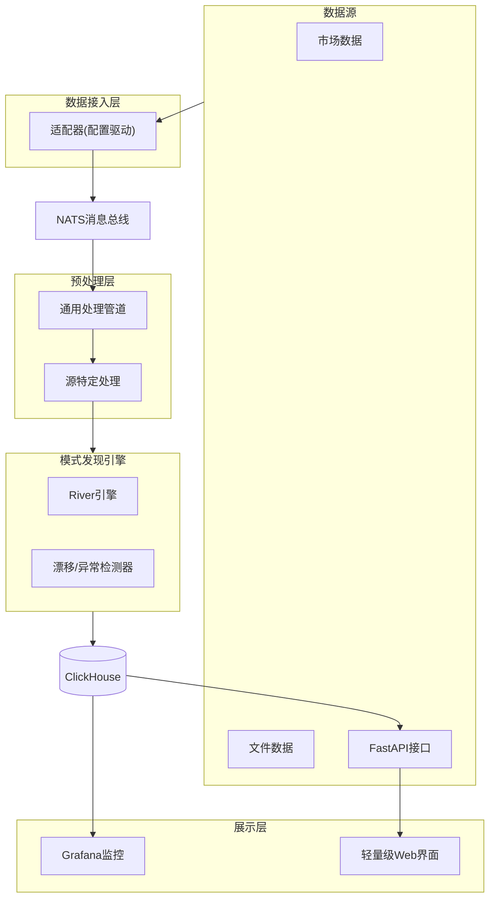
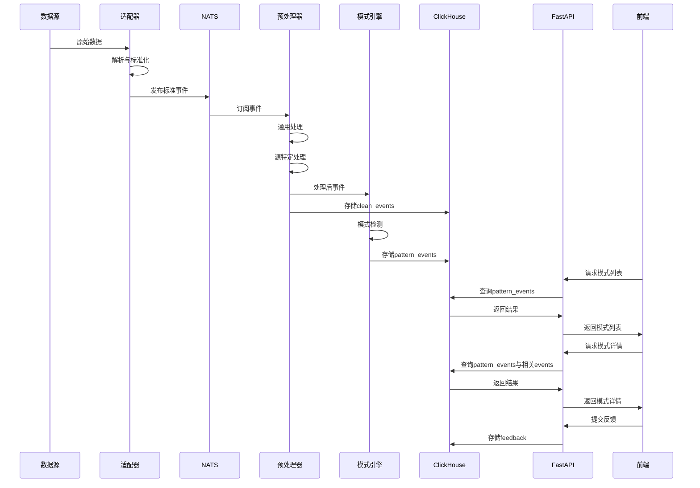

# Qraft7.0 — 数据流驱动自动化模式探索（精简版MVP）设计文档

## 一、总览

Qraft7.0是一个以**实时/近实时数据流**为输入、对多源数据做**统一预处理 + 自动化模式发现**，并以**结构化 + 可视化**方式呈现的轻量级平台。MVP聚焦核心模式发现能力与系统透明性，保持架构完整但功能精简。

## 二、设计原则

1. **轻量至上**：选择轻量级组件，避免过度设计，确保系统资源占用最小化
2. **性能优先**：关键路径使用高性能组件，确保数据处理低延迟
3. **模块化设计**：每层职责单一，接口清晰，便于替换或扩展
4. **配置驱动**：通过配置文件管理数据源与处理逻辑，避免代码修改
5. **可观测性**：每个环节可监控、可调试，确保系统透明
6. **工程防护**：对外部依赖做版本锁定与适配层隔离，确保系统稳定性

## 三、技术栈选择（明确版）

| 层级 | 技术选择 | 选择理由 |
| --- | --- | --- |
| **消息总线** | **NATS** | 极轻量(单二进制)、低延迟、简单部署、资源占用小，适合MVP阶段 |
| **数据处理** | **Python + asyncio + polars** | asyncio提供异步非阻塞处理能力，polars提供高性能数据处理 |
| **模式引擎** | **River** | 纯Python实现、API稳定、文档完善、维护活跃，适合MVP阶段 |
| **存储层** | **ClickHouse** | 列式存储高效、查询性能优异、资源占用可控，适合时序与事件数据 |
| **监控** | **Prometheus + Grafana** | 轻量级监控栈，部署简单，社区支持好 |
| **可视化** | **FastAPI + 轻量级前端** | 替代重量级Superset，提供最小可用的API与前端界面 |

> 注：MVP阶段暂不引入CapyMOA，待River稳定后再考虑；暂不引入MLflow，使用简单文件系统记录实验；LLM集成推迟到MVP之后实现

## 四、系统架构



## 五、详细设计（精简版）

### 1) 数据接入层

**职责**：将不同数据源统一转换为标准事件格式，发送到消息总线

**实现**：
- 轻量级适配器框架，每个适配器负责：拉取 → 解析 → 标准化 → 发送
- 通过YAML配置文件定义数据源与适配器参数
- MVP阶段实现3个核心适配器：WebSocket、REST API、文件监控

**标准事件格式**：
```json
{
  "event_id": "uuid",
  "source": "source_name",
  "type": "event_type",
  "timestamp": "ISO8601",
  "payload": { ... },
  "meta": { "version": "1.0" }
}
```

### 2) 预处理层

**职责**：数据清洗、验证、转换与特征提取

**实现**：
- 基于asyncio的异步处理管道
- 使用polars进行高性能数据处理
- 两级处理：通用处理(验证、时间标准化) → 源特定处理(聚合、特征提取)
- 处理逻辑通过配置文件定义，支持热重载

### 3) 模式发现引擎

**职责**：检测数据流中的模式变化、异常与漂移

**实现**：
- 基于River库实现在线学习与检测
- MVP阶段聚焦三类核心检测器：
  - 概念漂移检测(ADWIN/DDM)
  - 异常检测(Half-Space Trees)
  - 简单聚类变化检测
- 检测结果标准化为模式事件，存入ClickHouse

**模式事件格式**：
```json
{
  "pattern_id": "uuid",
  "type": "drift|anomaly|cluster_change",
  "timestamp": "ISO8601",
  "source": "source_name",
  "details": {
    "prev_state": "...",
    "new_state": "...",
    "metrics": {...},
    "confidence": 0.85
  },
  "contributors": [{"field":"price","score":0.7}, ...]
}
```

### 4) 存储层

**职责**：高效存储原始事件、处理后事件与模式事件

**实现**：
- 使用ClickHouse作为主存储
- 表结构设计：
  - `raw_events`: 原始事件存储
  - `clean_events`: 处理后事件
  - `pattern_events`: 模式事件
  - `pattern_feedback`: 用户反馈
- 数据生命周期管理：
  - 热数据保留7天
  - 重要模式事件保留30天
  - 可选配置冷数据归档

### 5) 展示层

**职责**：提供API接口与轻量级可视化界面

**实现**：
- FastAPI提供RESTful接口
- 轻量级前端(HTML + JS)展示模式事件与基本可视化
- Grafana用于系统监控与时序数据可视化
- MVP阶段核心API:
  - `GET /api/sources` - 数据源列表
  - `GET /api/patterns` - 模式事件查询
  - `GET /api/pattern/{id}` - 模式详情
  - `POST /api/feedback/{id}` - 提交反馈

## 六、交互时序图



## 七、实施路线（精简版）

### Sprint 0: 基础设施（1周）
- 项目骨架与代码规范
- NATS与ClickHouse本地部署
- 基础CI/CD配置

### Sprint 1: 数据管道（2周）
- 适配器框架与配置系统
- 实现3个核心适配器
- 预处理管道基础实现

### Sprint 2: 模式引擎（2周）
- River集成与检测器实现
- 模式事件生成与存储
- 基础回放测试框架

### Sprint 3: 展示层（2周）
- FastAPI接口实现
- 轻量级前端开发
- Grafana监控面板

> 总计：7周可交付最小可用版本

## 八、资源需求

**开发环境**：
- 8GB RAM, 4 CPU cores, SSD

**生产环境（单机）**：
- 16GB RAM, 8 CPU cores, SSD
- 存储：根据数据量，建议100GB起步

**软件依赖**：
- Python 3.10+
- NATS Server
- ClickHouse
- Docker & Docker Compose

## 九、风险与对策

| 风险 | 对策 |
| --- | --- |
| 数据量突增 | 实现背压机制，设置队列上限，提供降级策略 |
| 误报过多 | 提供用户反馈机制，动态调整阈值，实现自适应检测 |
| 性能瓶颈 | 关键路径性能监控，热点代码优化，提供水平扩展选项 |
| 依赖不稳定 | 版本锁定，适配层隔离，自动化测试，降级方案 |

## 十、未来扩展（MVP后）

1. **算法增强**：
   - 集成CapyMOA提供更多高性能算法
   - 增加深度学习模型支持

2. **规模扩展**：
   - 消息总线升级至Redpanda/Kafka
   - 处理层水平扩展

3. **功能增强**：
   - 实验管理集成(MLflow)
   - LLM解释层集成
   - 高级可视化与交互

4. **集成增强**：
   - 告警与通知系统
   - 与外部系统集成API

## 十一、结论

本设计方案专注于提供一个轻量级、高性能、可扩展的数据流模式探索平台。通过精选技术栈和精简功能范围，确保MVP能在7周内交付，同时保持架构完整性和未来扩展性。系统采用模块化设计，每个组件都可以独立升级或替换，为后续迭代提供灵活性。