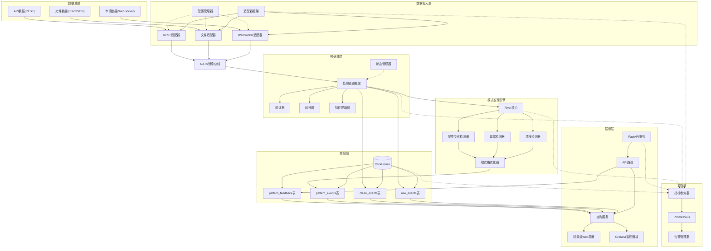
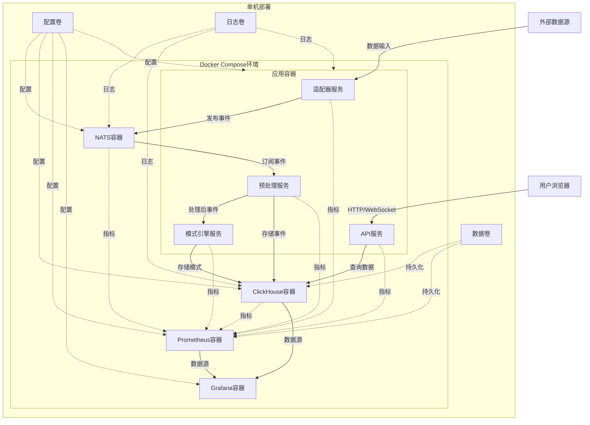

# Qraft7.0 架构与数据流详细设计

本文档提供Qraft7.0架构的详细视图，包括组件关系、数据流和部署拓扑。

## 一、系统组件详细架构



## 二、数据流详细视图

```mermaid
flowchart LR
    %% 数据流节点
    RawData["原始数据"] 
    StandardEvent["标准事件"] 
    ValidatedEvent["验证后事件"] 
    EnrichedEvent["增强事件"] 
    PatternEvent["模式事件"] 
    
    %% 处理节点
    Adapter["适配器"] 
    Validator["验证器"] 
    Transformer["转换器"] 
    Enricher["特征提取器"] 
    Detector["检测器"] 
    
    %% 存储节点
    RawStore["原始事件存储"] 
    CleanStore["处理后事件存储"] 
    PatternStore["模式事件存储"] 
    
    %% 数据流向
    RawData -->|"解析与标准化"| Adapter
    Adapter -->|"生成标准格式"| StandardEvent
    StandardEvent -->|"字段验证"| Validator
    Validator -->|"格式验证通过"| ValidatedEvent
    ValidatedEvent -->|"数据转换"| Transformer
    Transformer -->|"特征提取"| Enricher
    Enricher -->|"特征增强完成"| EnrichedEvent
    EnrichedEvent -->|"模式检测"| Detector
    Detector -->|"检测到模式"| PatternEvent
    
    StandardEvent -.->|"存储原始事件"| RawStore
    EnrichedEvent -.->|"存储处理后事件"| CleanStore
    PatternEvent -.->|"存储模式事件"| PatternStore
    
    %% 查询流向
    RawStore -.->|"查询原始数据"| Query["查询服务"]
    CleanStore -.->|"查询处理后数据"| Query
    PatternStore -.->|"查询模式事件"| Query
    Query -.->|"展示数据"| UI["用户界面"]
```



## 三、部署拓扑（单机MVP）



## 四、关键组件详细说明

### 1. 适配器框架

适配器框架提供统一的接口和基础设施，使不同数据源的适配器能够以一致的方式工作。

**核心组件**：
- `BaseAdapter`: 适配器基类，提供通用功能
- `ConfigManager`: 配置管理，支持热重载
- `EventEmitter`: 事件发布接口，连接NATS
- `HealthCheck`: 健康检查与监控

**适配器实现**：
- `WebSocketAdapter`: 处理WebSocket连接和消息
- `RESTAdapter`: 定时轮询REST API
- `FileAdapter`: 监控文件变化

### 2. 预处理管道

预处理管道负责数据清洗、验证、转换和特征提取，采用可组合的算子模式。

**核心组件**：
- `Pipeline`: 管道框架，编排处理步骤
- `Operator`: 算子基类，定义处理接口
- `StateManager`: 管理有状态算子的状态

**算子类型**：
- `Validator`: 数据验证算子
- `Transformer`: 数据转换算子
- `Enricher`: 特征提取算子

### 3. 模式引擎

模式引擎基于River库实现在线学习和模式检测，支持多种检测算法。

**核心组件**：
- `RiverAdapter`: River库适配层
- `DetectorRegistry`: 检测器注册表
- `PatternFormatter`: 模式事件格式化

**检测器类型**：
- `DriftDetector`: 概念漂移检测
- `AnomalyDetector`: 异常检测
- `ClusterDetector`: 聚类变化检测

### 4. 存储层

ClickHouse作为主存储，提供高效的列式存储和查询能力。

**表结构**：
- `raw_events`: 原始事件存储
- `clean_events`: 处理后事件存储
- `pattern_events`: 模式事件存储
- `pattern_feedback`: 用户反馈存储

**优化策略**：
- 分区策略：按日期分区
- 索引策略：对timestamp、source、type建立索引
- TTL策略：不同表设置不同保留期

### 5. API与前端

FastAPI提供RESTful接口，轻量级前端提供可视化界面。

**API组件**：
- `APIRouter`: 路由定义
- `QueryService`: 查询服务
- `SchemaValidator`: 请求/响应验证

**前端组件**：
- `PatternList`: 模式事件列表
- `PatternDetail`: 模式详情视图
- `TimelineView`: 时间线视图
- `FeedbackForm`: 反馈表单

## 五、配置示例

### 适配器配置

```yaml
adapters:
  - name: binance_trades
    type: websocket
    config:
      url: wss://stream.binance.com:9443/ws/btcusdt@trade
      reconnect_interval: 5
      parser: binance_trade_parser
      batch_size: 100
      batch_interval_ms: 500
  
  - name: yahoo_finance
    type: rest
    config:
      url: https://query1.finance.yahoo.com/v8/finance/chart/AAPL
      interval_sec: 60
      params:
        range: 1d
        interval: 1m
      parser: yahoo_finance_parser
  
  - name: local_csv
    type: file
    config:
      path: /data/trades/*.csv
      watch: true
      parser: csv_parser
      options:
        delimiter: ","
        header: true
```

### 预处理配置

```yaml
preprocessing:
  default:
    - name: validate_schema
      config:
        strict: true
    - name: add_timestamp
      config:
        field: processing_time
    - name: drop_malformed
      config: {}
  
  pipelines:
    - source: binance_trades
      operators:
        - name: normalize_price
          config:
            fields: ["price"]
            method: "min_max"
        - name: aggregate
          config:
            window: "1m"
            method: "ohlcv"
    
    - source: yahoo_finance
      operators:
        - name: extract_features
          config:
            features: ["sma_5", "sma_20", "rsi_14"]
```

### 检测器配置

```yaml
detectors:
  - name: price_drift
    type: adwin
    source: binance_trades
    config:
      delta: 0.002
      fields: ["price"]
      grace_period: 100
  
  - name: volume_anomaly
    type: half_space_trees
    source: binance_trades
    config:
      n_trees: 10
      height: 8
      window_size: 100
      fields: ["volume"]
  
  - name: market_regime
    type: cluster_detector
    source: yahoo_finance
    config:
      n_clusters: 4
      features: ["sma_5", "sma_20", "rsi_14"]
      window_size: 50
```

## 六、接口规范

### 标准事件格式

```json
{
  "event_id": "550e8400-e29b-41d4-a716-446655440000",
  "source": "binance_trades",
  "type": "trade",
  "timestamp": "2023-09-04T11:00:00.123Z",
  "payload": {
    "symbol": "BTCUSDT",
    "price": 29876.45,
    "quantity": 0.125,
    "side": "buy"
  },
  "meta": {
    "version": "1.0",
    "parser": "binance_trade_parser"
  }
}
```

### 模式事件格式

```json
{
  "pattern_id": "7f8d3a9c-5e4b-42d1-9f8a-123456789012",
  "type": "drift",
  "timestamp": "2023-09-04T11:05:00.000Z",
  "source": "binance_trades",
  "details": {
    "detector": "price_drift",
    "field": "price",
    "prev_mean": 29850.23,
    "new_mean": 29950.78,
    "change_pct": 0.34,
    "confidence": 0.92
  },
  "contributors": [
    {"field": "price", "score": 1.0}
  ]
}
```

### API接口

```
GET  /api/sources                  # 获取数据源列表
GET  /api/patterns                 # 获取模式事件列表
GET  /api/patterns?source=binance  # 按源筛选模式
GET  /api/patterns?type=drift      # 按类型筛选模式
GET  /api/patterns?start=2023-09-04T10:00:00&end=2023-09-04T12:00:00  # 按时间范围筛选
GET  /api/pattern/{id}             # 获取模式详情
POST /api/feedback/{id}            # 提交反馈
```

## 七、性能优化策略

1. **数据处理优化**：
   - 使用polars进行向量化操作
   - 批处理而非逐条处理
   - 异步I/O减少等待时间

2. **存储优化**：
   - ClickHouse分区与索引优化
   - 冷热数据分离
   - 压缩策略优化

3. **内存管理**：
   - 滑动窗口数据结构优化
   - 定期清理过期状态
   - 内存使用限制

4. **通信优化**：
   - 消息批处理
   - 压缩传输
   - 连接池管理

## 八、测试策略

1. **单元测试**：
   - 适配器解析逻辑
   - 预处理算子
   - 检测算法

2. **集成测试**：
   - 端到端数据流
   - 组件间交互

3. **性能测试**：
   - 吞吐量测试
   - 延迟测试
   - 资源使用测试

4. **回放测试**：
   - 历史数据回放
   - 模式检测一致性验证

## 九、总结

本文档详细描述了Qraft7.0的架构设计、数据流、部署拓扑和关键组件。通过精心设计的模块化架构和轻量级技术栈，Qraft7.0能够高效处理实时数据流并发现其中的模式变化，同时保持系统的可扩展性和可维护性。MVP阶段聚焦核心功能，为后续迭代提供坚实基础。